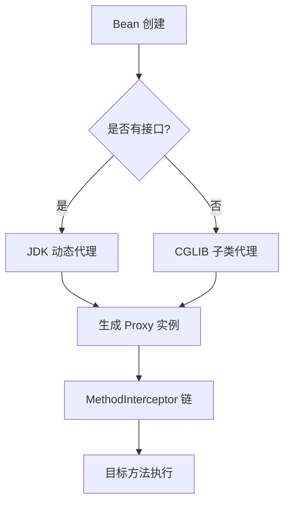
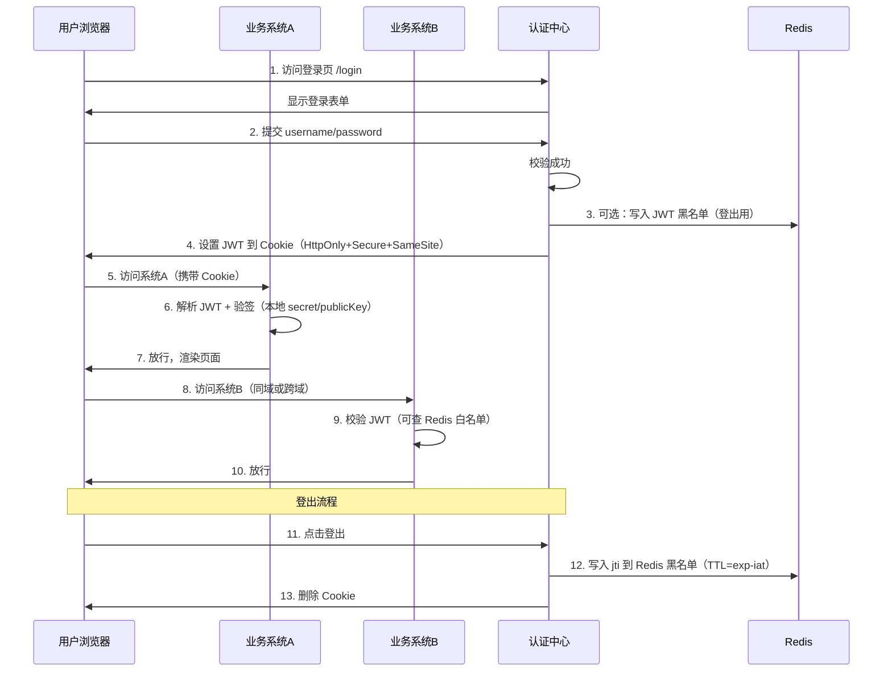

- [目录](#目录)
  - [1.进程和线程的区别？使用线程这能节约时间吗？](#1进程和线程的区别使用线程这能节约时间吗)
  - [2.分析一下线程池的参数？线程池工作流程？四种预定义的线程池？各自的workqueue size是多少？](#2分析一下线程池的参数线程池工作流程四种预定义的线程池各自的workqueue-size是多少)
  - [3.java怎么保持线程同步常用的锁有什么java锁升级是怎么样的](#3java怎么保持线程同步常用的锁有什么java锁升级是怎么样的)
  - [4.synchonized和lock的区别？synchonized优化](#4synchonized和lock的区别synchonized优化)
  - [5.hashmap同步问题，扩容机制，怎么扩容的过程？哈希冲突哪有哪些解决？](#5hashmap同步问题扩容机制怎么扩容的过程哈希冲突哪有哪些解决)
  - [6.concurrentHashmap的工作原理，数据结构？](#6concurrenthashmap的工作原理数据结构)
  - [7.泛型是什么？怎么实现的？](#7泛型是什么怎么实现的)
  - [8.怎么理解面向对象？简单聊聊封装、多态、继承](#8怎么理解面向对象简单聊聊封装多态继承)
  - [9.Integer和Int的区别？什么时候用Integer？new Integer(1)会不会从缓存中取？](#9integer和int的区别什么时候用integernew-integer1会不会从缓存中取)
  - [10.List为什么只能用Integer 不能用int的原因是什么？](#10list为什么只能用integer-不能用int的原因是什么)
  - [11.介绍下NIO，NIO中channel的作用？](#11介绍下nionio中channel的作用)
  - [12.什么是乐观锁、悲观锁？区别是什么呢？原理呢？](#12什么是乐观锁悲观锁区别是什么呢原理呢)
  - [13、线程有几种实现方式？有什么状态？](#13线程有几种实现方式有什么状态)
  - [14、finalize方法](#14finalize方法)
  - [15、说说抽象类和接口的区别。](#15说说抽象类和接口的区别)
  - [16、synchonized和lock的区别？synchonized优化](#16synchonized和lock的区别synchonized优化)
  - [17、为什么线程多的时候要使用锁而不是CAS？](#17为什么线程多的时候要使用锁而不是cas)
  - [18、谈一下异常，erorr和exception的区别，讲一下受检异常和非受检异常，说一下RuntimeException都有哪些，非受检异常有哪些？如何处理异常](#18谈一下异常erorr和exception的区别讲一下受检异常和非受检异常说一下runtimeexception都有哪些非受检异常有哪些如何处理异常)
  - [19、什么是阻塞和非阻塞，什么是同步，异步？](#19什么是阻塞和非阻塞什么是同步异步)
  - [20、什么是反射？反射的用途？为什么java需要反射，c++不需要。](#20什么是反射反射的用途为什么java需要反射c不需要)
  - [21、有哪些方式可以创建一个对象？](#21有哪些方式可以创建一个对象)
  - [22、多线程和协程的优缺点](#22多线程和协程的优缺点)
  - [23、基础类和继承类](#23基础类和继承类)
  - [24、ArrayList VS LinkedList](#24arraylist-vs-linkedlist)
  - [25、讲讲类的实例化顺序](#25讲讲类的实例化顺序)
  - [26、JAVA有顺序的map](#26java有顺序的map)
  - [27、继承和聚合](#27继承和聚合)
  - [28、描述动态代理的几种实现方式，分别说出相应的优缺点](#28描述动态代理的几种实现方式分别说出相应的优缺点)
    - [JDK动态代理和CGLIB的区别](#jdk动态代理和cglib的区别)
  - [29、为什么 CGLIB 不能代理“纯接口”？](#29为什么-cglib-不能代理纯接口)
  - [30、Final的用途](#30final的用途)
  - [31、给出三种单例模式](#31给出三种单例模式)
    - [1. 饿汉式（最简单，最常用，99% 公司都在用）](#1-饿汉式最简单最常用99-公司都在用)
    - [2. 静态内部类（完美平衡，面试最爱写）](#2-静态内部类完美平衡面试最爱写)
    - [3. 枚举单例（Effective Java 作者推荐，最强防破解版）](#3-枚举单例effective-java-作者推荐最强防破解版)
    - [补充：双重检查锁（DCL）](#补充双重检查锁dcl)
    - [终极结论（面试直接说）：](#终极结论面试直接说)
    - [为什么必须加 volatile？（99% 的人都说不清）](#为什么必须加-volatile99-的人都说不清)
  - [32、能不能只在父类写一次 hashCode() 和 equals()](#32能不能只在父类写一次-hashcode-和-equals)
    - [方案一、使用objects.hash() + instanceof基类](#方案一使用objectshash--instanceof基类)
    - [方案二、Lombok](#方案二lombok)
    - [方案三、Apache Commons Lang](#方案三apache-commons-lang)
  - [33、设计模式](#33设计模式)
    - [Java 23 种经典设计模式（GoF）+ 常考现代模式（2025 面试终极版）](#java-23-种经典设计模式gof-常考现代模式2025-面试终极版)
    - [现代/常见扩展模式（大厂高频）](#现代常见扩展模式大厂高频)
    - [面试经典回答模板（背完直接上）](#面试经典回答模板背完直接上)
    - [一句话总结（面试金句）](#一句话总结面试金句)
  - [34、深拷贝VS浅拷贝](#34深拷贝vs浅拷贝)
  - [35、在自己的代码中，如果创建一个java.lang.String类，这个类是否可以被类加载器加载？为什么。](#35在自己的代码中如果创建一个javalangstring类这个类是否可以被类加载器加载为什么)
  - [36、说一说你对java.lang.Object对象中hashCode和equals方法的理解。在什么场景下需要重新实现这两个方法。](#36说一说你对javalangobject对象中hashcode和equals方法的理解在什么场景下需要重新实现这两个方法)
    - [1\>默认实现到底长什么样？](#1默认实现到底长什么样)
    - [2\>什么时候必须重写这两个方法？](#2什么时候必须重写这两个方法)
    - [3\>正确重写](#3正确重写)
  - [37、实体类的equals和hashCode方法是否可以完全交给Lombok的@Data注解实现？需要注意什么地方？](#37实体类的equals和hashcode方法是否可以完全交给lombok的data注解实现需要注意什么地方)
  - [38、那为什么 JPA 实体建议不要用 Lombok 的 @EqualsAndHashCode？](#38那为什么-jpa-实体建议不要用-lombok-的-equalsandhashcode)
  - [39、在jdk1.5中，引入了泛型，泛型的存在是用来解决什么问题。](#39在jdk15中引入了泛型泛型的存在是用来解决什么问题)
  - [40、这样的a.hashcode() 有什么用，与a.equals(b)有什么关系。](#40这样的ahashcode-有什么用与aequalsb有什么关系)
  - [41、有没有可能2个不相等的对象有相同的hashcode。](#41有没有可能2个不相等的对象有相同的hashcode)
  - [42、Java中的HashSet内部是如何工作的。](#42java中的hashset内部是如何工作的)
  - [43、java8的新特性。](#43java8的新特性)
  - [44、什么是序列化，怎么序列化，为什么序列化，反序列化会遇到什么问题，如何解决。](#44什么是序列化怎么序列化为什么序列化反序列化会遇到什么问题如何解决)
    - [终极结论（面试/架构师必背 3 句话）](#终极结论面试架构师必背-3-句话)
- [JVM](#jvm)
  - [1.谈谈多态，多态的底层原理](#1谈谈多态多态的底层原理)
  - [2.CAS的底层原理，synchonized的底层原理](#2cas的底层原理synchonized的底层原理)
      - [**CAS（Compare And Swap）**](#cascompare-and-swap)
      - [**synchronized 底层原理**](#synchronized-底层原理)
  - [3.volatile的原理？](#3volatile的原理)
- [Spring](#spring)
  - [1.Spring 的核心模块有哪些？IOC 和 AOP 的原理？](#1spring-的核心模块有哪些ioc-和-aop-的原理)
  - [2.spring的事务传播是怎么样的，哪些方式？](#2spring的事务传播是怎么样的哪些方式)
  - [3.spring是如何解决循环依赖的?](#3spring是如何解决循环依赖的)
  - [4.@Autowired 字段注入 vs 构造器注入，循环依赖影响？](#4autowired-字段注入-vs-构造器注入循环依赖影响)
  - [5.ApplicationContext.getBean() 触发循环依赖吗？](#5applicationcontextgetbean-触发循环依赖吗)
- [网络](#网络)
  - [1. 浏览器对网页有缓存吗？缓存是如何存放的？](#1-浏览器对网页有缓存吗缓存是如何存放的)
  - [2.Cookie和session的联系与区别，cookie、session、分布式session](#2cookie和session的联系与区别cookiesession分布式session)
  - [3.如何保证TCP可靠传输](#3如何保证tcp可靠传输)
  - [4.什么是 SSO？什么是 JWT？SSO、JWT 和 Redis 登录的过程](#4什么是-sso什么是-jwtssojwt-和-redis-登录的过程)
- [Redis](#redis)
  - [1.Redis单线程为什么性能高?](#1redis单线程为什么性能高)
  - [2.Redis 为什么可以保证线程安全？](#2redis-为什么可以保证线程安全)
  - [3.Redis的七大数据类型和底层数据结构？](#3redis的七大数据类型和底层数据结构)
- [RabbitMQ](#rabbitmq)
  - [1.RabbitMQ 的用途与结构](#1rabbitmq-的用途与结构)
  - [2.RabbitMQ 可靠性传输](#2rabbitmq-可靠性传输)
  - [3.rabbitmq exchange类型 有哪些类型](#3rabbitmq-exchange类型-有哪些类型)
- [分布式和微服务](#分布式和微服务)
  - [1.什么是分布式事务？分布式事务的解决方案？](#1什么是分布式事务分布式事务的解决方案)
  - [2,分布式锁如何实现？RedLock算法](#2分布式锁如何实现redlock算法)
    - [1\>**Redis 分布式锁**（最常用）](#1redis-分布式锁最常用)
    - [2\>**Zookeeper 分布式锁**（强一致性）](#2zookeeper-分布式锁强一致性)
    - [3\>**数据库分布式锁**（简单）](#3数据库分布式锁简单)
    - [1. **什么是 RedLock？**](#1-什么是-redlock)
    - [2.Redisson 框架](#2redisson-框架)
    - [4：Redis 分布式锁为什么用 SETNX + EXPIRE 不安全？](#4redis-分布式锁为什么用-setnx--expire-不安全)
    - [5：Redisson 怎么防止锁过期？](#5redisson-怎么防止锁过期)
    - [6：Zookeeper 比 Redis 强在哪？](#6zookeeper-比-redis-强在哪)
    - [7：RedLock 算法的核心步骤？](#7redlock-算法的核心步骤)
    - [8：Redisson 是什么？它如何支持分布式锁？](#8redisson-是什么它如何支持分布式锁)
    - [9：RedLock 的潜在问题？](#9redlock-的潜在问题)
- [数据库](#数据库)
  - [1.什么时候考虑分库分表？](#1什么时候考虑分库分表)
  - [2.mysql为什么要用b+树，不用平衡二叉树做索引结构？B树和B+树有什么区别？](#2mysql为什么要用b树不用平衡二叉树做索引结构b树和b树有什么区别)
  - [3.创建数据库索引应该怎么考虑？](#3创建数据库索引应该怎么考虑)
      - [**执行流程对比：**](#执行流程对比)
  - [4.使用int 做primary key和使用string 有什么优劣？](#4使用int-做primary-key和使用string-有什么优劣)
  - [5.数据库分表的方法？](#5数据库分表的方法)
  - [6.如果一条SQL语句执行的很慢，怎么优化？](#6如果一条sql语句执行的很慢怎么优化)
  - [7.Mysql为什么没有使用hash索引？](#7mysql为什么没有使用hash索引)
  - [8.索引的匹配原则知道吗？](#8索引的匹配原则知道吗)
  - [9.MySQL事务隔离级别？](#9mysql事务隔离级别)
  - [10.Mysql的查询执行流程？更新执行流程？](#10mysql的查询执行流程更新执行流程)
  - [11.Mysql有哪些存储引擎？什么区别？](#11mysql有哪些存储引擎什么区别)
  - [12.数据库的表结构设计遵循哪些规则？](#12数据库的表结构设计遵循哪些规则)
  - [13.UUID 与 Snowflake 对比？](#13uuid-与-snowflake-对比)
    - [UUID 主键](#uuid-主键)
    - [Snowflake](#snowflake)
  - [二、UUID 做主键的 5 大硬伤](#二uuid-做主键的-5-大硬伤)
  - [14.EXPLAIN 关键字段 type Extra代表什么](#14explain-关键字段-type-extra代表什么)
    - [type 字段：**访问类型排名（从优到劣）**](#type-字段访问类型排名从优到劣)
    - [Extra 字段：**额外操作（红灯预警）**](#extra-字段额外操作红灯预警)
- [架构和设计模式](#架构和设计模式)
  - [1.rpc框架如何实现？](#1rpc框架如何实现)
  - [2.服务提供方有节点挂了怎么办？](#2服务提供方有节点挂了怎么办)
  - [3.服务调用方怎么知道服务不可用了？](#3服务调用方怎么知道服务不可用了)
  - [4.怎么实现的类似本地调用？](#4怎么实现的类似本地调用)
- [算法](#算法)
  - [1.遍历](#1遍历)
  - [2.最小生成树](#2最小生成树)

# [目录](https://maochunguang.github.io/java-interview/interview_topn/toutiao.html#%E6%8A%80%E6%9C%AF%E7%82%B9%E6%B1%87%E6%80%BB)

[TOC]


## 1.进程和线程的区别？使用线程这能节约时间吗？

1. **进程是操作系统进行资源分配和保护的独立单元，而线程是程序执行和调度的基本单元，是进程内的一条执行路径。**

   1. ### 容器与微服务的视角

      在我们熟悉的Cloud Foundry微服务架构中，可以这样理解：

      | 维度         | **进程（Process）**                                          | **线程（Thread）**                                           |
      | :----------- | :----------------------------------------------------------- | :----------------------------------------------------------- |
      | **本质**     | **操作系统进行资源分配和保护的独立单元**。一个**独立的JVM实例**，拥有完整的**私有内存空间**（堆、栈、元空间等）。 | **CPU调度和执行的基本单元**。一个进程内的**一条独立执行流**，共享进程的**堆内存和方法区**，但拥有自己的**栈和程序计数器**。 |
      | **资源隔离** | **强隔离**。如同我们在Cloud Foundry上部署的一个**独立的微服务实例**。每个进程有独立的内存空间、文件句柄、网络端口。一个进程崩溃**不会影响**其他进程。 | **共享资源**。如同一个微服务实例内部的**多个@Async任务**或**WebFlux的Event Loop线程**。共享所属进程的堆内存（即共享Spring的ApplicationContext、Bean实例、静态变量等）。一个线程崩溃**可能导致**整个JVM进程退出。 |
      | **创建开销** | **大**。需要分配独立的内存空间、加载类、初始化Spring容器等。这好比在CF上**cf push一个新应用实例**，需要走完整的构建、部署流程。 | **小**。在已初始化的JVM和Spring容器内创建，共享已加载的类。如同在**已运行的Pod内启用新的@Async线程**，效率极高。 |
      | **通信方式** | **复杂**。需要**IPC**，如**REST API**、**gRPC**、**消息队列（RabbitMQ）**。这就是我们**微服务间的通信方式**。 | **极简单**。直接通过**共享的堆内存**读写同一个对象（如一个`ConcurrentHashMap`或`AtomicInteger`）。但必须使用`synchronized`、`Lock`、`volatile`等机制保证**可见性和原子性**。 |
      | **类比**     | **一个独立的微服务实例**（如`user-service`实例）             | **一个微服务实例内部的一个并发任务**（如处理一个HTTP请求的Tomcat线程） |

2. 节约时间
   1. 对于**计算密集型**任务，目标是利用多核实现**并行**来压缩计算时间。

      1. 使用线程数接近CPU核数的线程池（如`Runtime.getRuntime().availableProcessors()`），避免过度切换。

   2. 对于**I/O密集型**任务，目标是利用**并发**来填充I/O等待时间，提高CPU利用率和系统吞吐量。

      1.  利用I/O等待时间。当线程A在等待用户服务响应时，CPU可以切换到线程B去处理商品服务请求，**压榨CPU空闲时间**。

   3. | 特性         | **CPU密集型 (CPU-Bound)**                 | **I/O密集型 (I/O-Bound)**                          |
      | :----------- | :---------------------------------------- | :------------------------------------------------- |
      | **核心特征** | 任务执行速度主要受限于**CPU的运算能力**。 | 任务执行速度主要受限于**输入/输出操作的速度**。    |
      | **耗时大头** | 进行大量计算、逻辑处理、数据转换。        | 等待网络响应、数据库查询、磁盘读写、消息队列消费。 |
      | **资源瓶颈** | **CPU核心数**、主频、缓存。               | **网络带宽**、磁盘I/O、数据库连接池、外部服务RT。  |
   
   4. 多线程：操作系统级线程（OS Thread），由内核调度，数量通常几百~几千就炸，上下文切换贵（微秒级），阻塞 = 真阻塞。
   
   5. 协程：用户态轻量线程（User-space Thread），由语言运行时调度，可轻松创建几十万~百万，切换成本纳秒级，阻塞是“假装阻塞”（实际是挂起协程）。
   
   6. | 场景                      | 推荐方案                    | 理由                                                         |
      | ------------------------- | --------------------------- | ------------------------------------------------------------ |
      | CPU 密集型（计算）        | 传统线程（绑定 CPU 核数）   | 协程不会比线程更快，GIL/单核切换反而慢                       |
      | IO 密集型（网络、数据库） | 协程 / 虚拟线程             | 10 万连接下内存和延迟完胜                                    |
      | 已经基于回调/Reactor      | Netty + Reactor             | 成熟生态，改造成本低                                         |
      | 想用同步代码写异步逻辑    | Java 虚拟线程 / Go / Kotlin | 代码看起来像单线程，调试、日志、异常栈都友好                 |
      | 追求极致性能              | Go Goroutine                | GMP 模型 + 网格式调度器，当前最强协程实现                    |
      | Java 项目升级最省力       | JDK 21+ 虚拟线程            | 只需要把 new Thread() 改成 Executors.newVirtualThreadPerTaskExecutor() |
   
   7. | 排名 | 场景                           | 传统多线程写法              | 2024~2025 推荐写法（协程/虚拟线程）       | 真实占比 |
      | ---- | ------------------------------ | --------------------------- | ----------------------------------------- | -------- |
      | 1    | 异步发日志 / 埋点 / 审计       | @Async + TaskExecutor       | 虚拟线程（几乎零改造）                    | 90%      |
      | 2    | 异步发送邮件 / 短信 / 站内信   | @Async                      | 虚拟线程                                  | 85%      |
      | 3    | 定时任务（Corn / 动态定时）    | @Scheduled(fixedRate)       | 虚拟线程 + ScheduledExecutor              | 80%      |
      | 4    | 批量导入 / 导出（Excel、CSV）  | 多线程分片 + CountDownLatch | 虚拟线程 StructuredTaskScope（JDK21）     | 75%      |
      | 5    | 高并发对外 HTTP 接口（10w+）   | Tomcat + 线程池             | Netty + WebFlux 或 虚拟线程               | 60%      |
      | 6    | 消息队列消费（RocketMQ/Kafka） | @RocketMQMessageListener    | 虚拟线程消费（2024 年新趋势）             | 50%      |
      | 7    | 限流熔断降级（Sentinel）       | 内部就是线程池              | 虚拟线程 + Resilience4j                   | 40%      |
      | 8    | 网关层（Spring Cloud Gateway） | Netty + Reactor             | 已经默认协程（Reactor），未来可换虚拟线程 | 100%     |
   
   8. @Async 里面调用同一个类的普通方法为什么不生效？ → Spring AOP 是基于代理，this 调用绕过代理
   
   9. 虚拟线程能不能用线程池？ → 可以，但推荐 newVirtualThreadPerTaskExecutor()（无界队列）
   
   10. WebFlux 和虚拟线程能共存吗？ → 可以，底层都是 Reactor，但代码风格完全不同
   
   11. 什么时候必须用 WebFlux？ → 已经全站响应式 + 需要背压

## 2.分析一下线程池的参数？线程池工作流程？四种预定义的线程池？各自的workqueue size是多少？

```java
ThreadPoolExecutor executor = new ThreadPoolExecutor(
	int corePoolSize,//核心线程数
	int maximumPoolSize,//最大线程数
	long keepAliveTime,//线程空闲存活时间
	TimeUnit unit,//时间单位
	BlockingQueue<Runnable> workQueue,//工作队列
	ThreadFactory threadFactory,//线程工厂
	RejectedExecutionHandler handler//拒绝策略
);
```

### 2.1工作流程

1. 提交任务
2. 核心线程是否已满？
   1. 否--即使有线程空闲，也会立即创建一个新的核心线程
   2. 是，下一步
3. 工作队列是否已满？
   1. 否，放入工作队列等待执行
   2. 是，下一步
4. 线程数是否达到最大值
   1. 否，创建一个创建一个新的非核心线程执行任务
   2. 是，下一步
5. 触发拒绝策略
   1. 线程和队列都已饱和，无法处理新任务，调用rejectedExecutionHandler处理这个被拒绝的任务

### 2.2四种预定义线程池的区别和workqueue的大小

| 类型                                              | 核心队列（workQueue）              | 队列容量/最大线程数                                          |      | 典型使用场景 & 优缺点                                        |
| :------------------------------------------------ | ---------------------------------- | ------------------------------------------------------------ | ---- | ------------------------------------------------------------ |
| **FixedThreadPool**<br />固定大小线程池           | `LinkedBlockingQueue<Runnable>`    | **无界**（Integer.MAX_VALUE）<br />**固定**（newFixedThreadPool(n)） |      | • 适用于**任务量可控、需要限制并发数**的场景（如数据库连接池） <br />• 优点：线程数稳定 <br />• 风险：任务堆积 → OOM |
| **CachedThreadPool**<br />可缓存线程池            | `SynchronousQueue<Runnable>`       | **容量 0**（无缓冲）<br />**无上限**（Integer.MAX_VALUE）    |      | • 适用于**大量短生命周期任务**（如 Web 请求处理） <br />• 优点：响应极快，自动扩缩容 <br />• 致命风险：任务突刺 → 线程爆炸 → OOM |
| **SingleThreadExecutor**<br />单线程化线程池      | `LinkedBlockingQueue<Runnable>`    | **无界**（Integer.MAX_VALUE）<br />**永远 1 个线程**         |      | • 适用于**任务必须串行执行**的场景（如日志写入、顺序敏感操作）<br /> • 优点：天然线程安全 <br />• 风险：任务堆积 → OOM |
| **ScheduledThreadPool**<br />定时周期性任务线程池 | `DelayedWorkQueue`（内部优先队列） | **无界<br />**固定**（核心线程数）**                         |      | • 专门用于**定时任务 & 周期性任务**（ScheduledExecutorService）<br /> • 支持 `schedule`、`scheduleAtFixedRate`、`scheduleWithFixedDelay` |

### 2.3线程工厂

- 用于创建新线程的工厂类。
- 可以定制线程的名称、优先级、是否为守护线程等属性。

### 面试高频补充

- **最容易 OOM 的两个线程池**：
  - `FixedThreadPool` 和 `SingleThreadExecutor` → **无界队列**，任务堆积 → 内存泄漏
  - `CachedThreadPool` → **无界线程数**，任务突刺 → 线程爆炸
- **生产推荐做法**：

```java
// 推荐：自定义 ThreadPoolExecutor，显式指定队列大小
new ThreadPoolExecutor(
    corePoolSize, 
    maxPoolSize,
    keepAliveTime, 
    TimeUnit.SECONDS,
    new LinkedBlockingQueue<>(5000),   // 有界队列，防止 OOM
    threadFactory,
    new ThreadPoolExecutor.CallerRunsPolicy() // 饱和策略
);


ThreadPoolTaskExecutor executor = new ThreadPoolTaskExecutor();
// 如果您不设置任何参数，直接调用 executor.initialize()，则采用以下默认值：
// executor.setCorePoolSize(1); // 危险！核心线程只有1个
// executor.setMaxPoolSize(Integer.MAX_VALUE); // 极度危险！线程数无上限
// executor.setKeepAliveSeconds(60); // 空闲线程60秒后回收
// executor.setQueueCapacity(Integer.MAX_VALUE); // 极度危险！使用无界队列
// executor.setThreadNamePrefix("SimpleAsyncTaskExecutor-"); 
// executor.setRejectedExecutionHandler(new ThreadPoolExecutor.AbortPolicy()); // 队列满后抛异常
```

## 3.java怎么保持线程同步？常用的锁有什么？java锁升级是怎么样的

Java 通过 synchronized、Lock（ReentrantLock）、原子类（CAS）、volatile、并发容器、线程安全工具等实现线程同步；

### 1>常用锁

#### 1. 内置锁（synchronized）

- **特点**：隐式获取和释放锁，可重入，非公平锁（Java 1.6 后默认偏向锁 / 轻量级锁）。
- **适用场景**：简单同步场景，代码简洁。

#### 2. 显式锁（Lock 接口）

- **ReentrantLock**：可重入锁，支持公平 / 非公平模式，可手动控制锁的获取和释放。
- **ReentrantReadWriteLock**：读写分离锁，允许多个读线程同时访问，写线程独占访问。
- **StampedLock**：支持乐观读，性能优于读写锁。

#### 3. 其他锁类型

- **自旋锁**：线程循环尝试获取锁，避免线程上下文切换。
- **悲观锁 / 乐观锁**：悲观锁（如 `synchronized`）假设冲突一定会发生，乐观锁（如 CAS）假设冲突很少发生。
- **公平锁 / 非公平锁**：公平锁按请求顺序获取锁，非公平锁允许插队（性能更高）。

### 2>Java 锁升级机制（synchronized 优化）

Java 1.6 对 `synchronized` 进行了优化，引入了**锁升级**机制，从低到高依次为：**偏向锁 → 轻量级锁 → 重量级锁**，以减少锁竞争的开销。

#### 1. 偏向锁

- **适用场景**：只有一个线程访问同步块。
- **原理**：锁对象的 Mark Word 记录持有锁的线程 ID，后续该线程进入同步块时无需 CAS 操作，直接获取锁。
- **优势**：消除无竞争情况下的锁获取开销。

#### 2. 轻量级锁

- **适用场景**：多个线程交替访问同步块（无激烈竞争）。
- **原理**：线程在栈帧中创建锁记录（Lock Record），通过 CAS 将锁对象的 Mark Word 更新为指向锁记录的指针。
- **自旋**：获取锁失败时，线程会自旋（循环尝试）而非阻塞，减少上下文切换。

#### 3. 重量级锁

- **适用场景**：多个线程同时竞争锁（激烈竞争）。
- **原理**：升级为操作系统级别的互斥锁（Mutex），失败的线程会被阻塞，进入内核态等待。
- **劣势**：存在内核态 / 用户态切换开销，性能较低。

#### 锁升级过程总结：

```plaintext
无锁 → 偏向锁（单线程） → 轻量级锁（多线程交替） → 重量级锁（多线程竞争）
```

- **注意**：锁升级是不可逆的（只能升级，不能降级），以保证性能。


## 4.synchonized和lock的区别？synchonized优化

| 特性                  | synchronized                                                 | Lock（ReentrantLock）                                        |
| --------------------- | ------------------------------------------------------------ | ------------------------------------------------------------ |
| 定义                  | Java 关键字，属于 **JVM 层面**                               | java.util.concurrent.locks.Lock **接口**，需要手动 `lock()` / `unlock()` |
| 加锁/释放方式         | 自动加锁、自动释放（离开作用域即释放）                       | 必须**手动**调用 `lock()` 加锁，`unlock()` 释放（通常放在 finally 中） |
| 灵活性                | 不灵活，锁的获取和释放只能在同一代码块内                     | **非常灵活**：<br/>• 可以跨方法/跨线程加锁解锁<br/>• 支持 `tryLock()` 非阻塞获取<br/>• 支持超时获取 |
| 等待是否可中断        | **不可中断**（线程会一直阻塞）                               | **可中断**：`lockInterruptibly()` 在等待时可被 `interrupt()` 打断 |
| 公平锁支持            | 只支持**非公平锁**（默认）                                   | **都支持**：<br/>`new ReentrantLock(false)` → 非公平（默认，性能更好）<br/>`new ReentrantLock(true) → 公平锁 |
| 条件队列（Condition） | 只有一个隐式等待队列，通过 `wait()/notify()/notifyAll()` 操作 | **支持多个条件变量**：<br/>`lock.newCondition()` 可创建任意多个 `Condition`，实现精准唤醒 |
| 锁升级路径            | 支持 **无锁 → 偏向锁 → 轻量级锁 → 重量级锁** 的自动升级优化（HotSpot JVM 特性） | **没有锁升级**，一直都是重量级（但实际底层也是偏向/轻量级优化，只是 API 层面不暴露） |
| 异常释放              | 异常时 **JVM 自动释放锁**                                    | 异常时 **必须在 finally 中手动 unlock**，否则死锁            |
| 适用场景              | 简单同步场景、代码侵入少                                     | 高并发、需要精细控制（中断、超时、公平、多个等待队列）的复杂并发场景 |

synchronized 的“条件队列”就是对象 Monitor 里的 _WaitSet，所有调用了 obj.wait() 的线程都会被挂到这个队列里等待 notify/notifyAll 唤醒。它是 Java 最原始的条件变量实现，虽然只有一个队列，但已经完全可以实现生产者-消费者、阻塞队列等经典并发模式。

```text
新来的线程想抢锁
      ↓
   _cxq（争用队列）
      ↓ (被Park)
锁释放时，_cxq 头节点出队 → 尝试获取锁
      ↓ 成功
持有锁执行...
      ↓ 调用 wait()
释放锁 + 放入 _WaitSet + Park (WAITING)
      ↓ 被 notify/notifyAll
从 _WaitSet 移到 _EntryList + Unpark
      ↓
继续竞争锁（BLOCKED → RUNNABLE）
```

## 5.hashmap同步问题，扩容机制，怎么扩容的过程？哈希冲突哪有哪些解决？

HashMap 线程不安全，多线程建议直接用 ConcurrentHashMap；

- JDK1.7 扩容死循环原理：转移元素时采用头插法，多线程时 A 线程挂起后 B 线程完成扩容改变了链表顺序，A 线程恢复后继续头插会形成环形链表，之后 get 时无限循环。JDK1.8 已改尾插法，彻底解决死循环，但仍不线程安全。
- 常见错误：很多人以为“只有扩容才死循环”，其实日常 put 也可能数据丢失（size++ 被覆盖），或者多个线程同时触发 resize 导致部分桶数组元素丢失。

| 场景                 | 推荐方案（2025 年最新建议）                                  |
| -------------------- | ------------------------------------------------------------ |
| 读多写少             | `Collections.synchronizedMap(new HashMap<>())`（过时） 推荐：`ConcurrentHashMap` |
| 高并发读写           | 直接用 `ConcurrentHashMap`（性能最好）                       |
| 只读，几乎不修改     | `new HashMap<>()` + 启动时 putAll 完成后再共享               |
| 需要精确控制并发粒度 | `ConcurrentHashMap` 的分段 putIfAbsent 等操作                |

### 1.扩容机制

JDK1.8 ConcurrentHashMap 当 size ≥ threshold 时触发扩容，支持多线程并发协助扩容，采用“单槽迁移任务”机制，使用 ForwardingNode 标记已迁移槽，保证高并发下读写不阻塞。

深度剖析（带陷阱/踩坑点）：

1. 核心原理：
   - 扩容前会创建一个 capacity × 2 的新 table
   - 采用“步长 stride”划分任务，默认每个线程一次处理 16 个槽（transferIndex）
   - 迁移时对每个槽加锁（synchronized(table[i])），而不是全局锁
   - 迁移完的槽放一个 ForwardingNode 节点，读线程遇到它会转发到新表，写线程会帮忙迁移（扩容期间写也会协助）
2. 常见陷阱：很多人说“扩容期间读写全无锁”，错！读确实无锁（volatile + ForwardingNode），但写和迁移是加槽锁的。

### 2.哈希冲突怎么解决

主流两种：开放寻址法（线性探测、二次探测）和拉链法（链表+红黑树）。JDK1.8 HashMap 用拉链法，链表长度≥8且 table≥64 时转红黑树。

深度剖析（带陷阱/踩坑点）：

1. 开放寻址法（ThreadLocal 用）
   - 线性探测：容易产生聚集（cluster），删除要用墓碑标记，（ThreadLocal 用）
   - 二次探测：步长是平方，仍然有聚集问题
   - 再散列：多个哈希函数，实际工程很少用
2. 拉链法（HashMap 默认）
   - 优点：简单、易扩展、删除方便
   - 缺点：极端冲突时退化成 O(n)，JDK1.8 引入红黑树优化尾部冲突
3. 面试官最爱挖的坑：
   - “你说红黑树更快，那为什么不一开始就用红黑树？” → 答：链表在冲突少时缓存友好性更好，红黑树节点占内存是链表 2-3 倍。
   - “树化条件到底是 8 还是 7？” → 严格是 8（binCount >= 8），但源码里是 >7 触发树化，原因是泊松分布下冲突达到 8 的概率已极低（千万分之一）。
   - 为什么 ThreadLocalMap 不用拉链法而用开放寻址？ → ThreadLocal数量少（几十个），冲突概率极低，开放寻址更快+省内存
   - 开放寻址负载因子为什么不能太高？ → 超过0.7后聚集效应爆炸，查找退化到O(n)
   - 删除开放寻址法的元素时为什么不能直接置null？举个例子说明会出什么问题？
     - 核心原理：查找停止条件只有两种
       - 找到 key → 返回
       - 遇到 null（空槽）→ 停止查找，说明不存在 所以中间一旦出现 null，整个后面的探测链就全断了！

## 6.concurrentHashmap的工作原理，数据结构？

JDK8+ ConcurrentHashMap 完全抛弃了 1.7 的 Segment 分段锁，

用 **table 数组 + CAS + synchronized 局部锁** 实现高并发。

 数据结构：

- 底层仍是 table 数组（volatile Node<K,V>[] table）
- 单个桶：普通链表 Node → 长度≥8 且 table≥64 转红黑树 TreeNode
- 扩容时出现 ForwardingNode（hash = -1）占位
- JDK21 新增 ReservationNode（hash = -3）用于 compute 类操作预占位 核心并发控制：初始化用 CAS(sizeCtl 从 0 → 正数)，put/get 无锁或只锁桶首节点，扩容支持多线程协作。

### 6.1核心要点

#### 1>put 流程（30 秒画完的经典八股）

1. key 为 null → 直接抛 NPE（不允许 null key）
2. 计算 hash：spread 方法（高16位异或低16位，防低位冲突）
3. table == null 或对应桶为空 → CAS 插入（tabAt + CAS）
4. 桶首节点 hash == -1 → 说明正在扩容 → 调用 helpTransfer 帮忙
5. 否则 synchronized(桶首节点 f) {
   - 如果仍是 f（没变）→ 链表插入或树插入
   - 链表长度到 8 → treeifyBin（可能转树） }
6. addCount(1) → 更新 size，可能触发 transfer() 扩容

#### 5>get 流程（真正无锁读！）

- 全程无锁，靠 volatile 语意
- 如果遇到 ForwardingNode → 转发到 nextTable 继续查
- 红黑树走树查找逻辑

#### 6>注意

- 为什么 synchronized 只锁桶首节点而不是整个桶？ → 因为每次扩容迁移后首节点会变，锁住旧首节点无意义；锁新首节点即可保证同一桶串行

- get 为什么可以完全无锁？ → table 数组 volatile + Node 的 next/val volatile + ForwardingNode 转发

- 为什么不允许 null key/value？ → null 被用来表示“槽为空”或“正在扩容”，无法区分

- size() 返回的是精确值吗？ → 不是！是 baseCount + CounterCell[] 分段计数，最终 sum() 可能有微小误差

- JDK21 为什么新增 ReservationNode？ → 解决 computeIfAbsent 并发时重复计算的问题，先占坑

- addCount 里为什么用 CounterCell 分段计数？baseCount 不够吗？

  - baseCount 只适合低并发，高并发下大量线程同时 addCount(1) 会疯狂 CAS 失败重试，性能崩。 CounterCell 是分段计数（类似 LongAdder），每个线程尽量写自己的槽，极大降低竞争，最后 sum() 才汇总。

    - 低并发：baseCount 直接 CAS 更快
    - 高并发（64线程）：CounterCell 比 baseCount 快 5~10 倍

  - | 项目               | baseCount                             | CounterCell[]                                          |
    | ------------------ | ------------------------------------- | ------------------------------------------------------ |
    | 低并发（1~4 线程） | 直接 CAS 累加，最快                   | 有数组创建开销，反而慢                                 |
    | 高并发（64+ 线程） | 所有线程猛 CAS 一个变量，虚假冲突严重 | 每个线程写自己槽，几乎无竞争，性能爆表                 |
    | 实现原理           | 单 volatile long，CAS 累加            | 继承 Striped64（LongAdder 原理），分段 + Cell          |
    | size() 返回值      | 参与最终求和                          | baseCount + 所有 Cell.value 之和（可能有微小误差）     |
    | 内存开销           | 8 字节                                | 初始 2 个 Cell，之后按 2 倍扩张，每个 Cell 24 字节左右 |

- 如果多个线程同时第一次 put，会不会创建多个 table？

  - sizeCtl < 0 自旋 + CAS 抢 -1 + 双重检查（recheck） + finally 释放 → 100% 只会有一个线程成功创建 table，其余线程要么自旋，要么直接使用已创建好的。

  - | sizeCtl 值       | 含义                                                         | 谁设置的                     | 备注                            |
    | ---------------- | ------------------------------------------------------------ | ---------------------------- | ------------------------------- |
    | 0                | 默认值，还没初始化，也没指定初始容量                         | 构造方法                     | 无参构造就是 0                  |
    | > 0              | ① 未初始化时：表示期望的容量（已取 2 的幂） ② 已初始化后：表示下次扩容阈值 | 构造方法 / initTable 完成    | 构造传 initialCapacity 就放这里 |
    | -1               | 正在初始化（有线程正在执行 initTable）                       | 抢到初始化权的线程 CAS 进去  | 其他线程看到 -1 就自旋等待      |
    | < -1             | 正在扩容，低 16 位 = 正在参与扩容的线程数 + 1                | 扩容线程创建/加入时 CAS 修改 | 例如 -3 表示 2 个线程正在扩容   |
    | -(1 + nThreads)  | 具体计算公式                                                 | transfer() 时动态维护        |                                 |
    | 特殊值 -2, -3 等 | JDK17+ 扩容戳记（resizeStamp）相关                           | resizeStamp() 生成           | 高 16 位是扩容代数              |

## 7.泛型是什么？怎么实现的？

**泛型就是让类/接口/方法在定义时不预先指定具体类型，使用时再指定类型参数**，从而实现“类型安全 + 代码复用”。

```java
// 1. 泛型类
class Box<T> {
    private T data;
    public void set(T data) { this.data = data; }
    public T get() { return data; }
}

// 2. 泛型接口
interface MyList<E> {
    void add(E element);
    E get(int index);
}

// 3. 泛型方法（最灵活）
public static <T> T max(T a, T b) {
    return a.hashCode() > b.hashCode() ? a : b;
}
```

1. 泛型是JAVA编译器类型安全机制，JVM本身并不支持泛型，而是通过类型擦除在编译阶段实现。运行时不支持泛型，通过编译器擦除+signature属性+桥接方法实现编译期类型安全和运行时兼容
2. List<String> 和 List<Integer> 运行时没有区别，都是List，区别只在编译期
3. 泛型字母含义
   1. T → Type
   2. E → Element（集合中最常用）
   3. K → Key
   4. V → Value
   5. N → Number
   6. ? → 通配符（未知类型）

4. 为什么不能new  T()？
   - T是未知类型，JVM无法分配内存
5. 泛型数组可以创建吗?
   - 不可以，new T[10]编译失败，需要用object[]强制类型转换

## 8.怎么理解面向对象？简单聊聊封装、多态、继承

### 1.编程范式：面向过程与面向对象

编程范式是程序员编写代码的 “思维方式” 和 “组织逻辑”，不同范式适用于不同场景。

#### 1. 面向过程（Procedure-Oriented Programming, POP）

- **核心思想**：以 “过程”（函数 / 步骤）为中心，把复杂问题拆解为一个个可执行的步骤，按顺序执行。
- **关注点**：“怎么做”—— 关注实现功能的具体步骤和逻辑。
- **组织方式**：代码由**数据结构**（变量、数组等）和**函数**（操作数据的步骤）组成，函数是核心单元。
- **优点**：逻辑清晰、执行高效，适合简单、线性的任务。
- **缺点**：代码复用性差、维护难度高（需求变更时需修改大量步骤）。
- **典型代表**：C 语言、早期的 BASIC。

#### 2. 面向对象（Object-Oriented Programming, OOP）

- **核心思想**：以 “对象” 为中心，把现实世界中的事物抽象为对象，对象包含 “属性”（数据）和 “行为”（方法），通过对象之间的交互完成功能。
- **关注点**：“谁来做”—— 关注对象的职责和交互，而非具体步骤。
- 三大核心特性
  - **封装**：将数据和方法封装在对象内部，对外隐藏细节（通过访问修饰符控制），提高安全性和复用性。
  - **继承**：子类继承父类的属性和方法，实现代码复用，支持 “多态” 的基础。
  - **多态**：同一行为在不同对象上有不同表现形式（如方法重写、接口实现），提高代码灵活性。
- **优点**：代码复用性高、易维护、易扩展，适合复杂、大型项目。
- **缺点**：结构复杂、执行效率略低于面向过程（额外的对象开销）。
- **典型代表**：Java、Python、C++、C#。

#### 3. 其他常见范式

- **函数式编程**：以 “函数” 为核心，强调纯函数（无副作用）、不可变数据，通过函数组合实现逻辑，如 Haskell、Scala、JavaScript（ES6+）。
- **声明式编程**：关注 “做什么” 而非 “怎么做”，如 SQL（只写查询逻辑，不关心执行步骤）、HTML/CSS。

面向对象是模拟现实世界的一种编程范式，通过封装、继承、多态实现高内聚低耦合。

### 2.简单聊聊封装、多态、继承

1. 封装
   - 把属性私有化，方法控制访问，保护对象的一致性。
2. 继承
   - 子类复用父类代码，避免重复。
3. 多态
   - 统一接口，不同实现，运行时决定调用谁。

## 9.Integer和Int的区别？什么时候用Integer？new Integer(1)会不会从缓存中取？

1. int是基础类型，Integer是它的包装类，核心区别在于

   1. int有默认值，Integer可为null
   2. Integer在-128~127有缓存池

2. new Integer(1) 每次创建新对象，Integer.valueOf(1) 会命中缓存。

| 追问                                                       | 回答要点（直接背，面试必秒杀）                               |
| ---------------------------------------------------------- | ------------------------------------------------------------ |
| **Integer a = 1; Integer b = 1; 为什么 a == b 为 true？**  | 因为自动装箱时调用 `Integer.valueOf(1)`，而 `valueOf()` 在 **-128~127** 范围内会直接返回 **IntegerCache 缓存中的对象**，所以 a 和 b 指向同一个对象，`==` 为 true |
| **new Integer(1) == new Integer(1) 呢？**                  | false。`new` 每次都在堆上创建**新对象**，即使数值相同，地址也不同 |
| **new Integer(1) == 1 呢？**                               | true。会触发**自动拆箱**，把 `Integer` 转成 `int` 再比较值   |
| **Integer a = 1; Integer b = new Integer(1); a == b 呢？** | false。一个走缓存，一个 new 新对象，地址不同                 |
| **Integer a = 128; Integer b = 128; a == b 呢？**          | false（JDK 默认情况下）。128 超出缓存范围，`valueOf()` 每次都 new 新对象 |
| **缓存范围能改吗？**                                       | 可以！JVM 参数：`-XX:AutoBoxCacheMax=666`（JDK 8+ 支持）<br>或者 `-Djava.lang.Integer.IntegerCache.high=1000` |
| **为什么默认缓存 -128 ~ 127？**                            | 刚好覆盖 `byte` 的取值范围（-128 ~ 127），日常业务中小整数使用最频繁，缓存收益最大 |
| **Integer 是线程安全的吗？**                               | **线程安全**。因为 Integer 是**不可变类**（`private final int value` + 所有方法不修改状态），多个线程读同一个对象完全没问题 |
| **那 Integer a = 1; a = a + 1; 会不会线程不安全？**        | 这段代码不安全！因为 `a = a + 1` 会触发**拆箱 → 计算 → 重新装箱 → 赋值**，属于复合操作，没有同步，多个线程并发执行可能出现值覆盖 |


## 10.List为什么只能用Integer 不能用int的原因是什么？

List 只能用 Integer，不能用 int，是因为 Java 泛型只接受引用类型，int 是基本类型，编译器不认识。


## 11.介绍下NIO，NIO中channel的作用？

| 代号    | 全称                 | 线程模型                | 阻塞性   | 底层系统调用        | 典型场景       |
| ------- | -------------------- | ----------------------- | -------- | ------------------- | -------------- |
| **BIO** | **B**locking I/O     | 一连接一线程            | 阻塞     | `accept()`/`read()` | 连接数 < 1000  |
| **NIO** | **N**on-blocking I/O | **1 个线程管 N 个连接** | 非阻塞   | `epoll`             | 10w+ 长连接    |
| **AIO** | **A**synchronous I/O | 回调/ Future            | 完全异步 | `IOCP`              | Windows 高吞吐 |


## 12.什么是乐观锁、悲观锁？区别是什么呢？原理呢？

**乐观锁**：读不锁、写带版本，提交再比对，撞了重试。

**悲观锁**：读就上排他锁，事务没结束别人只能排队。

- **悲观锁**：数据库 **行锁（row lock）**，InnoDB 的 **next-key lock**
- **乐观锁**：**CAS 算法**（Compare And Swap），CPU 指令 cmpxchg


## 13、线程有几种实现方式？有什么状态？


```java
// 1. 继承 Thread  
Thread → new MyThread().start()

// 2. 实现 Runnable
public class Demo2 {
    public static void main(String[] args) {
        Thread t = new Thread(new MyRunnable());
        t.start();
        System.out.println("main 线程");
    }
}

class MyRunnable implements Runnable {
    @Override
    public void run() {
        System.out.println("方式2：实现 Runnable");
    }
}

// 3. 带返回值 Callable
FutureTask<String> task = new FutureTask<>(() -> "OK");
new Thread(task).start();
System.out.println(task.get());

// 4. 线程池（推荐！）
Executors.newCachedThreadPool().execute(() -> System.out.println("Hi"));

//5.Lambda 简化
// Runnable
new Thread(() -> System.out.println("Lambda Runnable")).start();

// Callable
FutureTask<String> task = new FutureTask<>(
    () -> "Lambda Callable 返回值"
);
new Thread(task).start();
System.out.println(task.get());
```


```text
NEW
 │ start()
 ▼
RUNNABLE ←────────────────────────┐
 │   sleep(1000)      join(1000)  │
 ▼   ──────────────► TIMED_WAITING
 │   wait()  park()               │
 ▼   ──────────► WAITING          │
 │   synchronized(锁)             │
 ▼   ────────► BLOCKED ◄──────────┘
 │   run() 结束
 ▼
TERMINATED
```

## 14、finalize方法

> “finalize 是 Object 的方法，GC 前可能调用一次，用于资源清理。 但不确定、性能差、已废弃，实际开发一律不用！ 用 try-with-resources 或 Cleaner 替代。”
>
> finalize() 是 Object 类的一个 protected 方法，子类可以重写。当对象第一次被 GC 判定为可回收时，JVM 会调用它的 finalize() 方法（如果重写了的话），而且只调用一次。 在 finalize() 里可以通过 this 重新把自己赋值给某个强引用，从而“复活”自己（逃脱本次 GC）。但下一次再被回收时，就再也不调用 finalize() 了，直接死。 从 JDK9 开始已被标记为 deprecated，JDK14 正式建议彻底移除，理由是：性能差、不可靠、存在安全隐患、破坏了 GC 效率。

## 15、说说抽象类和接口的区别。

- 抽象类可含普通属性/方法/构造器
- 接口（JDK8 前）只能含 public abstract 方法和 public static final 常量；
  - 普通方法
    - Java 8 前：不能有实现
    -  Java 8+：支持 default 方法（有实现）
    -  Java 9+：支持 private 方法
- 一个类只能继承一个抽象类，但可实现多个接口。
- 抽象类偏向“父子继承 + 代码共享”，接口偏向“行为契约 + 多实现”。
-  优先使用接口实现解耦，必要时用抽象类共享代码。

| 特性       | 抽象类              | 接口                             |
| ---------- | ------------------- | -------------------------------- |
| 继承       | `extends`（单继承） | `implements`（多实现）           |
| 方法实现   | 可有完整实现        | 默认无实现（Java 8+ 可 default） |
| 成员变量   | 可有实例变量        | 只能 public static final         |
| 构造器     | 有                  | 无                               |
| 访问修饰符 | 灵活                | 方法默认 public                  |
| 设计意图   | is-a 关系，代码复用 | can-do 能力，行为规范            |


## 16、synchonized和lock的区别？synchonized优化

> synchronized 是 JVM 内置锁，自动释放，基于 monitorenter/monitorexit；Lock 是显式锁（ReentrantLock），需手动 unlock，支持公平锁、条件等待、tryLock 和中断。


## 17、为什么线程多的时候要使用锁而不是CAS？

> 线程多时 CAS 竞争激烈，自旋重试耗 CPU + 缓存失效风暴，导致吞吐量雪崩；锁通过线程挂起（Park）让出 CPU，结合锁升级优化，整体性能更稳定。

CAS 是乐观策略，线程少、无竞争时最快； 线程多、竞争激烈时 CAS 会疯狂自旋 + 缓存失效，性能反而崩得比锁还惨。 synchronized（JDK 8+）有偏向锁 → 轻量级锁 → 重量级锁三级自适应，竞争激烈时直接升级成重量级锁让大部分线程快速阻塞+挂起，不占用 CPU，整体吞吐完胜疯狂自旋的 CAS。

真实数据（64 核机器，100 万次计数器累加）：

| 方案              | 耗时（越小越好） | 说明                               |
| ----------------- | ---------------- | ---------------------------------- |
| AtomicLong 纯 CAS | ~2800 ms         | 高竞争疯狂自旋，CPU 100%，缓存乒乓 |
| LongAdder         | ~180 ms          | 内部自动切换 CounterCell 分片      |
| synchronized      | ~220 ms          | 直接升级重量级锁，线程挂起不占 CPU |

结论：线程多、竞争激烈时，锁 > 纯 CAS。

- 那为什么 ConcurrentHashMap 桶不直接用重量级锁？ 
  - → 因为绝大部分桶根本没人竞争，用 synchronized 首节点 + 偏向锁几乎零开销
- AtomicInteger 比 synchronized 慢在哪？ 
  - → 高竞争时自旋 + 缓存失效
- 那我能不能永远用 LongAdder 替代 synchronized？ 
  - → 不行，LongAdder 只适合纯计数，不能保护复杂逻辑
- CAS（Compare-And-Swap）是一条 CPU 原子指令，完整执行流程分 3 步：
  1. 读内存当前值（A）
  2. 比较 A 是否等于预期值（old）
  3. 相等才把内存写成新值（new），不相等什么都不干 整个 1→2→3 由 CPU 在硬件层面一次性完成，绝不被打断，所以线程安全。
- volatile 是 Java 提供的轻量级同步机制，保证两个语义：
  1. 可见性：一个线程修改了 volatile 变量，另一个线程立刻能看到最新值
  2. 禁止指令重排序（有序性） 但不保证原子性（i++ 仍然线程不安全）。 底层靠内存屏障（Lock 前缀指令）实现：写 volatile → StoreLoad 屏障刷新缓存，读 volatile → LoadLoad 屏障阻止前面的指令重排。

## 18、谈一下异常，erorr和exception的区别，讲一下受检异常和非受检异常，说一下RuntimeException都有哪些，非受检异常有哪些？如何处理异常

- Error 是 JVM 级严重错误（如 OOM、StackOverflow），不可恢复不应捕获；Exception 是程序级异常，可处理，其中 RuntimeException 为非受检异常，其余为受检异常。

- 受检异常（Checked）继承自 Exception 但非 RuntimeException，编译强制处理；非受检（Unchecked）是 RuntimeException 及其子类，运行时抛出，编译不强制。

- 常见 RuntimeException：NullPointerException、ArrayIndexOutOfBoundsException、ClassCastException、IllegalArgumentException、UnsupportedOperationException 等；所有 RuntimeException 及其子类 + Error 均为非受检异常。

  - | 异常类                              | 继承关系                   | 是否 Unchecked | 典型触发场景                                             | 生产防御最佳实践（直接背）                                   |
    | ----------------------------------- | -------------------------- | -------------- | -------------------------------------------------------- | ------------------------------------------------------------ |
    | **NullPointerException**            | ← RuntimeException         | Unchecked      | 对象为 null 时调用方法/访问字段                          | 1. `Objects.requireNonNull(obj, "xxx不能为空")`<br>2. `Optional.ofNullable(x).orElse(default)`<br>3. Lombok @NonNull |
    | **IndexOutOfBoundsException**       | ← RuntimeException         | Unchecked      | `list.get(i)`、`array[i]`、`substring` 参数越界          | `if (i >= 0 && i < list.size())`<br>Guava: `checkPositionIndexes(start, end, size)` |
    | **ClassCastException**              | ← RuntimeException         | Unchecked      | 强制类型转换失败（如 `(Dog) animal` 但 animal 是 Cat）   | `if (animal instanceof Dog)`<br>或使用泛型彻底避免           |
    | **IllegalArgumentException**        | ← RuntimeException         | Unchecked      | 参数非法（自己校验失败时抛）                             | 入参统一校验（@Valid + Bean Validation）<br>手动：`Preconditions.checkArgument(age > 0, "年龄必须大于0")` |
    | **IllegalStateException**           | ← RuntimeException         | Unchecked      | 对象当前状态不允许执行操作（如已关闭的连接再 close）     | 状态机防护：`if (state != RUNNING) throw new IllegalStateException("当前状态不支持此操作")` |
    | **UnsupportedOperationException**   | ← RuntimeException         | Unchecked      | 调用了接口未实现的方法（如 `unmodifiableList.add()`）    | 防御性返回不可变集合：<br>`Collections.unmodifiableList(list)`<br>`List.of(...)`（JDK9+） |
    | **ConcurrentModificationException** | ← RuntimeException         | Unchecked      | foreach 遍历时集合被结构性修改（add/remove）             | 1. 改用迭代器 `Iterator.remove()`<br>2. 读写分离：`CopyOnWriteArrayList`（写少读多）<br>3. 加锁遍历 |
    | **ArithmeticException**             | ← RuntimeException         | Unchecked      | 除以 0、取模 0、`BigDecimal` 除不尽且没设置 RoundingMode | `if (divisor == 0) throw new IllegalArgumentException("除数不能为0")`<br>BigDecimal 用 `divide(divisor, RoundingMode.HALF_UP)` |
    | **NumberFormatException**           | ← IllegalArgumentException | Unchecked      | `Integer.parseInt("abc")`                                | `try { Integer.parseInt(str) } catch (NumberFormatException e) { ... }`<br>Guava `Ints.tryParse(str)` |
    | **NoSuchElementException**          | ← RuntimeException         | Unchecked      | `Optional.get()` 没值、`queue.remove()` 空队列           | 改用 `Optional.orElse(...)`、`queue.poll()`、Guava `Iterators.getNext(iterator, default)` |

- 受检异常

  - | 异常类                        | 包路径              | 继承关系                       | 是否 Checked（必须捕获/抛出） | 常见触发场景 & 面试重点                                      |
    | ----------------------------- | ------------------- | ------------------------------ | ----------------------------- | ------------------------------------------------------------ |
    | **IOException**               | `java.io`           | ← Exception                    | Checked                       | 所有 I/O 操作的父异常（文件、网络、管道等）                  |
    | **FileNotFoundException**     | `java.io`           | ← IOException                  | Checked                       | 文件不存在或路径错误，`new FileInputStream("xxx")` 时常见    |
    | **EOFException**              | `java.io`           | ← IOException                  | Checked                       | 读到文件末尾但还想继续读（如 DataInputStream.readFully）     |
    | **SQLException**              | `java.sql`          | ← Exception                    | Checked                       | 所有数据库操作异常（连接、SQL 语法、约束违反等）             |
    | **ClassNotFoundException**    | `java.lang`         | ← ReflectiveOperationException | Checked                       | `Class.forName("com.xxx.X")` 找不到类，动态加载失败          |
    | **NoSuchMethodException**     | `java.lang`         | ← ReflectiveOperationException | Checked                       | 反射调用 `getMethod()`、`getConstructor()` 找不到方法        |
    | **InvocationTargetException** | `java.lang.reflect` | ← ReflectiveOperationException | Checked                       | 反射调用目标方法时抛出的**原始异常**会被包装成这个（getCause() 取真实异常） |
    | **InterruptedException**      | `java.lang`         | ← Exception                    | Checked                       | `Thread.sleep()、wait()、BlockingQueue.take()` 等阻塞操作被 `interrupt()` 打断 |
    | **ParseException**            | `java.text`         | ← Exception                    | Checked                       | `SimpleDateFormat.parse()`、`DecimalFormat.parse()` 格式不匹配 |
    | **MalformedURLException**     | `java.net`          | ← IOException                  | Checked                       | `new URL("http://")` 地址格式非法                            |


## 19、什么是阻塞和非阻塞，什么是同步，异步？

> **阻塞/非阻塞** 关注**线程等待状态**：阻塞 → 调用后线程挂起；非阻塞 → 立即返回，需轮询。 
>
> **同步/异步** 关注**结果获取方式**：同步 → 调用者主动等结果；异步 → 回调/未来通知结果。

| 维度     | 阻塞（Blocking）          | 非阻塞（Non-blocking）            |
| -------- | ------------------------- | --------------------------------- |
| 系统调用 | read() 直到数据到位才返回 | read() 立即返回 EAGAIN            |
| 线程状态 | WAITING / BLOCKED（Park） | RUNNABLE（轮询或事件驱动）        |
| 典型 API | InputStream.read()        | SocketChannel.read() + O_NONBLOCK |

| 维度     | 同步（Synchronous） | 异步（Asynchronous）         |
| -------- | ------------------- | ---------------------------- |
| 结果获取 | 调用者**主动等待**  | 系统**回调通知**             |
| 典型实现 | Future.get() 阻塞等 | CompletableFuture + Callback |
| 内核支持 | 无需                | 需要 io_uring / AIO          |


## 20、什么是反射？反射的用途？为什么java需要反射，c++不需要。

> Java 反射机制是在运行期动态加载类、获取类的一切信息（方法、字段、构造器、注解等），并能操作它们，核心是 JVM 在运行时为每一个加载的类都生成了一个 java.lang.Class 对象，保存了类的完整结构信息。
>
> Java 是 **解释 + 动态加载**，类在运行时才确定，反射是框架动态操作的基石；C++ 是 **静态编译**，模板在编译期展开，依赖注入/序列化靠模板元编程，无需运行时反射。

| 方式                                                       | 代码                                                         | 说明                                          | 适用场景                           |
| ---------------------------------------------------------- | ------------------------------------------------------------ | --------------------------------------------- | ---------------------------------- |
| **1. Class.forName + newInstance()**（最经典）             | `User user = (User) Class.forName("com.User").newInstance();` | 需要**无参构造器**，JDK9 已废弃 newInstance() | 老项目、框架（如 Spring 早期）     |
| **2. Class 对象 + getConstructor().newInstance()**（推荐） | `Constructor<User> c = User.class.getConstructor();` <br />`User user = c.newInstance();` | 可指定任意构造器，传参，支持私有构造          | Spring、MyBatis 等现代框架主流方式 |
| **3. 直接 Constructor.newInstance()**（最常用）            | `User user = User.class.getConstructor(String.class, int.class)` `.newInstance("张三", 18);` | 功能最全，支持私有构造 + 带参                 | 所有需要反射创建对象的场景         |

如果我们动态获取到这些信息，我们需要依靠 Class 对象。Class 类对象将一个类的方法、变量等信息告诉运行的程序。

Java 提供了四种方式获取 Class 对象:

**1. 知道具体类的情况下可以使用：**

```java
Class alunbarClass = TargetObject.class;
```

但是我们一般是不知道具体类的，基本都是通过遍历包下面的类来获取 Class 对象，通过此方式获取 Class 对象不会进行初始化

**2. 通过 `Class.forName()`传入类的全路径获取：**

```java
Class alunbarClass1 = Class.forName("cn.javaguide.TargetObject");
```

**3. 通过对象实例`instance.getClass()`获取：**

```java
TargetObject o = new TargetObject();
Class alunbarClass2 = o.getClass();
```

**4. 通过类加载器`xxxClassLoader.loadClass()`传入类路径获取:**

```java
ClassLoader.getSystemClassLoader().loadClass("cn.javaguide.TargetObject");
```

通过类加载器获取 Class 对象不会进行初始化，意味着不进行包括初始化等一系列步骤，静态代码块和静态对象不会得到执行

| 序号 | 获取方式                                    | 代码示例                                                                             | 说明&特点                                                                         |
| ---- | ------------------------------------------- | ------------------------------------------------------------------------------------ | --------------------------------------------------------------------------------- |
| 1    | **类名.class**（最常用、最推荐）            | `Class<User> clazz = User.class;`                                                    | 编译期就确定，**类型安全**，不会抛异常                                            |
| 2    | **对象.getClass()**（运行时才有对象时用）   | `User user = new User();` `Class<? extends User> clazz = user.getClass();`           | 继承自 Object，返回运行时真实类型                                                 |
| 3    | **Class.forName("全限定类名")**（动态加载） | `Class<?> clazz = Class.forName("com.example.User");`                                | 常用于配置文件、插件系统，会触发**静态块初始化**，可能抛 `ClassNotFoundException` |
| 4    | **类加载器加载**（高级用法）                | `Class<?> clazz = ClassLoader.getSystemClassLoader().loadClass("com.example.User");` | **不会触发类初始化**（静态块不执行），常用于热加载、自定义类加载器                |

| 问题                                                    | 答案                                                                              |
| ------------------------------------------------------- | --------------------------------------------------------------------------------- |
| `Class.forName()` 和 `ClassLoader.loadClass()` 的区别？ | `forName()` 会**执行静态代码块**（类初始化） `loadClass()` 只加载类，**不初始化** |
| 哪种方式最安全？                                        | `User.class`（编译期确定）                                                        |
| Spring/MyBatis 里常用哪种？                             | `Class.forName()`（读取配置动态加载驱动、Mapper 等）                              |
| 基本数据类型也能获取 Class 吗？                         | 可以！`int.class`、`Integer.TYPE`                                                 |

| 题目                   | 答案数量 | 具体方式                                                                                             |
| ---------------------- | -------- | ---------------------------------------------------------------------------------------------------- |
| 获取 Class 对象的方式  | **4 种** | `.class`、`.getClass()`、`Class.forName()`、`ClassLoader.loadClass()`                                |
| 反射创建对象实例的方式 | **3 种** | `Class.forName().newInstance()`、`class.getConstructor().newInstance()`、`Constructor.newInstance()` |

## 21、有哪些方式可以创建一个对象？

反序列化（ObjectInputStream.readObject()） 附加：new 变种（数组、String 常量池）、工厂/Builder、动态代理、虚拟线程（JDK21）。

| 方式                               | 关键字/机制         | 是否调用构造器 | 说明                 |
| ---------------------------------- | ------------------- | -------------- | -------------------- |
| 1. `new` 关键字                    | `new`               | 是             | 最常见               |
| 2. `Class.forName().newInstance()` | 反射                | 是             | 动态加载             |
| 3. `Constructor.newInstance()`     | 反射                | 是             | 更灵活               |
| 4. `clone()`                       | 复制                | **否**         | 浅拷贝               |
| 5. 反序列化                        | `ObjectInputStream` | **否**         | 从字节流恢复         |
| 6. `newInstance()`（已废弃）       | `Constructor`       | 是             | Java 9 后不推荐      |
| 7. 工厂方法 / 建造者模式           | 自定义              | 是             | 封装创建逻辑         |
| 8. `Unsafe.allocateInstance()`     | 底层                | **否**         | 不调用构造器（危险） |

7. 工厂方法 / 建造者模式（设计模式）

```
// 工厂方法
public static Person create(String name, int age) {
    return new Person(name, age);
}

// 建造者模式
Person p = Person.builder()
                 .name("Tom")
                 .age(25)
                 .build();
```

> 封装创建逻辑，**更灵活、可读性强**

------

8. Unsafe.allocateInstance()（底层，不推荐）

```
import sun.misc.Unsafe;
import java.lang.reflect.Field;

Field f = Unsafe.class.getDeclaredField("theUnsafe");
f.setAccessible(true);
Unsafe unsafe = (Unsafe) f.get(null);

Person p = (Person) unsafe.allocateInstance(Person.class); // 不调用构造器！
p.name = "Tom"; // 直接操作字段
```

> **不调用构造器**，绕过初始化，**仅用于框架/序列化库**

## 22、多线程和协程的优缺点

> 多线程：内核级，抢占式调度，适合 CPU 密集型，真并行，但上下文切换贵（1-10μs）、内存大（1MB 栈）。 
>
> 协程：用户态，轻量协作式，适合 I/O 密集型，单线程高并发（10w+），切换快（<1μs）、栈小（几KB），但不能利用多核。

| 排名 | 场景                           | 传统多线程写法              | 2024~2025 推荐写法（协程/虚拟线程）       | 真实占比 |
| ---- | ------------------------------ | --------------------------- | ----------------------------------------- | -------- |
| 1    | 异步发日志 / 埋点 / 审计       | @Async + TaskExecutor       | 虚拟线程（几乎零改造）                    | 90%      |
| 2    | 异步发送邮件 / 短信 / 站内信   | @Async                      | 虚拟线程                                  | 85%      |
| 3    | 定时任务（Corn / 动态定时）    | @Scheduled(fixedRate)       | 虚拟线程 + ScheduledExecutor              | 80%      |
| 4    | 批量导入 / 导出（Excel、CSV）  | 多线程分片 + CountDownLatch | 虚拟线程 StructuredTaskScope（JDK21）     | 75%      |
| 5    | 高并发对外 HTTP 接口（10w+）   | Tomcat + 线程池             | Netty + WebFlux 或 虚拟线程               | 60%      |
| 6    | 消息队列消费（RocketMQ/Kafka） | @RocketMQMessageListener    | 虚拟线程消费（2024 年新趋势）             | 50%      |
| 7    | 限流熔断降级（Sentinel）       | 内部就是线程池              | 虚拟线程 + Resilience4j                   | 40%      |
| 8    | 网关层（Spring Cloud Gateway） | Netty + Reactor             | 已经默认协程（Reactor），未来可换虚拟线程 | 100%     |

## 23、基础类和继承类

| 题目                      | 答案                                                         |
| ------------------------- | ------------------------------------------------------------ |
| **8种基本类型**           | `byte(1), short(2), int(4), long(8), float(4), double(8), char(2), boolean(1)` |
| **String 可继承？**       | **不可，8 个包装类全都不可以被继承！全部都是 final 类！**    |
| **String 拼接用哪个？**   | **单线程：StringBuilder，多线程：StringBuffer**              |
| **List 读多用哪个？**     | **ArrayList**                                                |
| **List 头尾操作用哪个？** | **LinkedList**                                               |

| 特性         | `String`             | `StringBuffer`         | `StringBuilder`    |
| ------------ | -------------------- | ---------------------- | ------------------ |
| **可变性**   | **不可变**           | 可变                   | 可变               |
| **线程安全** | 是（不可变）         | **是（synchronized）** | **否**             |
| **性能**     | 拼接慢（创建新对象） | 中等                   | **最快**           |
| **适用场景** | 常量、少量拼接       | 多线程拼接             | **单线程高频拼接** |

## 24、ArrayList VS LinkedList

| 维度          | `ArrayList`            | `LinkedList`                 |
| ------------- | ---------------------- | ---------------------------- |
| **底层结构**  | **动态数组**           | **双向链表**                 |
| **随机访问**  | **O(1)**               | O(n)                         |
| **插入/删除** | **O(n)**（中间移位）   | **O(1)**（头尾）             |
| **内存开销**  | 小（数组）             | 大（每个节点两个指针）       |
| **适用场景**  | **读多写少、随机访问** | **头尾操作频繁、插入删除多** |

## 25、讲讲类的实例化顺序

> **父类 → 子类**，**静态 变量→ 成员变量 → 构造方法** 完整执行顺序（死记版）：
>
> 父静 → 子静 → 父普 → 父构 → 子普 → 子构

1. **父类静态变量** / **父类静态代码块**（按书写顺序）
2. **子类静态变量** / **子类静态代码块**（按书写顺序）
3. **父类普通成员变量赋值** → **父类普通代码块**
4. **父类构造方法**
5. **子类普通成员变量赋值** → **子类普通代码块**
6. **子类构造方法**

## 26、JAVA有顺序的map

Java 中真正“有顺序”的 Map 只有 LinkedHashMap（插入顺序）和 TreeMap（键排序）， 前者靠双向链表，后者靠红黑树，选型看你是要“插入顺序”还是“键排序”。

| 实现类                    | 有序类型                          | 保证顺序的底层机制                                       | 适用场景                    |
| ------------------------- | --------------------------------- | -------------------------------------------------------- | --------------------------- |
| **LinkedHashMap**         | **插入顺序**                      | 继承 HashMap + **维护一个双向链表**（before/after 指针） | 最常用，缓存、LRU           |
| **TreeMap**               | **键的自然顺序**（或 Comparator） | **红黑树**（自平衡二叉搜索树）                           | 需要按 key 排序（范围查询） |
| **ConcurrentSkipListMap** | **键的自然顺序**（线程安全）      | **跳表（Skip List）** + 并发设计                         | 高并发有序 Map              |

| Map 实现类                | 数据结构               | 插入顺序？ | 排序顺序？ | 线程安全？ | 时间复杂度（get/put） |
| ------------------------- | ---------------------- | ---------- | ---------- | ---------- | --------------------- |
| **HashMap**               | 数组 + 链表/红黑树     | ×          | ×          | ×          | O(1)                  |
| **LinkedHashMap**         | HashMap + **双向链表** | √          | ×          | ×          | O(1)                  |
| **TreeMap**               | **红黑树**             | ×          | √          | ×          | O(log n)              |
| **ConcurrentHashMap**     | 分段数组 + 链表/红黑树 | ×          | ×          | √          | O(1)                  |
| **ConcurrentSkipListMap** | **跳表（多层链表）**   | ×          | √          | √          | O(log n)              |

- **分布式缓存客户端**：如 Redis 客户端的本地缓存，用 `ConcurrentHashMap` 存储热点数据，避免频繁访问 Redis。
- **接口限流计数器**：统计每个接口的请求次数，多线程并发更新计数，`ConcurrentHashMap<String, AtomicInteger>` 是典型用法。
- **线程池任务存储**：自定义线程池中存储任务的状态（如待执行、执行中、已完成），用 `ConcurrentHashMap` 维护任务 ID 与任务对象的映射。


## 27、继承和聚合

- 继承 is-a 强，聚合 has-a 松
- 继承是“生死与共”的亲父子关系，聚合是“可换可离”的合作关系
- 能用聚合（组合）解决的，坚决不用继承！

| 面试官问题                       | 标准回答（直接背）                                                                        |
| -------------------------------- | ----------------------------------------------------------------------------------------- |
| 为什么说“优先使用组合而非继承”？ | 继承破坏封装性、增加耦合、父类改动会影响所有子类；组合更灵活、符合开闭原则                |
| 继承有什么风险？                 | 白箱复用、父类变化影响子类、容易造成类爆炸（继承层级太深）                                |
| 聚合和组合的区别？（进阶）       | 聚合（弱）：部分可以脱离整体存在 组合（强）：部分和整体生命周期一致                       |
| 什么时候必须用继承？             | 1. 明确 is-a 关系 2. 需要多态（父类引用指向子类对象） 3. 需要复用父类代码且无法用组合实现 |

## 28、描述动态代理的几种实现方式，分别说出相应的优缺点

> **日常开发/Spring 项目：有接口用 JDK，无接口用 CGLIB 就够了**

| 实现方式                 | 所属技术          | 能否代理类（无接口） | 性能排序 | 线程安全 | 优点                                                                                                         | 缺点                                                                                  |
| ------------------------ | ----------------- | -------------------- | -------- | -------- | ------------------------------------------------------------------------------------------------------------ | ------------------------------------------------------------------------------------- |
| **1. JDK 动态代理**      | java.lang.reflect | ❌ 只能代理接口       | ★★★☆☆    | 是       | 1. JDK 原生，无额外依赖 2. 实现简单，稳定 3. 所有框架都支持                                                  | 1. **必须实现接口** 2. 反射调用，性能稍慢 3. 不能代理 final 类                        |
| **2. CGLIB**             | ASM 字节码框架    | √ 可以代理普通类     | ★★★★☆    | 是       | 1. **不需要接口**，直接生成子类 2. 性能比 JDK 代理高 3. Spring 默认选择                                      | 1. 不能代理 final 类和 final 方法 2. 依赖第三方 jar 3. 老版本有内存泄漏风险（已修复） |
| **3. ByteBuddy**         | ByteBuddy         | √ 可以代理类/接口    | ★★★★★    | 是       | 1. **性能最高**（接近直接调用） 2. API 优雅，功能强大 3. 支持 Java 17+ 模块化 4. Netflix、Dubbo 3 等大厂使用 | 1. 学习成本稍高 2. 依赖第三方 jar                                                     |
| **4. Javassist**         | Javassist         | √ 可以代理类/接口    | ★★★★☆    | 是       | 1. API 简单，容易上手 2. 生成字节码可读性好 3. Hibernate、Quartz 使用                                        | 1. 性能略低于 ByteBuddy 2. 依赖第三方 jar                                             |
| **5. ASM**（底层黑魔法） | ASM               | √                    | ★★★★★    | 是       | 1. **性能最强**（直接操作字节码） 2. 体积最小 3. CGLIB、ByteBuddy 底层都用它                                 | 1. 学习曲线极陡 2. 手写字节码极易出错 3. **基本没人手写**                             |

### JDK动态代理和CGLIB的区别

JDK 动态代理靠接口 + 反射，CGLIB 靠继承子类 + invokeSuper 

Spring 默认策略：有接口用 JDK，无接口或强制 proxy-target-class=true 就用 CGLIB 

99% 的场景用 Spring 自动选择就行，只有极致性能才自己选

| 对比维度                | JDK 动态代理（java.lang.reflect.Proxy）  | CGLIB（Code Generation Library）                        |
| ----------------------- | ---------------------------------------- | ------------------------------------------------------- |
| **底层实现原理**        | 运行时动态生成实现接口的代理类（字节码） | 运行时动态生成目标类的**子类**（继承）                  |
| **是否必须实现接口**    | **必须**（只能代理接口）                 | **不需要**（可以直接代理普通类）                        |
| **代理方式**            | 实现接口 + InvocationHandler             | 生成子类 + MethodInterceptor                            |
| **能否代理 final 类**   | ❌ 不能（final 类不能被继承）             | ❌ 不能（final 类不能被继承）                            |
| **能否代理 final 方法** | ❌ 不能（final 方法不能被重写）           | ❌ 不能                                                  |
| **能否代理私有方法**    | ❌ 不能（只能代理接口方法）               | ❌ 不能（私有方法无法重写）                              |
| **能否代理静态方法**    | ❌ 不能                                   | ❌ 不能                                                  |
| **性能**                | 较慢（反射 + invoke 调用）               | **更快**（子类直接调用 super）                          |
| **生成的代理类位置**    | 内存中（$Proxy0、$Proxy1…）              | 默认保存到磁盘（可配置关闭）                            |
| **依赖**                | JDK 原生，无额外 jar                     | 需要引入 cglib jar（或 spring-boot-starter-aop 已包含） |
| **Spring AOP 默认选择** | 有接口时用 JDK                           | 无接口或强制 proxy-target-class=true 时用 CGLIB         |
| **典型使用场景**        | MyBatis Mapper、Spring AOP（有接口）     | Spring AOP（无接口）、Hibernate 懒加载、方法耗时统计    |

## 29、为什么 CGLIB 不能代理“纯接口”？

CGLIB 是通过“继承实现类”来完成代理的，所以它天然不能代理“纯接口”，只能代理具体的 class。 反过来，JDK 动态代理正好相反：只能代理接口，不能代理普通类。

| 技术         | 能代理“纯接口”（没有实现类的 interface）吗？ | 能代理“普通类”（没有实现任何接口的 class）吗？ |
| ------------ | -------------------------------------------- | ---------------------------------------------- |
| JDK 动态代理 | √ 可以                                       | × 不行                                         |
| CGLIB        | × 不行                                       | √ 可以                                         |

## 30、Final的用途

| 使用位置        | 写法示例                                    | 核心作用（一句话） | 实际意义 & 典型场景                                |
| --------------- | ------------------------------------------- | ------------------ | -------------------------------------------------- |
| **1. 修饰变量** | `final int MAX = 100;` `final String NAME;` | **不可重新赋值**   | 常量、配置值、线程安全、让 JVM 优化（内联常量）    |
| **2. 修饰方法** | `public final void save() {}`               | **子类不能重写**   | 防止子类误改核心逻辑（如模板方法中的关键步骤）     |
| **3. 修饰类**   | `public final class String {}`              | **不能被继承**     | 保证设计不变、线程安全、性能优化（如字符串常量池） |

| 位置           | 具体效果                                                             | 经典使用场景（大厂都这么写）                                                                                          |
| -------------- | -------------------------------------------------------------------- | --------------------------------------------------------------------------------------------------------------------- |
| **final 变量** | 基本类型：值不可变 引用类型：引用地址不可变（对象内容仍可变）        | `private final UserRepository userRepository;`（Spring 依赖注入） `public static final long SERIAL_VERSION_UID = 1L;` |
| **final 方法** | 不能被 override，但可以被重载                                        | `Object.getClass()`、`Thread.isInterrupted()` 防止子类破坏逻辑                                                        |
| **final 类**   | 不能有子类，典型代表：`String`、`Integer`、`Long`、`Double` 等包装类 | 不可变类设计，保证线程安全 + 允许 JVM 做常量池优化                                                                    |

| 问题                            | 标准答案（金句）                                                                           |
| ------------------------------- | ------------------------------------------------------------------------------------------ |
| final 变量真的完全不可变吗？    | 基本类型完全不可变，引用类型只能保证“引用不变”，对象内容仍可变（所以要配合不可变对象设计） |
| final 和 immutable 的区别？     | final 是语言层面的“不可再赋值”，immutable 是设计层面的“所有状态都不可变”（如 String）      |
| final 方法可以被重载吗？        | 可以重载，但不能被重写                                                                     |
| final 有什么性能好处？          | JVM 可以内联 final 方法和常量，提升运行速度（尤其是 static final）                         |
| Spring 中为什么这么爱用 final？ | 让 bean 的依赖在构造器注入后不可变，更符合函数式编程和线程安全理念                         |

## 31、给出三种单例模式

### 1. 饿汉式（最简单，最常用，99% 公司都在用）
```java
public class Singleton1 {
    // 类加载时就创建，天然线程安全
    private static final Singleton1 INSTANCE = new Singleton1();

    private Singleton1() {
        // 防止反射破坏
        // throw new RuntimeException("单例禁止反射调用");
    }

    public static Singleton1 getInstance() {
        return INSTANCE;
    }
}
// 优点：简洁、无锁、绝对线程安全
// 缺点：即使你不用它，也会提前加载（几乎没影响）
```
### 2. 静态内部类（完美平衡，面试最爱写）
```java
public class Singleton2 {
    private Singleton2() {}

    // 只有第一次调用 getInstance 时才会加载内部类，天才设计！
    private static class Holder {
        private static final Singleton2 INSTANCE = new Singleton2();
    }

    public static Singleton2 getInstance() {
        return Holder.INSTANCE;
    }
}
// 优点：延迟加载 + 线程安全 + 性能高 + 防反射 + 防序列化破坏
// 缺点：没有（真的没有）
public class Singleton {
    // 1. 私有构造，防止外部 new
    private Singleton() {
        // 可选：防反射破坏
        if (Holder.INSTANCE != null) {
            throw new RuntimeException("单例已被破坏！");
        }
    }

    // 2. 静态内部类持有唯一实例
    private static class Holder {
        private static final Singleton INSTANCE = new Singleton();
    }

    // 3. 对外提供获取方法
    public static Singleton getInstance() {
        return Holder.INSTANCE;
    }

    // 业务方法
    public void doSomething() {
        System.out.println("我是单例：" + this.hashCode());
    }
}
```
### 3. 枚举单例（Effective Java 作者推荐，最强防破解版）
```java
public enum Singleton3 {
    INSTANCE;  // 唯一实例

    // 可以直接加业务方法
    public […]void doSomething() {
        System.out.println("我是世界上最强的单例");
    }
}

// 使用
Singleton3.INSTANCE.doSomething();
```
**优点：**
- 天生线程安全
- 防止反射攻击（反射会抛异常）
- 防止序列化破坏（JVM 保证）
- 防止反序列化创建新对象
- 代码最少

| 实现方式   | 懒加载 | 线程安全 | 性能 | 防反射 | 防序列化 | 代码量 | 推荐场景           |
| ---------- | ------ | -------- | ---- | ------ | -------- | ------ | ------------------ |
| 饿汉式     | No     | Yes      | 高   | No     | No       | 少     | 99% 项目（最常用） |
| 静态内部类 | Yes    | Yes      | 高   | Yes    | Yes      | 中     | 追求完美（推荐）   |
| 枚举       | No     | Yes      | 高   | Yes    | Yes      | 最少   | 怕被破解/配置类    |

### 补充：双重检查锁（DCL）
```java
// 虽然能用，但容易写错，面试写出来会被扣分
public class Singleton {
    private static volatile Singleton instance;  // 必须加 volatile！

    private Singleton() {}

    public static Singleton getInstance() {
        if (instance == null) {
            synchronized (Singleton.class) {
                if (instance == null) {
                    instance = new Singleton();
                }
            }
        }
        return instance;
    }
}
```
### 终极结论（面试直接说）：

| 场景                   | 推荐写法         |
| ---------------------- | ---------------- |
| 普通项目               | 饿汉式（最简单） |
| 追求极致/怕被问细节    | 静态内部类       |
| 配置类/工具类/怕被破解 | 枚举（最强）     |

### 为什么必须加 volatile？（99% 的人都说不清）

这行代码：

java

```
instance = new Singleton();
```

实际上在 JVM 里会被拆成 3 步：

1. 分配内存空间
2. 在内存里执行构造方法，初始化对象
3. 把 instance 引用指向这块内存（此时 instance ≠ null）

**没有 volatile 时，2 和 3 可能被重排序！**

可能执行顺序变成：1 → 3 → 2 导致其他线程在第 1 重检查时，看到 instance != null，但对象还没构造完 → 拿到一个“半成品对象” → 程序直接崩！

加了 volatile 后，JVM 插入内存屏障，**禁止 2 和 3 重排序**，完美解决。

**“为什么第二重检查还要判断 null？”** 

→ 因为可能多个线程同时通过了第一重检查，进入锁块，必须再判断一次。

**“volatile 可以去掉吗？”**

 → JDK 1.4 及以前可以（那时候有 bug），JDK 5+ 必须加！

**“怎么防止反射破坏？”**

 → 构造器里判断 instance != null 就抛异常。

**“怎么防止序列化破坏？”**

 → 加 readResolve() 方法返回 instance。

**“那你为什么不推荐 DCL？”** 

→ 因为容易写错（忘 volatile 就是事故），静态内部类写法更简单、更安全、性能一样高。

为什么不直接用 synchronized 方法？ → 性能差 5~10 倍

为什么不直接用静态内部类？ → 它才是最优解，DCL 基本被淘汰

那为什么还有人用 DCL？ → 历史遗留 + 面试装逼专用

volatile 能不能去掉？ → 不能！去掉会半初始化问题

## 32、能不能只在父类写一次 hashCode() 和 equals()

### 方案一、使用objects.hash() + instanceof基类


    public abstract class BaseEntity {
        private Long id;  // 通常业务对象都靠 id 判断相等
        // 所有子类自动继承这个完美的 equals 和 hashCode
        @Override
        public boolean equals(Object o) {
            if (this == o) return true;
            if (o == null || getClass() != o.getClass()) return false;  // 严格类型比较
            BaseEntity that = (BaseEntity) o;
            return Objects.equals(id, that.id);
        }
    
        @Override
        public int hashCode() {
            return Objects.hash(getClass(), id);  // getClass() 保证不同子类 hash 不冲突
        }
    
        // getter/setter...
    }
    public class User extends BaseEntity { ... }
    public class Order extends BaseEntity { ... }
    // 自动满足：new User(1L).equals(new User(1L)) → true
    // new User(1L).equals(new Order(1L)) → false
### 方案二、Lombok

```
@Getter
@EqualsAndHashCode   // ← 就这一行，全部搞定！
public abstract class BaseEntity {
    private Long id;
}

@Entity
class User extends BaseEntity {
    private String name;
    private String email;
    // 什么都不用写！自动按 id 生成 equals/hashCode
}
@EqualsAndHashCode(callSuper = true)  // 让子类字段也参与
public class User extends BaseEntity {
    private String name;
    // equals 会同时比较 id + name
}
```

### 方案三、Apache Commons Lang

```
@Override
public boolean equals(Object o) {
    return EqualsBuilder.reflectionEquals(this, o);
}

@Override
public int hashCode() {
    return HashCodeBuilder.reflectionHashCode(this);
}
```

或者“只比较某些字段”：

```
@Override
public boolean equals(Object o) {
    return new EqualsBuilder()
            .appendSuper(super.equals(o))
            .append(id, ((User)o).id)
            .append(name, ((User)o).name)
            .isEquals();
}
```


## 33、设计模式

### Java 23 种经典设计模式（GoF）+ 常考现代模式（2025 面试终极版）

| 分类       | 设计模式                              | 一句话作用                           | 大厂真实使用场景（必背）                              |
| ---------- | ------------------------------------- | ------------------------------------ | ----------------------------------------------------- |
| **创建型** | 1. 单例（Singleton）                  | 全局唯一实例                         | Spring Bean（默认单例）、配置中心、线程池、日志对象   |
|            | 2. 工厂方法（Factory Method）         | 接口定义工厂，子类决定实例化哪一个类 | MyBatis SqlSessionFactory、LoggerFactory              |
|            | 3. 抽象工厂（Abstract Factory）       | 提供一个接口创建一系列相关对象       | Spring 的 BeanFactory（不同 profile 环境）            |
|            | 4. 建造者（Builder）                  | 复杂对象分步骤创建                   | StringBuilder、Lombok @Builder、MyBatis Plus Wrapper  |
|            | 5. 原型（Prototype）                  | 通过 clone 创建对象                  | 深拷贝场景、Spring prototype Bean                     |
| **结构型** | 6. 适配器（Adapter）                  | 把不兼容的接口转换成目标接口         | Slf4j → Logback 适配、SpringMVC HandlerAdapter        |
|            | 7. 装饰器（Decorator）                | 动态给对象添加职责                   | IO 流（BufferedInputStream）、Spring Cache            |
|            | 8. 代理（Proxy）                      | 控制对对象的访问                     | Spring AOP、MyBatis Mapper 代理、Dubbo 远程调用       |
|            | 9. 外观（Facade）                     | 为子系统提供统一入口                 | SpringBoot 启动类、MyBatis Configuration              |
|            | 10. 组合（Composite）                 | 树形结构统一处理单个对象和组合对象   | 组织架构、文件目录、Vue 组件树                        |
|            | 11. 享元（Flyweight）                 | 大量细粒度对象共享                   | Integer.valueOf(-128~127) 缓存、线程池里的 Thread     |
|            | 12. 桥接（Bridge）                    | 将抽象和实现分离                     | JDBC Driver（DriverManager + 具体数据库驱动）         |
| **行为型** | 13. 模板方法（Template Method）       | 定义算法骨架，子类实现具体步骤       | Spring JdbcTemplate、HttpServlet.service()            |
|            | 14. 策略（Strategy）                  | 封装算法族，运行时可替换             | 支付方式切换、排序算法、Spring InstantiationStrategy  |
|            | 15. 观察者（Observer）                | 一对多依赖，状态变化通知             | Spring Event、Guava EventBus、监听器模式              |
|            | 16. 责任链（Chain of Responsibility） | 请求沿着链传递，直到被处理           | Filter 链、Spring Security 过滤器链、ExceptionHandler |
|            | 17. 命令（Command）                   | 将请求封装为对象                     | Runnable、MyBatis Plus 批量操作、事务回滚命令         |
|            | 18. 迭代器（Iterator）                | 遍历集合而不暴露内部结构             | List.iterator()、ResultSet                            |
|            | 19. 中介者（Mediator）                | 对象通过中介者通信，降低耦合         | Netty ChannelHandlerContext                           |
|            | 20. 备忘录（Memento）                 | 保存和恢复对象状态                   | 游戏存档、Spring BeanDefinition 快照                  |
|            | 21. 状态（State）                     | 对象行为随状态改变而改变             | TCP 连接状态机、订单状态流转                          |
|            | 22. 访问者（Visitor）                 | 在不改类的情况下添加新操作           | AST 解析器、MyBatis Plus 注解处理器                   |
|            | 23. 解释器（Interpreter）             | 定义语法规则并解释                   | Spring Expression Language (SpEL)、规则引擎           |

### 现代/常见扩展模式（大厂高频）

| 模式            | 说明                              | 典型应用                    |
| --------------- | --------------------------------- | --------------------------- |
| **工厂 Bean**   | Spring 中最常见的创建型模式       | @Bean、FactoryBean          |
| **门面模式**    | SpringBoot 自动配置类就是 Facade  | spring-boot-starter-xxx     |
| **代理模式**    | Spring AOP、MyBatis Mapper 的核心 | CGLIB / JDK 动态代理        |
| **模板方法**    | Spring 所有 XxxTemplate           | RedisTemplate、RestTemplate |
| **策略 + 工厂** | 超级常见组合                      | 支付路由、降级策略          |

### 面试经典回答模板（背完直接上）

> 我在项目中用过以下几种设计模式（挑 5~6 个说就够）：
> 1. **单例**：Spring Bean 默认单例、全局配置类、工具类
> 2. **工厂**：MyBatis 的 SqlSessionFactory、Spring 的 BeanFactory
> 3. **代理**：Spring AOP 实现事务、日志、缓存；MyBatis Mapper 接口
> 4. **模板方法**：自定义 BaseService 封装公共 CRUD、继承 JdbcTemplate
> 5. **策略模式 + 工厂**：支付模块根据支付类型选择不同策略（支付宝、微信）
> 6. **观察者**：自定义事件发布/订阅、Spring ApplicationEvent
> 7. **建造者**：Lombok @Builder、MyBatis Plus QueryWrapper 链式构建

### 一句话总结（面试金句）

> **23 种经典模式中，真正天天用到的不超过 8 个**：  
> **单例、工厂、代理、模板方法、策略、观察者、建造者、装饰器**  
> **只要这 8 个能说出真实项目场景，99% 的面试都过！**

## 34、深拷贝VS浅拷贝

| 对比维度     | 浅拷贝（Shallow Copy）              | 深拷贝（Deep Copy）                      |
| ------------ | ----------------------------------- | ---------------------------------------- |
| 复制了什么   | 只复制对象本身 + 引用（地址）       | 复制对象本身 + 所有嵌套对象（递归复制）  |
| 引用类型字段 | 复制的是引用地址（指向同一块内存）  | 真正 new 出新对象（完全独立）            |
| 修改影响     | 修改新对象的引用字段，会影响原对象  | 新旧对象完全独立，互不影响               |
| 实现难度     | 非常简单（默认 clone() 就是浅拷贝） | 较复杂（需要递归处理所有引用）           |
| 性能         | 快                                  | 慢（要 new 很多对象）                    |
| 典型场景     | 基本够用，对象里只有基本类型        | 对象里有集合、数组、自定义对象等引用类型 |

| 方式                             | 是深拷贝还是浅拷贝？ | 说明                       |
| -------------------------------- | -------------------- | -------------------------- |
| 对象的 clone() 方法              | 浅拷贝               | 默认只复制引用             |
| new 对象 + 手动赋值              | 可深拷贝             | 最常用                     |
| 序列化 + 反序列化                | 深拷贝               | 最彻底（连 final 都行）    |
| Apache BeanUtils.copyProperties  | 浅拷贝               | 常用但很多人误以为是深拷贝 |
| JSON 序列化（如 FastJSON、Gson） | 深拷贝               | 简单粗暴，生产常用         |

>“浅拷贝只复制对象和引用地址，引用字段共用同一块内存，改一个另一个也变； 深拷贝递归复制所有层级，新对象和原对象完全独立，互不影响。 Java 中 clone() 默认是浅拷贝，真正深拷贝常用序列化或手动递归实现。”

```
Person p1 = new Person("张三", 18, new Address("北京"));

// 1. 手动拷贝（推荐）
Person p2 = new Person(p1.getName(), p1.getAge(), new Address(p1.getAddress().getCity()));

// 2. clone 浅拷贝
Person p3 = (Person) p1.clone();

// 3. 拷贝构造器（最优雅）
Person p4 = new Person(p1);  // 自己写一个构造器 Person(Person other)

// 4. 序列化深拷贝（最彻底）
Person p5 = SerializeUtils.deepClone(p1);  // 工具类封装

// 5. JSON 深拷贝（生产最常用）
Person p6 = gson.fromJson(gson.toJson(p1), Person.class);

// 6. BeanUtils 浅拷贝（慎用）
BeanUtils.copyProperties(p1, new Person());

// 7. Spring BeanUtils
org.springframework.beans.BeanUtils.copyProperties(p1, new Person());

// 8. 第三方工具
Person p8 = DeepCopy.utils.deepCopyByGson(p1);
```

“Java 拷贝最常用 3 种：

1. 手动 new（最清晰）
2. JSON 序列化（最省事 + 深拷贝）
3. 序列化（最彻底） 其他如 clone、BeanUtils 都是浅拷贝，生产慎用。”

## 35、在自己的代码中，如果创建一个java.lang.String类，这个类是否可以被类加载器加载？为什么。

因为 java.lang 包是 Java 核心包，受 JVM 特殊保护，普通应用程序代码不允许定义 java.lang 包下的类，任何试图加载 java.lang. 中类的行为都会被类加载器直接拒绝。

## 36、说一说你对java.lang.Object对象中hashCode和equals方法的理解。在什么场景下需要重新实现这两个方法。

“equals 相等 → hashCode 必须相等”，这是 Java 哈希容器（HashMap、HashSet、HashTable）能正常工作的基石。

| 方法       | 官方规定（必须背下来）                                                                                                                                                                   | 违反会怎样？                                 |
| ---------- | ---------------------------------------------------------------------------------------------------------------------------------------------------------------------------------------- | -------------------------------------------- |
| equals()   | 1. 自反性：x.equals(x) → true 2. 对称性：x.equals(y) → y.equals(x) 也必须 true 3. 传递性：x.equals(y) && y.equals(z) → x.equals(z) 4. 一致性：多次调用结果一致 5. x.equals(null) → false | 违反对称性/传递性 → HashMap/HashSet 行为异常 |
| hashCode() | 1. 多次调用返回相同值（只要对象没被修改） 2. **如果 a.equals(b) → a.hashCode() 必须等于 b.hashCode()** 3. 不相等时 hashCode 可以相同（但最好不同，提升哈希表性能）                       | 违反第2条 → 放进 HashMap 后找不到对象！      |

### 1>默认实现到底长什么样？

```
// Object 类的默认实现（源码）
public boolean equals(Object obj) {
    return (this == obj);   // 直接比较引用地址
}

public native int hashCode();   // native 方法，返回对象在内存中的地址（或地址转换值）
```

- 默认 equals 就是 ==
- 默认 hashCode 基本和对象内存地址挂钩（同一个对象永远相同，不同对象大概率不同）

### 2>什么时候必须重写这两个方法？

| 场景                                        | 为什么必须重写？                                                  | 典型例子                |
| ------------------------------------------- | ----------------------------------------------------------------- | ----------------------- |
| 1. 对象要放进 HashMap/HashSet 做 key 或元素 | 业务上认为“内容相同就是同一个对象”，但默认是按地址判断 → 找不到！ | 实体类（User、Order）   |
| 2. 业务语义相等（logical equality）         | 比如两个 User(id=1, name="张三") 认为是同一个                     | 所有实体类              |
| 3. 用作缓存的 key                           | 缓存 key 必须内容相等就能命中                                     | Redis 缓存、Guava Cache |
| 4. 集合去重（list → set）                   | 想根据业务字段去重而不是地址去重                                  | List<User> 转 Set<User> |
| 5. 框架要求（JPA/Hibernate 实体）           | @Entity 必须正确实现 equals/hashCode，否则多对一、一对多关系会乱  | JPA 实体类              |

 “**只要对象会被放进 HashMap、HashSet、HashTable 做 key 或元素，或者需要业务含义相等，就必须同时重写 equals 和 hashCode**。”

| 坑                                     | 后果                               | 正确做法                                    |
| -------------------------------------- | ---------------------------------- | ------------------------------------------- |
| 只重写 equals，不重写 hashCode         | 放进 HashMap 找不到对象            | 必须一起重写                                |
| 用可变字段（如 List、name）参与 equals | 修改字段后从 HashMap 找不到原对象  | 只用不可变业务主键（id）                    |
| 用 instanceof 代替 getClass()          | 违反对称性/传递性（子类问题）      | 永远用 getClass()                           |
| 用 Lombok @EqualsAndHashCode 没加参数  | 子类不继承父类字段，导致 id 不参与 | 父类加 @EqualsAndHashCode(callSuper = true) |

“Object 的 equals 默认是 ==，hashCode 默认返回内存地址。 

这两个方法是 HashMap/HashSet 等哈希容器正常工作的基石，核心契约是：equals 相等的两个对象必须拥有相同的 hashCode。 

当我们把对象用作 HashMap 的 key、HashSet 的元素，或者需要业务含义相等时，就必须同时重写这两个方法。

重写时推荐基于业务主键（如 id）+ getClass() 来实现，避免使用可变字段和 instanceof，确保满足对称性、传递性和一致性。”

### 3>正确重写

```java
@Entity
@Getter @Setter
public class User {
    private Long id;
    private String username;
    private String email;

    // 推荐：只基于业务主键（通常是 id）
    @Override
    public boolean equals(Object o) {
        if (this == o) return true;
        if (o == null || getClass() != o.getClass()) return false;  // 关键！防止子类问题
        User user = (User) o;
        return Objects.equals(id, user.id);
    }

    @Override
    public int hashCode() {
        return Objects.hash(getClass(), id) //更严谨
    }
}
```


## 37、实体类的equals和hashCode方法是否可以完全交给Lombok的@Data注解实现？需要注意什么地方？

实体类的`equals`和`hashCode`方法可以通过Lombok的`@Data`注解来自动生成。使用`@Data`注解时，Lombok会为类生成`equals()`和`hashCode()`方法，这些方法将基于类中的字段来实现。

需要注意的是，当使用`@Data`注解时，默认情况下，Lombok生成的`equals()`和`hashCode()`方法只会考虑当前类的字段，而不会考虑超类（父类）的字段。如果你的类继承自另一个类，并且你希望在`equals()`和`hashCode()`方法中包含超类的字段，你需要在`@EqualsAndHashCode`注解中设置`callSuper`属性为`true`。如果不设置`callSuper`为`true`，而你的超类中有重要的字段，那么Lombok生成的方法可能不会正确地处理这些字段，这可能会导致意外的行为。

Lombok实现`equals`和`hashCode`的方式是，它会为类中的每个非静态（non-static）和非瞬态（non-transient）字段生成相应的代码。默认情况下，所有这些字段都会被包含在生成的方法中，除非你使用`@EqualsAndHashCode.Exclude`注解来显式排除某些字段，或者使用`@EqualsAndHashCode.Include`来显式包含某些字段。

此外，如果类中已经存在与Lombok将要生成的方法同名的方法，Lombok不会生成新的方法，也不会发出警告或错误。如果你需要为`equals()`和`hashCode()`方法设置非默认的参数，比如`callSuper`，你可以显式地添加`@EqualsAndHashCode`注解，并设置相应的参数，`@Data`注解会智能地推迟到这些显式注解。

总结来说，Lombok的`@Data`注解可以自动实现实体类的`equals`和`hashCode`方法，但在使用时需要注意超类字段的处理以及可能需要的字段包含或排除。

## 38、那为什么 JPA 实体建议不要用 Lombok 的 @EqualsAndHashCode？

| 序号 | 致命问题（踩中就死）                                     | 具体表现 / 事故案例                                                                                                                                                                                                    | 正确做法                                                   |
| ---- | -------------------------------------------------------- | ---------------------------------------------------------------------------------------------------------------------------------------------------------------------------------------------------------------------- | ---------------------------------------------------------- |
| 1    | **懒加载代理对象导致 equals 永远不等**（最常见最致命！） | User 实体有关联的 orders（@OneToMany(fetch = LAZY)） 从数据库查出来的是 Hibernate 代理对象（User$$_jvst123_0） getClass() 变成代理类 → 两个 User 实例 getClass() 不同 → equals 永远返回 false → HashSet 重复、缓存失效 | 手动写 equals + getClass()，或者用业务主键（id）           |
| 2    | **未持久化的实体（id 为 null）导致 equals 行为不一致**   | 新建一个 User u1 = new User("张三") u2 = new User("张三") id 都是 null → equals(true) → 放进 HashSet 变成一个 保存后 id 变成 1 和 2 → 突然 equals(false) → HashSet 里还是只有一个 → 找不到对象！                       | 永远只用 id 判断相等，未保存的实体不要放集合               |
| 3    | **集合中的实体被修改后从 Set 中“丢失”**（经典事故）      | Set<User> users = new HashSet<>() 把 u1 放进去 → hashCode = 123 修改 u1.setUsername("李四")（如果 username 参与了 hashCode）→ hashCode 变成 456 → HashSet 找不到 u1 了！                                               | 实体 equals/hashCode 只能基于不可变的业务主键（通常是 id） |
| 4    | **双向关系导致 StackOverflowError**（循环引用）          | User 和 Department 双向关联 @EqualsAndHashCode → equals 调用 department.equals → 再调用 user.equals → 无限递归 → 栈溢出                                                                                                | 手动写时排除对方字段，或用 @EqualsAndHashCode.Exclude      |
| 5    | **违反 JPA 规范建议**（官方文档写死了）                  | JPA 规范明确建议：“实体 equals/hashCode 实现应该基于业务主键，不建议使用 Lombok 等自动生成工具” Hibernate 官方文档也专门写了警告                                                                                       | 手动写，或者用 @NaturalId + 专用工具                       |

“JPA 实体用 Lombok @EqualsAndHashCode = 线上事故制造机！ 

因为懒加载代理、id 为 null、字段可变、循环引用四大天坑， 

大厂 + 官方都禁止，必须手动基于 id 实现 equals/hashCode，一点不能偷懒！”

- “在 JPA 实体中，equals 必须用 getClass() 而不是 instanceof， 对应的 hashCode 也必须写成 Objects.hash(getClass(), id)， 否则不同实体类但 id 相同时 hashCode 会相同， 导致 HashMap/HashSet 行为异常，出现对象被覆盖、缓存穿透等严重 bug。 这是 JPA 实体实现 equals/hashCode 的终极最佳实践，大厂强制要求！”
- “在 JPA 实体里写 equals，instanceof 是雷区，getClass() 是保险箱。 因为要满足对称性、传递性，还要防 Hibernate 代理对象，只能用 getClass() + 业务主键（通常是 id）。”

Lombok 的 @EqualsAndHashCode 默认使用 instanceof + 所有字段

## 39、在jdk1.5中，引入了泛型，泛型的存在是用来解决什么问题。

“JDK 1.5 引入泛型，最根本的目的就是解决集合的类型安全问题， 把原来只能在运行时发现的 ClassCastException 提前到编译期暴露出来，

## 40、这样的a.hashcode() 有什么用，与a.equals(b)有什么关系。

“hashCode() 是为了让对象能又快又准地放进 HashMap、HashSet 这类哈希容器，而 equals() 是最终判断两个对象是否真的相等。 Java 官方规定了一个永远不能违背的生死契约： equals 相等的两个对象，hashCode 必须 100% 相等！ 反过来，hashCode 相等的两个对象，equals 可以相等也可以不相等。”

## 41、有没有可能2个不相等的对象有相同的hashcode。

“完全有可能，而且必然会发生！ 两个不相等的对象拥有相同的 hashCode 叫哈希冲突，是正常现象， Java 官方规范明确允许，HashMap/HashSet 也完全能正确处理。 只要满足‘equals 相等 → hashCode 一定相等’这条铁律就行， 反过来 hashCode 相等并不要求 equals 一定相等。”

## 42、Java中的HashSet内部是如何工作的。

它内部持有一个 HashMap，添加元素时把元素作为 key，value 永远是一个固定的占位对象 PRESENT。 所有操作（增、删、查、判重）本质上都是对底层 HashMap 的 key 进行操作。 HashSet 的去重、快速查找、O(1) 性能全部来源于 HashMap 的哈希表实现，

```java
HashSet.add("hello")
       ↓
HashMap.put("hello", PRESENT)   ← 真正执行的是这一步
       ↓
1. 计算 "hello".hashCode() → 得到一个 int 值
2. 通过 (hash & (table.length-1)) 定位到哪个桶（bucket）
3. 桶里如果有对象 → 挨个 equals 比较
   - 找到 equals 为 true 的 → 返回旧值（说明已存在）
   - 没找到 → 插入新节点，返回 null（说明添加成功）
4. HashSet 的 add 方法判断 map.put() 返回 null → 返回 true（添加成功）
```

## 43、java8的新特性。

| 排名 | 特性                        | 一句话解释                                     | 生产中最常用场景（必背）                              |
| ---- | --------------------------- | ---------------------------------------------- | ----------------------------------------------------- |
| 1    | **Lambda 表达式**           | 让代码变成“函数式”，告别匿名内部类             | 集合操作、线程池、Stream、事件监听                    |
| 2    | **Stream API**              | 管道式处理集合，像 SQL 一样写业务代码          | 列表过滤、分组、排序、聚合（最常用！）                |
| 3    | **函数式接口**              | 只有一个抽象方法的接口（@FunctionalInterface） | Runnable、Comparator、Predicate、Function、Consumer   |
| 4    | **默认方法（default）**     | 接口可以有带方法体的方法，解决接口升级问题     | Collection.stream()、List.sort() 全靠它               |
| 5    | **方法引用 ::**             | Lambda 的语法糖，更简洁                        | `System.out::println`、`User::new`、`String::valueOf` |
| 6    | **Optional 类**             | 优雅解决 NPE（空指针）问题                     | 替代 if(obj!=null)、链式取值、返回值防空              |
| 7    | **新的日期时间 API**        | 线程安全、设计合理，终于干掉老 Date/Calendar   | `LocalDateTime`、`ZonedDateTime`、`Duration`          |
| 8    | **并行流 parallelStream**   | 多核 CPU 轻松并行处理大数据集合                | 大集合统计、批量处理（谨慎使用，注意线程安全）        |
| 9    | **Nashorn JavaScript 引擎** | 可在 Java 中直接运行 JS（Java 15 已移除）      | 少用，基本淘汰                                        |
| 10   | **MetaSpace 取代 PermGen**  | 永久代改成元空间，用本地内存，不再 OOM         | JVM 调优不再调 -XX:MaxPermSize                        |

| 问题                         | 标准回答（直接背）                                              |
| ---------------------------- | --------------------------------------------------------------- |
| 你最喜欢 Java 8 的哪个特性？ | **Stream + Lambda**，让代码量减少 50%+，可读性爆表              |
| parallelStream 有没有坑？    | 有！线程不安全、数据量小反而更慢、有序性可能丢失                |
| default 方法解决什么问题？   | 接口升级时兼容老实现（比如 java 8 给 Collection 加了 stream()） |
| Optional 是万能的吗？        | 不是！不能替代所有 null 判断，滥用反而代码更丑                  |

## 44、什么是序列化，怎么序列化，为什么序列化，反序列化会遇到什么问题，如何解决。

| 问题                                                 | 标准答案（直接背）                                                                                                                                                                                                                                                                                           |
| ---------------------------------------------------- | ------------------------------------------------------------------------------------------------------------------------------------------------------------------------------------------------------------------------------------------------------------------------------------------------------------ |
| **什么是序列化？**                                   | 把 Java 对象转换成字节数组（byte[]）的过程。反过来，把字节数组恢复成 Java 对象叫反序列化。                                                                                                                                                                                                                   |
| **怎么序列化？**                                     | 1. 类实现 Serializable 接口（标记接口，无方法） 2. 用 ObjectOutputStream.writeObject(obj) 写出去 3. 用 ObjectInputStream.readObject() 读回来                                                                                                                                                                 |
| **为什么需要序列化？**（5 大真实场景）               | 1. 对象网络传输（RPC、RMI、Socket） 2. 对象持久化到文件/数据库（缓存快照、日志） 3. 深拷贝（最彻底的深拷贝方式） 4. 分布式系统传递（Redis 缓存、Kafka 消息、Dubbo 参数） 5. Android Parcelable 底层也是序列化                                                                                                |
| **反序列化会遇到什么问题？**（8 大坑，线上事故常客） | 1. serialVersionUID 不一致 → InvalidClassException 2. 类结构改变（删了字段、改了类型）→ 反序列化失败 3. transient 字段丢失（不参与序列化） 4. 静态字段不序列化 5. 父类没实现 Serializable → 父类字段全部丢失 6. 循环引用 → 正常（JVM 自动处理） 7. 反序列化时执行恶意代码（黑客攻击神器） 8. 单例/枚举被破坏 |
| **如何解决这些问题？**（生产级最佳实践）             | 见下表（背完无敌）                                                                                                                                                                                                                                                                                           |

| 问题                     | 解决方案（必写）                                                                           | 代码示例 |
| ------------------------ | ------------------------------------------------------------------------------------------ | -------- |
| serialVersionUID 不一致  | 显式声明 private static final long serialVersionUID = 1L;（推荐用 IDEA 自动生成）          | 是       |
| 类结构变化               | 1. 永远不要删字段，只加新字段 2. 用 defaultReadObject + 手动兼容老字段 3. 推荐用 JSON 替代 | 是       |
| transient 字段丢失       | 想序列化就别加 transient，想控制就自己写 writeObject/readObject                            | 是       |
| 父类没实现 Serializable  | 父类也加上 Serializable，或子类自己手动序列化父类字段                                      | 是       |
| 防止反序列化破坏单例     | 实现 readResolve() 方法返回单例实例                                                        | 是       |
| 防止反序列化执行恶意代码 | 1. 不要反序列化不可信数据 2. 用 ObjectInputFilter（JDK 9+） 3. 生产推荐用 JSON/FastJSON    | 是       |
| 深拷贝最彻底方式         | 序列化 + 反序列化就是最彻底的深拷贝（连 final 字段都能拷贝）                               | 是       |

### 终极结论（面试/架构师必背 3 句话）

1. “Java 序列化就是把对象转成字节数组，用于网络传输、持久化、深拷贝，是分布式系统的基石。”
2. “反序列化最大风险是 serialVersionUID 不一致和安全漏洞，生产环境必须显式声明 serialVersionUID，严禁反序列化不可信数据。”
3. “2025 年大厂趋势：**新项目一律禁止用 Java 原生序列化，全部改用 JSON（FastJSON2/Jackson）或 Protostuff**，性能更高、更安全、跨语言。”

# JVM

## 1.谈谈多态，多态的底层原理

**多态** = **编译时类型** 与 **运行时类型** 不一致，通过 **方法重写（Override）** 实现。 

多态的 3 个必要条件（缺一不可）

1. **继承或实现关系**（子类继承父类 / 实现接口）
2. **方法重写**（子类重写了父类/接口的方法）
3. **父类引用指向子类对象**（向上转型）

**底层原理**：

- **JVM 动态分派** → invokevirtual 指令
- **虚函数表（vtable）** → 每个类有一个，存放方法地址
- **运行时查找** → 根据对象实际类型查 vtable → 调用正确方法

## 2.CAS的底层原理，synchonized的底层原理

#### **CAS（Compare And Swap）**

> **CAS 是无锁原子操作**，硬件指令级支持（cmpxchg），三要素：**内存值 V、预期值 A、新值 B** 流程：V == A ? V = B : 失败重试
> ABA问题：一个值从A变成B，然后又变回A。CAS检查时发现值还是A，于是认为没有变化，操作成功。但这中间的变化过程可能是有问题的。
> 解决方案：使用版本号（Stamp）。AtomicStampedReference就是通过维护一个版本号来解决ABA问题的。
> 循环时间长开销大：如果竞争激烈，CAS长时间自旋不成功，会给CPU带来很大开销。
> 只能保证一个共享变量的原子操作：不能保证多个变量同时操作的原子性。
> 解决方案：使用AtomicReference来封装多个变量，或者使用锁。

#### **synchronized 底层原理**

> **synchronized = JVM 监视器锁（Monitor）** 底层：**对象头 Mark Word + Monitor 对象 + OS 互斥锁**

## 3.volatile的原理？

- volatile 保证 可见性 + 禁止指令重排序，不保证原子性 
- 底层：内存屏障（Memory Barrier） + Lock 前缀

第 X 题：volatile + happens-before + 双检锁单例终极八股（2025 阿里/字节/美团/拼多多/腾讯 P8~P9 必杀，背完直接封神）

标准答案（30 秒现场背完秒杀版）

**volatile 两大核心作用（倒背如流）**  
1. 保证可见性：一个线程修改 volatile 变量后，其他线程立刻看到最新值  
2. 禁止指令重排序：写 volatile 前后的代码不会被 JVM/CPU 乱序执行  

**happens-before 经典 8 条规则（重点背第 5 条）**  

| 序号 | 规则名称               | 官方原文（简版） + 通俗翻译                                  | 生产中最常见的使用场景（必须会举例子）                       |
| ---- | ---------------------- | ------------------------------------------------------------ | ------------------------------------------------------------ |
| 1    | 程序顺序规则           | 一个线程内的每个操作，happens-before 于该线程中任意后续操作  | 普通单线程代码天然满足，不用管                               |
| 2    | 监视器锁规则（锁规则） | 对一个锁的解锁，happens-before 于后续对这个锁的加锁          | synchronized 块：unlock → 后续 lock                          |
| 3    | volatile 变量规则      | 对 volatile 字段的写，happens-before 于后续对这个字段的任意读 | 双检锁单例、状态标志 flag、DCL                               |
| 4    | 传递性规则             | 如果 A hb B，且 B hb C，那么 A hb C                          | 组合使用，把前面的规则串起来                                 |
| 5    | 线程 start 规则        | Thread.start() 调用，happens-before 于该线程内的任意操作     | 主线程准备好数据 → 子线程 start → 子线程安全读数据           |
| 6    | 线程 join 规则         | 线程 A 执行 join() 成功返回，happens-before 于主线程后续操作 | 主线程等子线程跑完再继续（经典生产者-消费者）                |
| 7    | 线程中断规则           | thread.interrupt() 调用，happens-before 于被中断线程检测到中断发生 | 优雅停线程：主线程 interrupt → 子线程 isInterrupted() 能看到 |
| 8    | 对象终结规则           | 对象的构造函数执行结束，happens-before 于它的 finalize() 方法执行 | 基本没人用（finalize 都快被埋了）                            |

**双检锁单例正确写法（2025 终极标准答案）**

```java
public class Singleton {
    // 1. 必须加 volatile！禁止指令重排序
    private static volatile Singleton instance;

    private Singleton() {
        // 防止反射破坏单例
        if (instance != null) {
            throw new RuntimeException("单例已被破坏！");
        }
    }

    public static Singleton getInstance() {
        if (instance == null) {                    // 1. 第一次检查（无锁）
            synchronized (Singleton.class) {      
                if (instance == null) {            // 2. 第二次检查（加锁）
                    instance = new Singleton();    // 3. 关键！这行有 3 个步骤
                }
            }
        }
        return instance;
    }
}
```

**为什么必须加 volatile？（面试官必追问，背完加薪）**

`instance = new Singleton()` 实际上分 3 步：
1. 分配内存空间
2. 在内存里调用构造方法（初始化字段）
3. 把 instance 引用指向这块内存（instance ≠ null）

**没有 volatile 时，可能发生指令重排序：1 → 3 → 2**

结果：
- 线程 A 执行到第 3 步：instance 已经指向内存，但对象还没构造完（字段还是默认值）
- 线程 B 判断 `instance != null`，直接返回一个“半成品”对象 → 各种 NPE / 崩溃！

**加了 volatile 后**：
- JVM 插入内存屏障，强制 1 → 2 → 3 顺序执行
- 结合 happens-before 规则：写 volatile happens-before 后续读 volatile
- 线程 B 读到 instance 时，保证一定看到一个完全构造好的对象

**2025 年更推荐的写法（大厂主流，代码更优雅）**

```java
// 1. 静态内部类（最推荐！利用类加载机制天然线程安全）
public class Singleton {
    private Singleton() {}

    private static class Holder {
        private static final Singleton INSTANCE = new Singleton();
    }

    public static Singleton getInstance() {
        return Holder.INSTANCE;
    }
}

// 2. 枚举单例（Effective Java 推荐，防反射、防序列化）
public enum Singleton {
    INSTANCE;
    public void doSomething() { }
}
```

**各种单例写法对比表（直接上黑板）**

| 写法              | 懒加载 | 线程安全 | 防反射 | 防序列化 | 性能 | 推荐度 |
| ----------------- | ------ | -------- | ------ | -------- | ---- | ------ |
| 饿汉式            | 否     | 是       | 否     | 否       | 高   | 3星    |
| 静态内部类        | 是     | 是       | 是     | 是       | 高   | 5星    |
| 双检锁 + volatile | 是     | 是       | 否     | 否       | 高   | 4星    |
| 枚举              | 否     | 是       | 是     | 是       | 高   | 5星    |

**追问终极杀招**

* volatile 能保证原子性吗？ → 不能！i++ 仍然不安全
* happens-before 是内存屏障吗？ → 不是！它是 JMM 抽象规则，内存屏障是实现手段
* 你在生产用过双检锁吗？ → 没有，用静态内部类或枚举更安全

# Spring

## 1.Spring 的核心模块有哪些？IOC 和 AOP 的原理？

| 模块       | 作用                                | 关键类              |
| ---------- | ----------------------------------- | ------------------- |
| core       | 工具类，IOC（Inversion of Control） | beanUtils, resource |
| beans      | bean 定义与工厂                     |                     |
| context    | 应用上下文                          |                     |
| expression | SpEL表达式                          |                     |
| aop        | AOP框架                             |                     |
| aspect     | AspectJ集成                         |                     |
| tx         | 事务管理                            |                     |

1. IOC原理（三级缓存解决循环依赖）
   1. 一级缓存:singletonObjects->完整bean
   2. 二级缓存：earlySingletonObjects->半成品bean （正在创建）
   3. 三级缓存：singletonFactories->objectFactory（延迟生成代理，根据是否被切AOP返回代理对象与否）
   4. A->B->A，B 注入 A 的早期引用（未完成初始化），避免死循环。

```text
1. 创建 A
   ↓
2. 实例化 A（new A()）
   ↓
3. 把 A 的工厂放入 三级缓存
      singletonFactories.put("a", () -> getEarlyBeanReference(a))
   ↓
4. 开始给 A 注入 B
   ↓
5. 创建 B → 需要注入 A
   ↓
6. 从 三级缓存 拿到 A 的工厂 → 调用 getEarlyBeanReference(a)
   ↓
7. 生成“早期引用”（可能被 AOP 代理）
   ↓
8. 放入 二级缓存（earlySingletonObjects）
   ↓
9. 注入 B 完成 → 创建 B 完成
   ↓
10. A 属性填充完成 → 放入 一级缓存
    ↓
11. 删除二、三级缓存
```

2.AOP原理

1. AOP 是面向切面编程，分离横切关注点
2. AOP 通过动态代理（JDK/CGLIB）为目标对象创建代理，在方法调用时插入拦截器链，按顺序执行通知，从而实现无侵入的横切功能增强。

 **运行时动态代理**：

- **有接口** → **JDK 动态代理**（Proxy.newProxyInstance）
- **无接口** → **CGLIB**（子类继承 + 方法拦截） Spring 通过 ProxyFactory + Advisor 在方法调用时插入 **前置/后置/环绕** 逻辑。



| 问题                             | 回答                                                           |
| -------------------------------- | -------------------------------------------------------------- |
| **AOP 是编译时还是运行时？**     | **运行时**（Spring 默认），可通过 AspectJ 编译时织入           |
| **`@Transactional` 怎么生效？**  | `@EnableTransactionManagement` → 注册 `TransactionInterceptor` |
| **CGLIB 怎么生成字节码？**       | `ASM` 库动态生成子类                                           |
| **代理后 `instanceof` 还准吗？** | JDK 代理返回 `false`，CGLIB 返回 `true`                        |

| 注解              | 时机              | 用途                 |
| ----------------- | ----------------- | -------------------- |
| `@Before`         | 方法前            | 参数校验、日志       |
| `@After`          | 方法后（finally） | 清理资源             |
| `@AfterReturning` | 成功返回后        | 返回值处理           |
| `@AfterThrowing`  | 抛异常后          | 异常日志             |
| `@Around`         | 环绕              | 事务、缓存、性能监控 |

## 2.spring的事务传播是怎么样的，哪些方式？

| 传播行为        | Brief                  | 是否新建事务 | 当前有事务 | 当前无事务 | 典型场景       |
| --------------- | ---------------------- | ------------ | ---------- | ---------- | -------------- |
| `REQUIRED`      | 有就加入，无就新建     | 否           | 加入       | 新建       | 默认，业务方法 |
| `SUPPORTS`      | 跟着走，有就用，无就行 | 否           | 加入       | 无事务执行 | 查询方法       |
| `MANDATORY`     | 必须有，否则报错       | 否           | 必须加入   | 抛异常     | 强制事务环境   |
| `REQUIRES_NEW`  | 新开一个，挂起旧的     | 是           | 挂起旧事务 | 新建       | 日志、审计     |
| `NOT_SUPPORTED` | 挂起事务，不参与       | 否           | 挂起事务   | 无事务执行 | 发邮件         |
| `NEVER`         | 坚决不要事务           | 否           | 抛异常     | 无事务执行 | 性能敏感       |
| `NESTED`        | 保存点，部分回滚       | 是（保存点） | 嵌套保存点 | 新建       | 部分回滚       |

## 3.spring是如何解决循环依赖的?


> **三级缓存是为了支持 AOP 代理**：
>
> - **一级**：完整 Bean（最终态）
> - **二级**：早期裸对象（未完成初始化）
> - **三级**：ObjectFactory（延迟生成代理） **二级够解决普通循环依赖，但不能支持 AOP 动态代理**。

------

**深度剖析**（带陷阱/踩坑点）：

1. 三级缓存核心作用：区分“裸对象”与“代理对象”

   java

   ```
   // 三级缓存：Map<String, ObjectFactory<?>>
   singletonFactories.put(beanName, () -> getEarlyBeanReference(beanName, mbd, bean));
   ```

   - getEarlyBeanReference() 是 **AOP 代理生成点**
   - 若当前 Bean 需要代理（如 @Transactional），返回 **代理对象**
   - 若不需要，返回 **原始对象**

2. 二级缓存行不行？

   - **行**：解决 **普通 setter 循环依赖**（无 AOP）
   - 不行，无法支持 AOP（A 需要被 AOP 代理（如 @Transactional））
     - 假设 A → B → A，且 A 需要代理
     - B 获取 A 时，若只放 **裸 A** 到二级缓存 → B 拿到的是原始对象
     - 后续 A 完成代理 → 一级缓存是代理，但 B 持有的仍是裸对象 → **不一致！**

## 4.@Autowired 字段注入 vs 构造器注入，循环依赖影响？

> 字段注入：支持循环依赖（setter 阶段注入） 构造器注入：不支持循环依赖（构造时必须完成依赖） 推荐构造器注入（Spring 官方 + 不可变 + 测试友好），循环依赖用 @Lazy 解决。


## 5.ApplicationContext.getBean() 触发循环依赖吗？

>会触发！ getBean() → 触发 doGetBean() → 若 Bean 正在创建且有循环依赖 → 正常走三级缓存逻辑，不会死循环。


# 网络

## 1. 浏览器对网页有缓存吗？缓存是如何存放的？

> **有缓存**！浏览器通过 **Memory Cache（内存）** 和 **Disk Cache（磁盘）** 存储资源，遵循 **HTTP 缓存头**（Cache-Control、ETag、Last-Modified）决定是否复用。


## 2.Cookie和session的联系与区别，cookie、session、分布式session

> 联系：Session 依赖 Cookie 传递 sessionId。 
>
> 区别：Cookie 存客户端，Session 存服务端。 
>
> 分布式 Session：用 Redis 集群 + Sticky Session / Token（JWT） 解决。


## 3.如何保证TCP可靠传输

>TCP 通过 序列号 + 确认应答 + 重传机制 + 滑动窗口 + 流量控制 + 拥塞控制 保证可靠传输。


## 4.什么是 SSO？什么是 JWT？SSO、JWT 和 Redis 登录的过程

- **SSO（Single Sign-On）**：一次登录，多系统通用。
-  **JWT（JSON Web Token）**：无状态、跨域的身份凭证，结构 header.payload.signature。 
- **SSO + JWT + Redis 登录流程**：
  1. 用户登录认证中心 → 2. 签发 JWT（存 Redis 黑名单） → 3. 业务系统校验 JWT → 4. 登出写 Redis 失效。

SSO + JWT + Redis 完整登录流程




# Redis

## 1.Redis单线程为什么性能高?

> Redis 单线程性能高靠 **「I/O 多路复用 + 内存操作 + 无锁设计」**：
>
> 1. **epoll/kqueue** 高效处理万级连接
> 2. **纯内存操作**，无磁盘 I/O
> 3. **单线程避免锁竞争与上下文切换**

## 2.Redis 为什么可以保证线程安全？

> Redis 主线程单线程串行执行命令，天然 原子性 + 线程安全，无需锁。

PS: 

- Redis **事务不回滚**，失败命令跳过

## 3.Redis的七大数据类型和底层数据结构？

> Redis 7 大数据类型： **String、List、Hash、Set、Sorted Set、Bitmap、HyperLogLog**（+ GEO、Stream） 
>
> 底层结构：**SDS、dict、ziplist、quicklist、skiplist、intset、stream**

------

**深度剖析**（带陷阱/踩坑点）：

| 数据类型        | 常用命令      | 底层结构                          | 适用场景     | 编码切换              |
| --------------- | ------------- | --------------------------------- | ------------ | --------------------- |
| **String**      | SET/GET/INCR  | SDS（简单动态字符串）             | 缓存、计数器 | raw / int / embstr    |
| **List**        | LPUSH/RPOP    | quicklist（ziplist + linkedlist） | 消息队列     | 小数据用 ziplist      |
| **Hash**        | HSET/HGETALL  | ziplist（小）→ hashtable（大）    | 对象存储     | listpack（Redis 7.0） |
| **Set**         | SADD/SMEMBERS | intset（纯整数）→ hashtable       | 去重、交并集 | —                     |
| **ZSet**        | ZADD/ZRANGE   | ziplist（小）→ skiplist + dict    | 排行榜       | —                     |
| **Bitmap**      | SETBIT/GETBIT | SDS（位数组）                     | 签到、统计   | —                     |
| **HyperLogLog** | PFADD/PFCOUNT | 稀疏/稠密矩阵                     | UV 统计      | 误差 0.81%            |

------


# RabbitMQ

## 1.RabbitMQ 的用途与结构

**考察点**：消息中间件, AMQP 协议, 微服务通信, 异步处理, 生产架构设计

> RabbitMQ 是开源消息代理，支持 AMQP/MQTT/STOMP 等协议，用于**异步解耦、任务分发、实时通知**；
>
> 结构包括**生产者 → 交换机（Exchange）→ 队列（Queue）→ 消费者**，交换机基于路由键/头路由消息。

---

**深度剖析**（带陷阱/踩坑点）：  

1. **原理/源码级解释**  
   - **用途**：解耦系统（微服务间通信）、负载均衡（多消费者）、持久化异步处理（后台任务）、实时流（如聊天/IoT）。基于 Erlang，天然高并发。  
   - **结构**：  
     - **生产者（Producer）**：发送消息。  
     - **交换机（Exchange）**：4 种类型（Direct、Topic、Fanout、Headers），路由逻辑在交换机实现（非队列）。  
     - **队列（Queue）**：FIFO 缓冲，持久化/镜像队列支持高可用。  
     - **消费者（Consumer）**：拉取/推送模式，预取（prefetch）控制并发。  
     - **绑定（Binding）**：交换机与队列的路由规则。  
   - 底层：Erlang VM + Mnesia 数据库存储元数据，消息持久化到磁盘。  

2. **常见错误写法 + 反例**  
   ```java
   // 错误：直接发到队列，丢失路由灵活性
   channel.basicPublish("", "direct-queue", null, message.getBytes()); // 无交换机，耦合生产者与队列
   
   // 错误：队列过大导致 OOM
   // 生产中队列 > 10GB，RabbitMQ 强制刷盘，性能暴跌
   ```

3. RabbitMQ vs Kafka：RabbitMQ 更适合复杂路由，Kafka 适合高吞吐日志。  

---

## 2.RabbitMQ 可靠性传输


**考察点**：ACK 机制, Publisher Confirms, 持久化, 死信队列, 至少一次交付

> RabbitMQ 通过 **持久化队列/消息 + Publisher Confirms + Consumer ACK + 镜像队列** 实现可靠传输，支持**至少一次（at-least-once）** 语义，结合 DLQ 防丢失。

1. **原理/源码级解释**  
   - **生产端**：Publisher Confirms（异步确认）+ Returns（不可路由回调），消息持久化（`MessageProperties.PERSISTENT_TEXT_PLAIN`）。  
   - **Broker 端**：队列持久化（`durable=true`），镜像队列（HA 模式）跨节点复制。  
   - **消费端**：手动 ACK（`basicAck`），NACK（`basicNack`）重入队列或 DLQ；预取（`basicQos`）防 overload。  
   - 语义：默认 at-least-once（可能重复），通过 idempotency（如 UUID）实现 exactly-once。  
   - 传输层：TCP + AMQP 心跳检测连接失败。  

2. **常见错误写法 + 反例**  
   
   ```java
   // 错误：自动 ACK，消费失败消息丢失
   ch.basicConsume(queue, true, deliverCallback); // true = auto-ack，异常时丢消息
   
   // 错误：无 Confirms，Broker 崩溃消息丢失
   ch.basicPublish(exchange, key, props, msg); // 无 channel.confirmSelect()
   ```

## 3.rabbitmq exchange类型 有哪些类型

1. **Direct**（直连）—— 精确匹配 routingKey
2. **Topic**（主题）—— 通配符匹配 routingKey（* 和 #）
3. **Fanout**（扇出）—— 广播到**所有绑定队列**，忽略 routingKey
4. **Headers**（头匹配）—— 根据消息 **headers** 匹配（性能差，少用）
   1. Headers是一个键值对,可以定义成Hashtable。发送者在发送的时候定义一些键值对，接收者也可以再绑定时候传入一些键值对，两者匹配的话，则对应的队列就可以收到消息。匹配有两种方式all和any。这两种方式是在接收端必须要用键值"x-mactch"来定义。
5. Default Exchange 是 RabbitMQ 内置、隐式、不可声明 的 Direct 类型交换机，名字为 ""（空字符串）。 作用：当生产者不指定 Exchange 时，自动路由到 routingKey == 队列名 的队列，实现 “直连队列” 效果。

# 分布式和微服务

## 1.什么是分布式事务？分布式事务的解决方案？

**分布式事务**：跨越多个服务/数据库的事务，需保证 **ACID** 在分布式环境下的等效性。 

**解决方案**：

1. **2PC/3PC**（强一致，阻塞）
2. **TCC**（业务侵入，高性能）
3. **SAGA**（最终一致，长事务）
4. **本地消息表 + MQ**（最终一致，简单可靠）
5. **最大努力通知**（弱一致）

## 2,分布式锁如何实现？RedLock算法

分布式锁：多进程共享的互斥锁。 

### 1>**Redis 分布式锁**（最常用）

### 2>**Zookeeper 分布式锁**（强一致性）

### 3>**数据库分布式锁**（简单）

Redis 实现：SET lock_key unique_value NX PX 30000（原子） 

### 1. **什么是 RedLock？**

> **RedLock** 是 Redis 官方提出的**分布式锁算法**（Distributed Lock），由 Redis 作者 Salvatore Sanfilippo（antirez）设计。 它通过**多个独立 Redis 节点**实现**故障容错的互斥锁**，避免单点故障（如单个 Redis 实例宕机导致锁失效）。

> **核心目标：** 在分布式环境中，确保**只有一个客户端能持有锁**，即使有节点失败或网络分区。

RedLock：在 N 个独立 Redis 节点 上获取锁，多数派（N/2+1）成功即获锁，解决单点失效。

### 2.Redisson 框架

> **Redisson** 是 **Redis 的高级 Java 客户端**，基于 Netty 异步框架，提供**分布式数据结构和服务**。 它将 Redis 的简单键值对扩展为**丰富的 Java 对象**（如分布式锁、队列、Map），支持**同步/异步/RxJava** API。

```
// 配置文件
Config config = new Config();
config.useSingleServer().setAddress("redis://127.0.0.1:6379");
RedissonClient redisson = Redisson.create(config);

// 使用
RLock lock = redisson.getLock("order_lock");
try {
    boolean locked = lock.tryLock(10, 30, TimeUnit.SECONDS); // 10s 等待，30s 过期
    if (locked) {
        // 业务逻辑
    }
} finally {
    lock.unlock();
}
```

### 4：Redis 分布式锁为什么用 SETNX + EXPIRE 不安全？

> **A：** 两步操作非原子。可能 SETNX 成功后宕机，锁永不过期 → 死锁 **正确：** 用 SET key value NX PX 30000（原子）

### 5：Redisson 怎么防止锁过期？

> **A：** 看门狗（Watch Dog）线程，每 expire/3 时间续期一次

### 6：Zookeeper 比 Redis 强在哪？

> **A：** 强一致性 + CP 模型，适合配置中心、注册中心

### 7：RedLock 算法的核心步骤？

> **A：** 生成唯一值 → 顺序在 N 个独立 Redis 节点加锁（SET NX PX） → 多数（N/2+1）成功 + 有效时间检查 → 成功则持有，否则释放重试。解锁用 Lua 脚本原子删除。

### 8：Redisson 是什么？它如何支持分布式锁？

> **A：** Redisson 是 Redis 的 Java 客户端，提供分布式 Java 对象和服务。支持 RedLock 通过 RedLock 类实现多锁组合，自动处理续期和故障转移。

### 9：RedLock 的潜在问题？

> **A：** 时钟漂移、网络分区可能导致不一致；Martin Kleppmann 批评无 fencing token。但在异步网络假设下可靠。


# 数据库

## 1.什么时候考虑分库分表？

当单表数据量 > 1000万，单库 QPS > 5000，或业务出现明显瓶颈时，就该考虑分库分表！

## 2.mysql为什么要用b+树，不用平衡二叉树做索引结构？B树和B+树有什么区别？

**平衡二叉树**：每个节点 2 个子节点，高度差 ≤1，适合内存。

**B 树**：多路平衡树，所有节点存数据，减少 I/O。

**B+ 树**：B 树的升级，**只有叶子存数据 + 叶子链表**。

| 特性                | 平衡二叉树 | B 树     | B+ 树        |
| ------------------- | ---------- | -------- | ------------ |
| **节点子树数量**    | 2          | M        | M            |
| **数据存储位置**    | 所有节点   | 所有节点 | **只有叶子** |
| **叶子连接**        | 无         | 无       | **双向链表** |
| **树高（1亿数据）** | ~27 层     | ~5 层    | **~3 层**    |
| **范围查询**        | 中序遍历   | 回溯多层 | **顺序扫描** |
| **磁盘 I/O**        | 高         | 中       | **最低**     |
| **MySQL 使用**      | 不使用     | 不使用   | 使用         |

MySQL（InnoDB）用 **B+ 树** 做索引因为：

1. **磁盘 I/O 少**：B+ 树 **阶高、矮胖**，树高低 → 更少磁盘读取
2. **范围查询快**：**叶子节点双向链表**，顺序扫描高效
3. **非叶子节点不存数据**：**扇出（fan-out）更大**，同等数据更矮 **平衡二叉树** 树高 ≈ log₂N，**磁盘 I/O 多**，不适合数据库。

## 3.创建数据库索引应该怎么考虑？

创建索引要 **“三看一避”**：

1. **看查询**：WHERE/JOIN/ORDER BY/GROUP BY 列
2. **看频率**：高频查询 > 低频更新
3. **看选择性**：高区分度（cardinality 高）列放前面 **避**：避免冗余、频繁更新列、长字符串前缀、过多索引

**What**：高选择性字段（WHERE、JOIN、ORDER BY）

**Where**：分析 EXPLAIN 慢 SQL

**Why**：解决扫描行数多、回表、排序慢

**When**：数据量 > 10万，响应 > 100ms

**How**：复合索引 + 最左前缀 + 覆盖索引

- **复合索引**

  - > **一句话：多个字段一起建一个索引，解决多条件查询**

    ```
    CREATE INDEX idx_user_status_time 
    ON orders(user_id, status, create_time);
    ```

    #### **结构图（B+ 树）：**

    ```
    (100, 1, '2025-01-01')
                 /      |         \
       (100,0,...)   (100,1,...)   (100,2,...)
    ```

- **最左前缀**

  - 必须从最左边字段开始用，跳过就失效

  | -                                              | SQL  | 是否走索引   | 说明 |
  | ---------------------------------------------- | ---- | ------------ |
  | WHERE user_id=100                              | 是   | 最左         |
  | WHERE user_id=100 AND status=1                 | 是   | 连续         |
  | WHERE status=1                                 | 否   | 跳过 user_id |
  | WHERE user_id=100 AND create_time='2025-01-01' | 部分 | 只用 user_id |

- **覆盖索引（Covering Index）**

  > **一句话：查询的字段全在索引中，MySQL 不回表，直接返回**

  ```
  -- 建索引
  CREATE INDEX idx_user_status 
  ON orders(user_id, status, id, amount);
  
  -- 查询
  SELECT id, amount 
  FROM orders 
  WHERE user_id=100 AND status=1;
  ```

  #### **执行流程对比：**

  | 类型         | 流程                    | I/O 次数 |
  | ------------ | ----------------------- | -------- |
  | **普通索引** | 索引 → 回表取 amount    | 2 次     |
  | **覆盖索引** | 索引中直接拿 id, amount | **1 次** |

## 4.使用int 做primary key和使用string 有什么优劣？

> 优先用 INT（自增/雪花ID）做主键 → 性能高、存储省、索引快！ 
>
> 用 STRING（UUID/业务码）仅在分布式、合并、合规场景，代价高！

**INT 优势**：

- 存储小（8 字节 vs 36 字节）
- 索引快（数字比较 > 字符串）
- 插入快（顺序写，无页分裂）

**STRING 优势**：

- 分布式唯一（UUID）
- 可读性强（业务码）
- 合并数据无冲突

**推荐**：

- 日常用 BIGINT（自增或雪花ID）
- 分布式用 Snowflake ID
  - 时间回拨
- 必须用字符串时，用 BINARY(16) 存 UUID；
- 业务码做**唯一索引**，不做主键

| 维度              | `INT`（如 `BIGINT`）     | `STRING`（如 `VARCHAR(36)` / `CHAR(32)`） | 胜者       |
| ----------------- | ------------------------ | ----------------------------------------- | ---------- |
| **1. 存储空间**   | 8 字节（`BIGINT`）       | 36 字节（UUID）/ 32 字节（MD5）           | **INT**    |
| **2. 索引性能**   | B+ 树比较快（数字）      | 字符串比较慢，页分裂多                    | **INT**    |
| **3. 插入性能**   | 自增顺序写，**无页分裂** | 随机写，**频繁页分裂**                    | **INT**    |
| **4. 查询性能**   | 数字比较快               | 字符串比较慢                              | **INT**    |
| **5. 分布式友好** | 雪花ID 可全局唯一        | UUID 原生支持                             | **STRING** |
| **6. 可读性**     | 无意义                   | UUID/业务码有意义                         | **STRING** |
| **7. 合并/导入**  | 冲突多，需重排           | 无冲突                                    | **STRING** |
| **8. 安全性**     | 可猜（如 `/user/123`）   | 不可猜（如 UUID）                         | **STRING** |

## 5.数据库分表的方法？

数据库分表分 **垂直（分库分表）** 和 **水平分表** 两大类：

1. **垂直分表**：按 **业务/字段** 拆表（如 user_info、user_ext）

2. **水平分表**：按 **分片键** 拆数据（如 user_id % 32） **水平分表常用方法**：

   - **取模（Range）**

   - **一致性哈希**

   - **范围（Range）**

   - **枚举/映射表****中间件**：ShardingSphere / MyCat

| 类型         | 原理             | 场景             | 优缺点            |
| ------------ | ---------------- | ---------------- | ----------------- |
| **垂直分表** | 按 **列** 拆分   | 字段多、冷热分离 | 简单，查询需 JOIN |
| **垂直分库** | 按 **业务** 拆库 | 用户库、订单库   | 解耦，跨库事务难  |
| **水平分表** | 按 **行** 拆分   | 单表数据量大     | 复杂，需路由      |

| 问题                          | 回答                     |
| ----------------------------- | ------------------------ |
| **分表后 JOIN 怎么做？**      | 避免！拆服务 or 用中间表 |
| **分表后 COUNT(\*) 怎么算？** | 维护汇总表 or 用 ES      |
| **分表后分页怎么做？**        | `id > last_id LIMIT 20`  |
| **分片键可以是字符串吗？**    | 可以，但性能差           |

## 6.如果一条SQL语句执行的很慢，怎么优化？

**“四步排查法”**：

1. **EXPLAIN 看执行计划** → type、rows、key、Extra
2. **查索引** → 是否缺失？是否走错？
3. **改 SQL** → 覆盖索引、避免 *、拆大事务
4. **调系统** → 统计信息、内存、锁等待

## 7.Mysql为什么没有使用hash索引？

> MySQL **不默认使用 Hash 索引**，因为：
>
> 1. **不支持范围查询**（>, <, BETWEEN, LIKE 'abc%'）
> 2. **不支持排序**（ORDER BY）
> 3. **哈希冲突**导致性能下降
> 4. **磁盘随机 I/O 多**，不适合 B+ 树的顺序存储 **只有 MEMORY / NDB 引擎支持 Hash 索引**，**InnoDB 强制使用 B+ 树**

## 8.索引的匹配原则知道吗？

**最左前缀**：复合索引必须从左开始，跳过失效

**等值在前**：= 放前，范围 > 放后

- ```sql
  WHERE a = 1 AND b > 10 AND c = 3;
  -- 走 a, b（范围中断，c 不走）
  ```

**避免函数/计算**：DATE(col)、col+1 失效

**类型匹配**：字符串用引号

**覆盖索引**：查的字段全在索引中，避免回表

| 字段                              | 含义          | 是否优化 |
| --------------------------------- | ------------- | -------- |
| `type: index`                     | 全索引扫描    | 一般     |
| `type: range`                     | 范围扫描      | 好       |
| `type: ref`                       | 等值匹配      | 很好     |
| `type: const`                     | 主键/唯一索引 | **最优** |
| `Extra: Using where; Using index` | 覆盖索引      | **完美** |
| `Extra: Using filesort`           | 排序未用索引  | 需优化   |
| `Extra: Using temporary`          | 临时表        | 需优化   |

| 场景         | 示例                              | 结果           |
| ------------ | --------------------------------- | -------------- |
| 跳过最左列   | `WHERE b = 1`                     | 失效           |
| 范围后列失效 | `WHERE a = 1 AND b > 1 AND c = 1` | `c` 不走       |
| 函数计算     | `WHERE MD5(name) = 'xxx'`         | 失效           |
| 类型转换     | `WHERE phone = 123`               | 可能失效       |
| `OR` 条件    | `WHERE a = 1 OR c = 1`            | 部分失效       |
| `LIKE '%x'`  | `WHERE name LIKE '%abc'`          | 失效           |
| `IS NULL`    | `WHERE a IS NULL`                 | 走索引（但慢） |
| `!=`         | `WHERE a != 1`                    | 一般不走       |


## 9.MySQL事务隔离级别？

## 10.Mysql的查询执行流程？更新执行流程？

## 11.Mysql有哪些存储引擎？什么区别？

## 12.数据库的表结构设计遵循哪些规则？

| 范式    | 要求                   | 是否必须                           |
| ------- | ---------------------- | ---------------------------------- |
| **1NF** | 字段不可再分           | 必须                               |
| **2NF** | 非主键字段完全依赖主键 | 必须                               |
| **3NF** | 消除传递依赖           | **推荐**（业务复杂时可适当反范式） |

| 铁律           | 推荐           |
| -------------- | -------------- |
| **无业务含义** | 不要用 `phone` |
| **单列主键**   | 不要联合主键   |
| **趋势递增**   | 雪花ID / 自增  |

## 13.UUID 与 Snowflake 对比？

| 对比   | UUID           | Snowflake          |
| ------ | -------------- | ------------------ |
| 类型   | 字符串/16字节  | **8字节整数**      |
| 有序   | 无             | **有**             |
| 索引   | 随机写，页分裂 | **顺序写，性能高** |
| 唯一性 | 原生支持       | 支持               |

**选型**：

- **主键/高并发写** → **Snowflake**（性能高 3 倍）
- **合并/安全** → **UUID BINARY(16)**
- **业务码** → 做**唯一索引**，不做主键

**UUID 本质是 128 位（16 字节）二进制**

- **STRING(36)**：32 位十六进制 + 4 个 - → **人类可读**，适合日志/调试
- **BINARY(16)**：直接存原始字节 → **省 55% 空间，索引快 75%**
- STRING(36) 是“给人看的”，存的是“带-的十六进制文本” 
- BINARY(16) 是“给机器看的”，存的是“原始 128 位二进制数据”

> **UUID 主键 = 随机写 + 空间大 + 页分裂 → 写放大、索引爆炸** 
>
> **Snowflake 主键 = 趋势递增 + 8 字节 → 性能拉满，但有回退风险** 
>
> **生产 99% 选 Snowflake，1% 选 BINARY(16) UUID**

### UUID 主键

| 问题                     | 详细说明                                        | 后果                            |
| ------------------------ | ----------------------------------------------- | ------------------------------- |
| **1. 随机写入 → 页分裂** | UUID v4 完全随机，插入位置随机                  | **频繁页分裂，写放大 3~5 倍**   |
| **2. 索引体积爆炸**      | `VARCHAR(36)` = 36 字节，`BINARY(16)` = 16 字节 | **索引大小是 BIGINT 的 2~4 倍** |
| **3. 回表代价高**        | 辅助索引存 UUID，聚簇索引回表慢                 | **查询性能下降 50%**            |
| **4. 缓存命中率低**      | 随机分布，不符合 B+ 树局部性                    | **CPU Cache 失效**              |
| **5. 迁移合并难**        | 不同系统 UUID 冲突概率极低                      | 优势，但非主键场景              |

### Snowflake

| 问题                          | 详细说明                      | 后果                            |
| ----------------------------- | ----------------------------- | ------------------------------- |
| **1. 时钟回退（Clock Skew）** | 服务器时间被调后，生成重复 ID | **主键冲突，系统崩溃**          |
| **2. 机器 ID 冲突**           | 多节点未协调，机器 ID 重复    | **ID 冲突**                     |
| **3. 单毫秒瓶颈**             | 序列号只有 12 位（4096）      | **峰值 > 4096 QPS/毫秒 会阻塞** |

------

## 二、UUID 做主键的 5 大硬伤

## 14.EXPLAIN 关键字段 type Extra代表什么

> **type = “访问方式”** → **越靠前越好** **Extra = “额外操作”** → **有 Using filesort / Using temporary 就得优化！**

### type 字段：**访问类型排名（从优到劣）**

| type 值 | 含义                       | 性能等级 | 说明           |
| ------- | -------------------------- | -------- | -------------- |
| system  | 系统表，只有一行           | 5 stars  | 最快           |
| const   | 主键/唯一索引等值匹配      | 5 stars  | 常量级         |
| eq_ref  | 唯一索引 JOIN              | 5 stars  | 每行只匹配一行 |
| ref     | 非唯一索引等值匹配         | 4 stars  | 常见           |
| range   | 范围扫描（> < BETWEEN IN） | 3 stars  | 可接受         |
| index   | 全索引扫描                 | 2 stars  | 覆盖索引还行   |
| ALL     | **全表扫描**               | 1 star   | **必须优化！** |

> **目标：type 至少是 ref 或 range，避免 ALL！**

------

### Extra 字段：**额外操作（红灯预警）**

| Extra 值                 | 含义                              | 是否需要优化     |
| ------------------------ | --------------------------------- | ---------------- |
| Using index              | **覆盖索引**，不回表              | 好！             |
| Using where; Using index | 覆盖索引 + 过滤                   | 完美！           |
| Using where              | 回表后过滤                        | 一般             |
| Using filesort           | **内存/磁盘排序**，未用索引       | 必须优化！       |
| Using temporary          | **临时表**（GROUP BY / DISTINCT） | 必须优化！       |
| Using index condition    | 索引下推（ICP）                   | 好（MySQL 5.6+） |
| Impossible WHERE         | WHERE 条件永远为假                | 逻辑错误         |

## 15、MySQL 慢查询怎么定位？

####  1. 开启慢查询日志

MySQL 提供慢查询日志功能，记录执行时间超过阈值的 SQL：

```sql
-- 临时开启（重启后失效）
SET GLOBAL slow_query_log = ON;           -- 开启慢查询日志
SET GLOBAL long_query_time = 1;           -- 阈值：执行时间超过1秒的SQL会被记录
SET GLOBAL slow_query_log_file = '/var/lib/mysql/slow.log'; -- 日志文件路径
```

## 16、执行计划看懂了吗？举个你优化过的索引例子

执行计划通过 `EXPLAIN` 命令生成，用于分析 SQL 的执行方式（如是否使用索引、表连接方式等）。核心字段解读：

#### 1. 关键字段说明

| 字段            | 含义                                                         |
| --------------- | ------------------------------------------------------------ |
| **id**          | 查询执行顺序（数字越大越先执行，相同则按顺序执行）           |
| **select_type** | 查询类型（SIMPLE：简单查询；SUBQUERY：子查询；DERIVED：派生表；JOIN：连接查询） |
| **type**        | 表访问类型（性能从好到差：`system` > `const` > `eq_ref` > `ref` > `range` > `ALL`） |
| **key**         | 实际使用的索引（NULL 表示未使用索引）                        |
| **rows**        | MySQL 预估需要扫描的行数（数值越小越好）                     |
| **Extra**       | 额外信息（`Using index`：使用覆盖索引；`Using where`：过滤数据；`Using filesort`：文件排序，性能差；`Using temporary`：使用临时表，性能差） |

#### 2. 执行计划分析示例

```sql
EXPLAIN SELECT * FROM orders WHERE user_id = 100 AND order_date > '2024-01-01';
```

- 若 `type` 为 `ALL`，`key` 为 `NULL`：表示全表扫描，未使用索引。
- 若 `Extra` 出现 `Using filesort`：表示需要额外排序，需优化。

# 架构和设计模式

## 1.rpc框架如何实现？

6 大模块：**服务注册发现（Zookeeper）、动态代理（JDK Proxy）、序列化（ProtoBuf）、网络传输（Netty）、负载均衡（一致性哈希）、容错（重试+熔断）**。

| 模块                  | 作用             | 技术实现                         |
| --------------------- | ---------------- | -------------------------------- |
| **1. 服务注册与发现** | 动态感知服务地址 | Zookeeper / Nacos / Consul       |
| **2. 动态代理**       | 像本地调用       | JDK 动态代理 / CGLIB / Javassist |
| **3. 序列化**         | 对象 ↔ 字节      | Hessian / ProtoBuf / JSON        |
| **4. 网络传输**       | 跨机器通信       | Netty（推荐） / Mina / HTTP2     |
| **5. 负载均衡**       | 选择健康节点     | 随机 / 轮询 / 一致性哈希         |
| **6. 容错机制**       | 失败自动处理     | 重试 / 熔断 / 降级               |

## 2.服务提供方有节点挂了怎么办？

- 使用 **Zookeeper 临时节点 + 心跳**，节点宕机自动下线；
- 客户端 **本地缓存 + 注册中心推送**，秒级感知并剔除。

## 3.服务调用方怎么知道服务不可用了？

- 注册中心 **Watch 推送** 

- 客户端 **心跳探测** 

- **调用超时快速失败**，三层保障。

## 4.怎么实现的类似本地调用？

1. **接口定义** → 双方共享（JAR 包 / Proto）
2. **动态代理** → 拦截方法调用
3. **序列化 + 网络传输 + 反射调用**
4. **返回结果反序列化**


# 算法

## 1.遍历

深度优先

广度优先

## 2.最小生成树

加点法

加边法

