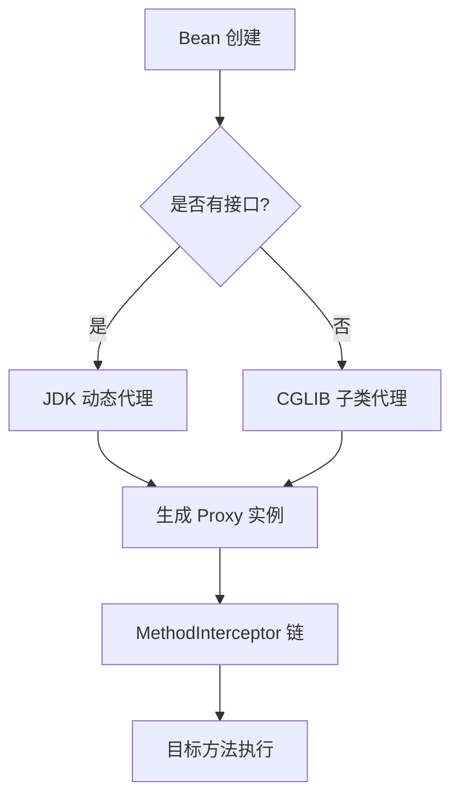
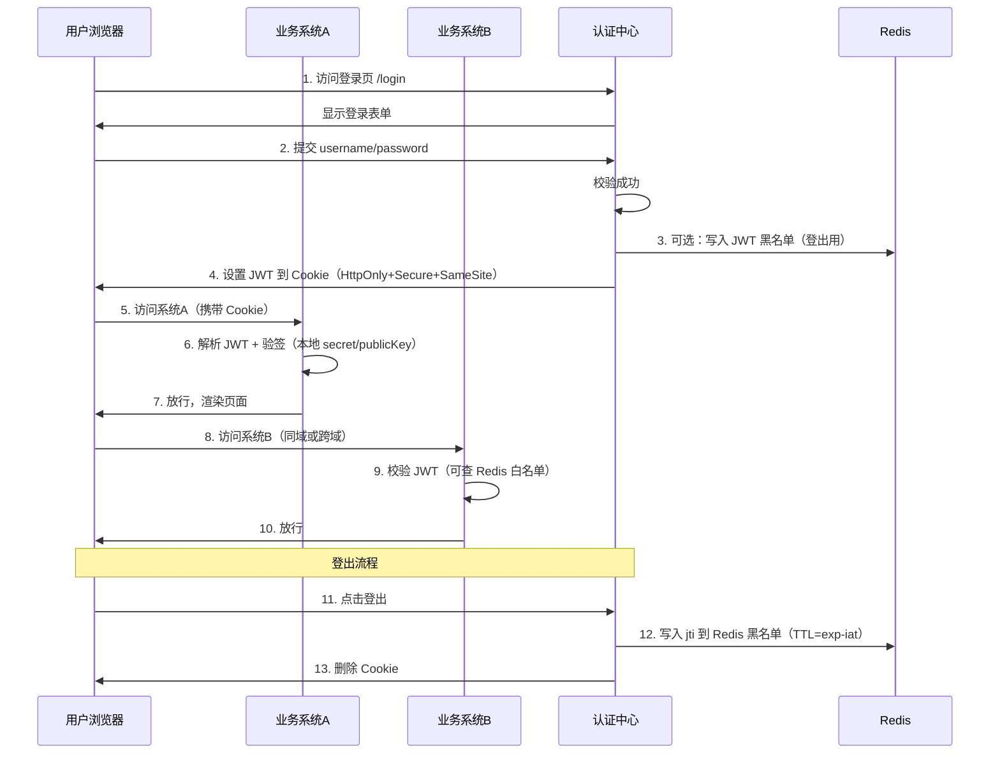

https://maochunguang.github.io/java-interview/interview_topn/toutiao.html#%E6%8A%80%E6%9C%AF%E7%82%B9%E6%B1%87%E6%80%BB

[TOC]


## 1.进程和线程的区别？使用线程这能节约时间吗？

1. **进程是操作系统进行资源分配和保护的独立单元，而线程是程序执行和调度的基本单元，是进程内的一条执行路径。**
2. 节约时间
   1. 对于**计算密集型**任务，目标是利用多核实现**并行**来压缩计算时间。
   2. 对于**I/O密集型**任务，目标是利用**并发**来填充I/O等待时间，提高CPU利用率和系统吞吐量。

## 2.分析一下线程池的参数？线程池工作流程？四种预定义的线程池？各自的workqueue size是多少？

1. ```java
   ThreadPoolExecutor executor = new ThreadPoolExecutor(
   	int corePoolSize,
   	int maximumPoolSize,
   	long keepAliveTime,
   	TimeUnit unit,
   	BlockingQueue<Runnable> workQueue,
   	ThreadFactory threadFactory,
   	RejectedExecutionHandler handler
   );
   ```

2. 工作流程

   1. 提交任务
   2. 核心线程是否已满？
      1. 否--即使有线程空闲，也会立即创建一个新的核心线程
      2. 是，下一步
   3. 工作队列是否已满？
      1. 否，放入工作队列等待执行
      2. 是，下一步
   4. 线程数是否达到最大值
      1. 否，创建一个创建一个新的非核心线程执行任务
      2. 是，下一步
   5. 触发拒绝策略
      1. 线程和队列都已饱和，无法处理新任务，调用rejectedExecutionHandler处理这个被拒绝的任务

3. 四种预定义线程池的区别和workqueue的大小

   1. | 类型                                | workqueue size                         | 使用场景                                                     |
      | ----------------------------------- | -------------------------------------- | ------------------------------------------------------------ |
      | FixedThreadPool——固定大小线程池     | LinkdBlockingQueue——Integer.MAX_VALUE  | 线程数固定                                                   |
      | CacheThreadPool——可缓存线程池       | SynchronousQueue                       | **容量 0**，不存储任务 <br />**生产者-消费者直接交换**，put() 必须等 take() <br />**动态线程**：无空闲线程就创建，最多 Integer.MAX_VALUE<br /> **60s 回收空闲线程**<br />**优点**：响应快，适合短任务 <br />**风险**：任务突刺 → 线程爆炸 → OOM |
      | SingleThreadExecutor——单线程线程池  | LinkedBlockingQueue——Integer.MAX_VALUE | 所有任务顺序执行，有任务无线堆积的风险                       |
      | ScheduledThreadPool——定时任务线程池 | DelayedWorkQueue——无界                 | 用于执行定时或周期性任务。                                   |

   

## 3、JAVA怎么保持线程同步？常用的锁有什么？java锁升级是怎么样的？

1. Java 通过 synchronized、Lock（ReentrantLock）、原子类（CAS）、并发容器、线程安全工具等实现线程同步；常用锁有偏向锁、轻量级锁、重量级锁；锁升级路径为：无锁 → 偏向锁 → 轻量级锁 → 重量级锁，JVM 自动优化，减少系统调用。

## 4、synchonized和lock的区别？synchonized优化

1. | 特性       | synchronized                                            | lock                                                         |
   | ---------- | ------------------------------------------------------- | ------------------------------------------------------------ |
   | 定义       | JAVA关键字，JVM层面，自动加锁、释放锁                   | 接口，调用lock(),  unlock()                                  |
   | 灵活       | 不灵活                                                  | **非常灵活**。可以跨方法加锁和解锁；<br />可以尝试非阻塞地获取锁（`tryLock`）；可以响应中断。 |
   | 等待可中断 | 不可                                                    | 可以，调用lockInterruptibly()                                |
   | 公平锁     | 仅非公平锁                                              | both，公平锁- new ReentrantLock(true)                        |
   | 条件队列   | 单一，通过wait(), notify(), notifyAll()操作一个等待队列 | 多个，通过 `newCondition()`可以创建多个条件变量（`Condition`对象） |

2. 无锁 → 偏向锁 → 轻量级锁 → 重量级锁，JVM 自动优化，减少系统调用。


## 5、hashmap同步问题，扩容机制，怎么扩容的过程？哈希冲突哪有哪些解决？

1. 开放地址法
   1. `ThreadLocal`内部的 `ThreadLocalMap`就使用了线性探测法。
2. 再哈希法
   1. 准备多个不同的哈希函数。
3. 建立公共溢出区
   1. 基本表和溢出表。所有冲突的元素都放入溢出表中。
4. 链地址法
   1. **核心思想**：**将数组的每一个元素视为一个桶（bucket）或一个链表的头节点**。所有哈希到同一索引的键值对，都会被放入这个桶对应的链表中。


## 6、concurrentHashmap的工作原理，数据结构？

1. 通过 分段锁 + CAS + 无锁读 + 红黑树优化，实现 高并发读写不阻塞。

## 7、泛型是什么？怎么实现的？

1. 泛型是JAVA编译器类型安全机制，JVM本身并不支持泛型，而是通过类型擦除在编译阶段实现。运行时不支持泛型，通过编译器擦除+signature属性+桥接方法实现编译期类型安全和运行时兼容
2. List<String> 和 List<Integer> 运行时没有区别，都是List，区别只在编译期
3. 为什么不能new  T()？
   - T是未知类型，JVM无法分配内存
4. 泛型数组可以创建吗?\
   - 不可以，new T[10]编译失败，需要用object[]强制类型转换

## 8、怎么理解面向对象？简单聊聊封装、多态、继承

1. 面向对象是模拟现实世界的一种编程范式，通过封装、继承、多态实现高内聚低耦合。
2. 封装
   - 把属性私有化，方法控制访问，保护对象的一致性。
3. 继承
   - 子类复用父类代码，避免重复。
4. 多态
   - 统一接口，不同实现，运行时决定调用谁。


## 9、Integer和Int的区别？什么时候用Integer？new Integer(1)会不会从缓存中取？

1. int是基础类型，Integer是它的包装类，核心区别在于

   1. int有默认值，Integer可为null
   2. Integer在-128~127有缓存池

2. new Integer(1) 每次创建新对象，Integer.valueOf(1) 会命中缓存。

3. | 追问                                            | 回答要点                                          |
   | ----------------------------------------------- | ------------------------------------------------- |
   | `Integer a = 1; Integer b = 1;` 为什么 `a==b`？ | 自动装箱调用 `valueOf()`，命中缓存                |
   | `new Integer(1) == 1` 呢？                      | 拆箱后 `int` 比较，`true`                         |
   | 缓存范围能改吗？                                | 可以：`-XX:AutoBoxCacheMax=1000`                  |
   | 为什么缓存 `-128~127`？                         | 覆盖 byte 范围，日常使用频繁                      |
   | `Integer` 是线程安全的吗？                      | 不可变（`final` + `private final int`），线程安全 |


## 10、List为什么只能用Integer 不能用int的原因是什么？

List 只能用 Integer，不能用 int，是因为 Java 泛型只接受引用类型，int 是基本类型，编译器不认识。


## 11、介绍下NIO，NIO中channel的作用？

| 代号    | 全称                 | 线程模型                | 阻塞性   | 底层系统调用        | 典型场景       |
| ------- | -------------------- | ----------------------- | -------- | ------------------- | -------------- |
| **BIO** | **B**locking I/O     | 一连接一线程            | 阻塞     | `accept()`/`read()` | 连接数 < 1000  |
| **NIO** | **N**on-blocking I/O | **1 个线程管 N 个连接** | 非阻塞   | `epoll`             | 10w+ 长连接    |
| **AIO** | **A**synchronous I/O | 回调/ Future            | 完全异步 | `IOCP`              | Windows 高吞吐 |


## 12、什么是乐观锁、悲观锁？区别是什么呢？原理呢？

**乐观锁**：读不锁、写带版本，提交再比对，撞了重试。

**悲观锁**：读就上排他锁，事务没结束别人只能排队。

- **悲观锁**：数据库 **行锁（row lock）**，InnoDB 的 **next-key lock**
- **乐观锁**：**CAS 算法**（Compare And Swap），CPU 指令 cmpxchg


## 13、线程有几种实现方式？有什么状态？


```java
// 1. 继承 Thread  
Thread → new MyThread().start()

// 2. 实现 Runnable
public class Demo2 {
    public static void main(String[] args) {
        Thread t = new Thread(new MyRunnable());
        t.start();
        System.out.println("main 线程");
    }
}

class MyRunnable implements Runnable {
    @Override
    public void run() {
        System.out.println("方式2：实现 Runnable");
    }
}

// 3. 带返回值 Callable
FutureTask<String> task = new FutureTask<>(() -> "OK");
new Thread(task).start();
System.out.println(task.get());

// 4. 线程池（推荐！）
Executors.newCachedThreadPool().execute(() -> System.out.println("Hi"));

//5.Lambda 简化
// Runnable
new Thread(() -> System.out.println("Lambda Runnable")).start();

// Callable
FutureTask<String> task = new FutureTask<>(
    () -> "Lambda Callable 返回值"
);
new Thread(task).start();
System.out.println(task.get());
```


```text
NEW
 │ start()
 ▼
RUNNABLE ←────────────────────────┐
 │   sleep(1000)      join(1000)  │
 ▼   ──────────────► TIMED_WAITING
 │   wait()  park()               │
 ▼   ──────────► WAITING          │
 │   synchronized(锁)             │
 ▼   ────────► BLOCKED ◄──────────┘
 │   run() 结束
 ▼
TERMINATED
```


## 14、finalize方法

> “finalize 是 Object 的方法，GC 前可能调用一次，用于资源清理。 但不确定、性能差、已废弃，实际开发一律不用！ 用 try-with-resources 或 Cleaner 替代。”


## 15、说说抽象类和接口的区别。

- 抽象类可含普通属性/方法/构造器
- 接口（JDK8 前）只能含 public abstract 方法和 public static final 常量；
  - 普通方法
    - Java 8 前：不能有实现
    -  Java 8+：支持 default 方法（有实现）
    -  Java 9+：支持 private 方法
- 一个类只能继承一个抽象类，但可实现多个接口。
- 抽象类偏向“父子继承 + 代码共享”，接口偏向“行为契约 + 多实现”。
-  优先使用接口实现解耦，必要时用抽象类共享代码。

| 特性       | 抽象类              | 接口                             |
| ---------- | ------------------- | -------------------------------- |
| 继承       | `extends`（单继承） | `implements`（多实现）           |
| 方法实现   | 可有完整实现        | 默认无实现（Java 8+ 可 default） |
| 成员变量   | 可有实例变量        | 只能 public static final         |
| 构造器     | 有                  | 无                               |
| 访问修饰符 | 灵活                | 方法默认 public                  |
| 设计意图   | is-a 关系，代码复用 | can-do 能力，行为规范            |


## 16、synchonized和lock的区别？synchonized优化

> synchronized 是 JVM 内置锁，自动释放，基于 monitorenter/monitorexit；Lock 是显式锁（ReentrantLock），需手动 unlock，支持公平锁、条件等待、tryLock 和中断。


## 17、为什么线程多的时候要使用锁而不是CAS？

> 线程多时 CAS 竞争激烈，自旋重试耗 CPU + 缓存失效风暴，导致吞吐量雪崩；锁通过线程挂起（Park）让出 CPU，结合锁升级优化，整体性能更稳定。

## 18、谈一下异常，erorr和exception的区别，讲一下受检异常和非受检异常，说一下RuntimeException都有哪些，非受检异常有哪些？如何处理异常

- Error 是 JVM 级严重错误（如 OOM、StackOverflow），不可恢复不应捕获；Exception 是程序级异常，可处理，其中 RuntimeException 为非受检异常，其余为受检异常。

- 受检异常（Checked）继承自 Exception 但非 RuntimeException，编译强制处理；非受检（Unchecked）是 RuntimeException 及其子类，运行时抛出，编译不强制。

- 常见 RuntimeException：NullPointerException、ArrayIndexOutOfBoundsException、ClassCastException、IllegalArgumentException、UnsupportedOperationException 等；所有 RuntimeException 及其子类 + Error 均为非受检异常。

  - | 异常                              | 触发场景      | 生产防御                            |
    | --------------------------------- | ------------- | ----------------------------------- |
    | `NullPointerException`            | 空对象调用    | `Objects.requireNonNull` / Optional |
    | `IndexOutOfBoundsException`       | 数组/列表越界 | `list.get(i)` 前 `checkIndex`       |
    | `ClassCastException`              | 类型转换失败  | `instanceof` 判断                   |
    | `IllegalArgumentException`        | 参数非法      | 入参校验                            |
    | `IllegalStateException`           | 状态非法      | 状态机保护                          |
    | `UnsupportedOperationException`   | 接口未实现    | `Collections.unmodifiableList()`    |
    | `ConcurrentModificationException` | 迭代中修改    | 用 `CopyOnWriteArrayList`           |
    | `ArithmeticException`             | `/0`          | 除零检查                            |

- 受检异常

  - | 异常类                      | 包                  | 常见场景                          |
    | --------------------------- | ------------------- | --------------------------------- |
    | `IOException`               | `java.io`           | 文件读写、网络 IO                 |
    | `FileNotFoundException`     | `java.io`           | 文件未找到                        |
    | `EOFException`              | `java.io`           | 文件结束异常                      |
    | `SQLException`              | `java.sql`          | 数据库操作异常                    |
    | `ClassNotFoundException`    | `java.lang`         | `Class.forName()` 找不到类        |
    | `InterruptedException`      | `java.lang`         | `Thread.sleep()`, `wait()` 被打断 |
    | `ParseException`            | `java.text`         | 日期/数字解析失败                 |
    | `MalformedURLException`     | `java.net`          | URL 格式错误                      |
    | `NoSuchMethodException`     | `java.lang.reflect` | 反射找不到方法                    |
    | `InvocationTargetException` | `java.lang.reflect` | 反射调用目标异常                  |


## 19、什么是阻塞和非阻塞，什么是同步，异步？

> **阻塞/非阻塞** 关注**线程等待状态**：阻塞 → 调用后线程挂起；非阻塞 → 立即返回，需轮询。 
>
> **同步/异步** 关注**结果获取方式**：同步 → 调用者主动等结果；异步 → 回调/未来通知结果。

| 维度     | 阻塞（Blocking）          | 非阻塞（Non-blocking）            |
| -------- | ------------------------- | --------------------------------- |
| 系统调用 | read() 直到数据到位才返回 | read() 立即返回 EAGAIN            |
| 线程状态 | WAITING / BLOCKED（Park） | RUNNABLE（轮询或事件驱动）        |
| 典型 API | InputStream.read()        | SocketChannel.read() + O_NONBLOCK |

| 维度     | 同步（Synchronous） | 异步（Asynchronous）         |
| -------- | ------------------- | ---------------------------- |
| 结果获取 | 调用者**主动等待**  | 系统**回调通知**             |
| 典型实现 | Future.get() 阻塞等 | CompletableFuture + Callback |
| 内核支持 | 无需                | 需要 io_uring / AIO          |


## 20、什么是反射？反射的用途？为什么java需要反射，c++不需要。

> 反射是 运行时动态获取类结构（如字段、方法、构造器）并操作其对象的能力；用途包括 框架自动注入（Spring）、序列化（Jackson）、动态代理（AOP）、插件系统。
>
> Java 是 **解释 + 动态加载**，类在运行时才确定，反射是框架动态操作的基石；C++ 是 **静态编译**，模板在编译期展开，依赖注入/序列化靠模板元编程，无需运行时反射。

## 21、有哪些方式可以创建一个对象？

反序列化（ObjectInputStream.readObject()） 附加：new 变种（数组、String 常量池）、工厂/Builder、动态代理、虚拟线程（JDK21）。

| 方式                               | 关键字/机制         | 是否调用构造器 | 说明                 |
| ---------------------------------- | ------------------- | -------------- | -------------------- |
| 1. `new` 关键字                    | `new`               | 是             | 最常见               |
| 2. `Class.forName().newInstance()` | 反射                | 是             | 动态加载             |
| 3. `Constructor.newInstance()`     | 反射                | 是             | 更灵活               |
| 4. `clone()`                       | 复制                | **否**         | 浅拷贝               |
| 5. 反序列化                        | `ObjectInputStream` | **否**         | 从字节流恢复         |
| 6. `newInstance()`（已废弃）       | `Constructor`       | 是             | Java 9 后不推荐      |
| 7. 工厂方法 / 建造者模式           | 自定义              | 是             | 封装创建逻辑         |
| 8. `Unsafe.allocateInstance()`     | 底层                | **否**         | 不调用构造器（危险） |

7. 工厂方法 / 建造者模式（设计模式）

```
// 工厂方法
public static Person create(String name, int age) {
    return new Person(name, age);
}

// 建造者模式
Person p = Person.builder()
                 .name("Tom")
                 .age(25)
                 .build();
```

> 封装创建逻辑，**更灵活、可读性强**

------

8. Unsafe.allocateInstance()（底层，不推荐）

```
import sun.misc.Unsafe;
import java.lang.reflect.Field;

Field f = Unsafe.class.getDeclaredField("theUnsafe");
f.setAccessible(true);
Unsafe unsafe = (Unsafe) f.get(null);

Person p = (Person) unsafe.allocateInstance(Person.class); // 不调用构造器！
p.name = "Tom"; // 直接操作字段
```

> **不调用构造器**，绕过初始化，**仅用于框架/序列化库**

## 22、多线程和协程的优缺点

> 多线程：内核级，抢占式调度，适合 CPU 密集型，真并行，但上下文切换贵（1-10μs）、内存大（1MB 栈）。 协程：用户态，轻量协作式，适合 I/O 密集型，单线程高并发（10w+），切换快（<1μs）、栈小（几KB），但不能利用多核。


# Spring

## 1.Spring 的核心模块有哪些？IOC 和 AOP 的原理？

| 模块       | 作用                                | 关键类              |
| ---------- | ----------------------------------- | ------------------- |
| core       | 工具类，IOC（Inversion of Control） | beanUtils, resource |
| beans      | bean 定义与工厂                     |                     |
| context    | 应用上下文                          |                     |
| expression | SpEL表达式                          |                     |
| aop        | AOP框架                             |                     |
| aspect     | AspectJ集成                         |                     |
| tx         | 事务管理                            |                     |

1. IOC原理（三级缓存解决循环依赖）
   1. 一级缓存:singletonObjects->完整bean
   2. 二级缓存：earlySingletonObjects->半成品bean （正在创建）
   3. 三级缓存：singletonFactories->objectFactory（延迟生成代理，根据是否被切AOP返回代理对象与否）
   4. A->B->A，B 注入 A 的早期引用（未完成初始化），避免死循环。

```text
1. 创建 A
   ↓
2. 实例化 A（new A()）
   ↓
3. 把 A 的工厂放入 三级缓存
      singletonFactories.put("a", () -> getEarlyBeanReference(a))
   ↓
4. 开始给 A 注入 B
   ↓
5. 创建 B → 需要注入 A
   ↓
6. 从 三级缓存 拿到 A 的工厂 → 调用 getEarlyBeanReference(a)
   ↓
7. 生成“早期引用”（可能被 AOP 代理）
   ↓
8. 放入 二级缓存（earlySingletonObjects）
   ↓
9. 注入 B 完成 → 创建 B 完成
   ↓
10. A 属性填充完成 → 放入 一级缓存
    ↓
11. 删除二、三级缓存
```

2.AOP原理

1. AOP 是面向切面编程，分离横切关注点
2. AOP 通过动态代理（JDK/CGLIB）为目标对象创建代理，在方法调用时插入拦截器链，按顺序执行通知，从而实现无侵入的横切功能增强。

 **运行时动态代理**：

- **有接口** → **JDK 动态代理**（Proxy.newProxyInstance）
- **无接口** → **CGLIB**（子类继承 + 方法拦截） Spring 通过 ProxyFactory + Advisor 在方法调用时插入 **前置/后置/环绕** 逻辑。



| 问题                             | 回答                                                         |
| -------------------------------- | ------------------------------------------------------------ |
| **AOP 是编译时还是运行时？**     | **运行时**（Spring 默认），可通过 AspectJ 编译时织入         |
| **`@Transactional` 怎么生效？**  | `@EnableTransactionManagement` → 注册 `TransactionInterceptor` |
| **CGLIB 怎么生成字节码？**       | `ASM` 库动态生成子类                                         |
| **代理后 `instanceof` 还准吗？** | JDK 代理返回 `false`，CGLIB 返回 `true`                      |

| 注解              | 时机              | 用途                 |
| ----------------- | ----------------- | -------------------- |
| `@Before`         | 方法前            | 参数校验、日志       |
| `@After`          | 方法后（finally） | 清理资源             |
| `@AfterReturning` | 成功返回后        | 返回值处理           |
| `@AfterThrowing`  | 抛异常后          | 异常日志             |
| `@Around`         | 环绕              | 事务、缓存、性能监控 |

## 2.spring的事务传播是怎么样的，哪些方式？

| 传播行为        | Brief                  | 是否新建事务 | 当前有事务 | 当前无事务 | 典型场景       |
| --------------- | ---------------------- | ------------ | ---------- | ---------- | -------------- |
| `REQUIRED`      | 有就加入，无就新建     | 否           | 加入       | 新建       | 默认，业务方法 |
| `SUPPORTS`      | 跟着走，有就用，无就行 | 否           | 加入       | 无事务执行 | 查询方法       |
| `MANDATORY`     | 必须有，否则报错       | 否           | 必须加入   | 抛异常     | 强制事务环境   |
| `REQUIRES_NEW`  | 新开一个，挂起旧的     | 是           | 挂起旧事务 | 新建       | 日志、审计     |
| `NOT_SUPPORTED` | 挂起事务，不参与       | 否           | 挂起事务   | 无事务执行 | 发邮件         |
| `NEVER`         | 坚决不要事务           | 否           | 抛异常     | 无事务执行 | 性能敏感       |
| `NESTED`        | 保存点，部分回滚       | 是（保存点） | 嵌套保存点 | 新建       | 部分回滚       |

## 3.spring是如何解决循环依赖的?


> **三级缓存是为了支持 AOP 代理**：
>
> - **一级**：完整 Bean（最终态）
> - **二级**：早期裸对象（未完成初始化）
> - **三级**：ObjectFactory（延迟生成代理） **二级够解决普通循环依赖，但不能支持 AOP 动态代理**。

------

**深度剖析**（带陷阱/踩坑点）：

1. 三级缓存核心作用：区分“裸对象”与“代理对象”

   java

   ```
   // 三级缓存：Map<String, ObjectFactory<?>>
   singletonFactories.put(beanName, () -> getEarlyBeanReference(beanName, mbd, bean));
   ```

   - getEarlyBeanReference() 是 **AOP 代理生成点**
   - 若当前 Bean 需要代理（如 @Transactional），返回 **代理对象**
   - 若不需要，返回 **原始对象**

2. 二级缓存行不行？

   - **行**：解决 **普通 setter 循环依赖**（无 AOP）
   - 不行，无法支持 AOP（A 需要被 AOP 代理（如 @Transactional））
     - 假设 A → B → A，且 A 需要代理
     - B 获取 A 时，若只放 **裸 A** 到二级缓存 → B 拿到的是原始对象
     - 后续 A 完成代理 → 一级缓存是代理，但 B 持有的仍是裸对象 → **不一致！**

## 4.@Autowired 字段注入 vs 构造器注入，循环依赖影响？

> 字段注入：支持循环依赖（setter 阶段注入） 构造器注入：不支持循环依赖（构造时必须完成依赖） 推荐构造器注入（Spring 官方 + 不可变 + 测试友好），循环依赖用 @Lazy 解决。


## 5.ApplicationContext.getBean() 触发循环依赖吗？

>会触发！ getBean() → 触发 doGetBean() → 若 Bean 正在创建且有循环依赖 → 正常走三级缓存逻辑，不会死循环。


# 网络

## 1. 浏览器对网页有缓存吗？缓存是如何存放的？

> **有缓存**！浏览器通过 **Memory Cache（内存）** 和 **Disk Cache（磁盘）** 存储资源，遵循 **HTTP 缓存头**（Cache-Control、ETag、Last-Modified）决定是否复用。


## 2.Cookie和session的联系与区别，cookie、session、分布式session

> 联系：Session 依赖 Cookie 传递 sessionId。 
>
> 区别：Cookie 存客户端，Session 存服务端。 
>
> 分布式 Session：用 Redis 集群 + Sticky Session / Token（JWT） 解决。


## 3.如何保证TCP可靠传输

>TCP 通过 序列号 + 确认应答 + 重传机制 + 滑动窗口 + 流量控制 + 拥塞控制 保证可靠传输。


## 4.什么是 SSO？什么是 JWT？SSO、JWT 和 Redis 登录的过程

- **SSO（Single Sign-On）**：一次登录，多系统通用。
-  **JWT（JSON Web Token）**：无状态、跨域的身份凭证，结构 header.payload.signature。 
- **SSO + JWT + Redis 登录流程**：
  1. 用户登录认证中心 → 2. 签发 JWT（存 Redis 黑名单） → 3. 业务系统校验 JWT → 4. 登出写 Redis 失效。

SSO + JWT + Redis 完整登录流程




# Redis

## 1.Redis单线程为什么性能高?

> Redis 单线程性能高靠 **「I/O 多路复用 + 内存操作 + 无锁设计」**：
>
> 1. **epoll/kqueue** 高效处理万级连接
> 2. **纯内存操作**，无磁盘 I/O
> 3. **单线程避免锁竞争与上下文切换**

## 2.Redis 为什么可以保证线程安全？

> Redis 主线程单线程串行执行命令，天然 原子性 + 线程安全，无需锁。

PS: 

- Redis **事务不回滚**，失败命令跳过

## 3.Redis的七大数据类型和底层数据结构？

> Redis 7 大数据类型： **String、List、Hash、Set、Sorted Set、Bitmap、HyperLogLog**（+ GEO、Stream） 
>
> 底层结构：**SDS、dict、ziplist、quicklist、skiplist、intset、stream**

------

**深度剖析**（带陷阱/踩坑点）：

| 数据类型        | 常用命令      | 底层结构                          | 适用场景     | 编码切换              |
| --------------- | ------------- | --------------------------------- | ------------ | --------------------- |
| **String**      | SET/GET/INCR  | SDS（简单动态字符串）             | 缓存、计数器 | raw / int / embstr    |
| **List**        | LPUSH/RPOP    | quicklist（ziplist + linkedlist） | 消息队列     | 小数据用 ziplist      |
| **Hash**        | HSET/HGETALL  | ziplist（小）→ hashtable（大）    | 对象存储     | listpack（Redis 7.0） |
| **Set**         | SADD/SMEMBERS | intset（纯整数）→ hashtable       | 去重、交并集 | —                     |
| **ZSet**        | ZADD/ZRANGE   | ziplist（小）→ skiplist + dict    | 排行榜       | —                     |
| **Bitmap**      | SETBIT/GETBIT | SDS（位数组）                     | 签到、统计   | —                     |
| **HyperLogLog** | PFADD/PFCOUNT | 稀疏/稠密矩阵                     | UV 统计      | 误差 0.81%            |

------


# RabbitMQ

## 1.RabbitMQ 的用途与结构

**考察点**：消息中间件, AMQP 协议, 微服务通信, 异步处理, 生产架构设计

> RabbitMQ 是开源消息代理，支持 AMQP/MQTT/STOMP 等协议，用于**异步解耦、任务分发、实时通知**；
>
> 结构包括**生产者 → 交换机（Exchange）→ 队列（Queue）→ 消费者**，交换机基于路由键/头路由消息。

---

**深度剖析**（带陷阱/踩坑点）：  

1. **原理/源码级解释**  
   - **用途**：解耦系统（微服务间通信）、负载均衡（多消费者）、持久化异步处理（后台任务）、实时流（如聊天/IoT）。基于 Erlang，天然高并发。  
   - **结构**：  
     - **生产者（Producer）**：发送消息。  
     - **交换机（Exchange）**：4 种类型（Direct、Topic、Fanout、Headers），路由逻辑在交换机实现（非队列）。  
     - **队列（Queue）**：FIFO 缓冲，持久化/镜像队列支持高可用。  
     - **消费者（Consumer）**：拉取/推送模式，预取（prefetch）控制并发。  
     - **绑定（Binding）**：交换机与队列的路由规则。  
   - 底层：Erlang VM + Mnesia 数据库存储元数据，消息持久化到磁盘。  

2. **常见错误写法 + 反例**  
   ```java
   // 错误：直接发到队列，丢失路由灵活性
   channel.basicPublish("", "direct-queue", null, message.getBytes()); // 无交换机，耦合生产者与队列
   
   // 错误：队列过大导致 OOM
   // 生产中队列 > 10GB，RabbitMQ 强制刷盘，性能暴跌
   ```

3. RabbitMQ vs Kafka：RabbitMQ 更适合复杂路由，Kafka 适合高吞吐日志。  

---

## 2.RabbitMQ 可靠性传输


**考察点**：ACK 机制, Publisher Confirms, 持久化, 死信队列, 至少一次交付

> RabbitMQ 通过 **持久化队列/消息 + Publisher Confirms + Consumer ACK + 镜像队列** 实现可靠传输，支持**至少一次（at-least-once）** 语义，结合 DLQ 防丢失。

1. **原理/源码级解释**  
   - **生产端**：Publisher Confirms（异步确认）+ Returns（不可路由回调），消息持久化（`MessageProperties.PERSISTENT_TEXT_PLAIN`）。  
   - **Broker 端**：队列持久化（`durable=true`），镜像队列（HA 模式）跨节点复制。  
   - **消费端**：手动 ACK（`basicAck`），NACK（`basicNack`）重入队列或 DLQ；预取（`basicQos`）防 overload。  
   - 语义：默认 at-least-once（可能重复），通过 idempotency（如 UUID）实现 exactly-once。  
   - 传输层：TCP + AMQP 心跳检测连接失败。  

2. **常见错误写法 + 反例**  
   
   ```java
   // 错误：自动 ACK，消费失败消息丢失
   ch.basicConsume(queue, true, deliverCallback); // true = auto-ack，异常时丢消息
   
   // 错误：无 Confirms，Broker 崩溃消息丢失
   ch.basicPublish(exchange, key, props, msg); // 无 channel.confirmSelect()
   ```

## 3.rabbitmq exchange类型 有哪些类型

1. **Direct**（直连）—— 精确匹配 routingKey
2. **Topic**（主题）—— 通配符匹配 routingKey（* 和 #）
3. **Fanout**（扇出）—— 广播到**所有绑定队列**，忽略 routingKey
4. **Headers**（头匹配）—— 根据消息 **headers** 匹配（性能差，少用）
   1. Headers是一个键值对,可以定义成Hashtable。发送者在发送的时候定义一些键值对，接收者也可以再绑定时候传入一些键值对，两者匹配的话，则对应的队列就可以收到消息。匹配有两种方式all和any。这两种方式是在接收端必须要用键值"x-mactch"来定义。
5. Default Exchange 是 RabbitMQ 内置、隐式、不可声明 的 Direct 类型交换机，名字为 ""（空字符串）。 作用：当生产者不指定 Exchange 时，自动路由到 routingKey == 队列名 的队列，实现 “直连队列” 效果。

# 分布式和微服务

## 1.什么是分布式事务？分布式事务的解决方案？

**分布式事务**：跨越多个服务/数据库的事务，需保证 **ACID** 在分布式环境下的等效性。 

**解决方案**：

1. **2PC/3PC**（强一致，阻塞）
2. **TCC**（业务侵入，高性能）
3. **SAGA**（最终一致，长事务）
4. **本地消息表 + MQ**（最终一致，简单可靠）
5. **最大努力通知**（弱一致）

## 2,分布式锁如何实现？RedLock算法

分布式锁：多进程共享的互斥锁。 

Redis 实现：SET lock_key unique_value NX PX 30000（原子） 

### 1. **什么是 RedLock？**

> **RedLock** 是 Redis 官方提出的**分布式锁算法**（Distributed Lock），由 Redis 作者 Salvatore Sanfilippo（antirez）设计。 它通过**多个独立 Redis 节点**实现**故障容错的互斥锁**，避免单点故障（如单个 Redis 实例宕机导致锁失效）。

> **核心目标：** 在分布式环境中，确保**只有一个客户端能持有锁**，即使有节点失败或网络分区。

RedLock：在 N 个独立 Redis 节点 上获取锁，多数派（N/2+1）成功即获锁，解决单点失效。

1. **Redis 分布式锁**（最常用）
2. **Zookeeper 分布式锁**（强一致性）
3. **数据库分布式锁**（简单）

### 2.Redisson 框架

> **Redisson** 是 **Redis 的高级 Java 客户端**，基于 Netty 异步框架，提供**分布式数据结构和服务**。 它将 Redis 的简单键值对扩展为**丰富的 Java 对象**（如分布式锁、队列、Map），支持**同步/异步/RxJava** API。

```
// 配置文件
Config config = new Config();
config.useSingleServer().setAddress("redis://127.0.0.1:6379");
RedissonClient redisson = Redisson.create(config);

// 使用
RLock lock = redisson.getLock("order_lock");
try {
    boolean locked = lock.tryLock(10, 30, TimeUnit.SECONDS); // 10s 等待，30s 过期
    if (locked) {
        // 业务逻辑
    }
} finally {
    lock.unlock();
}
```

### 4：Redis 分布式锁为什么用 SETNX + EXPIRE 不安全？

> **A：** 两步操作非原子。可能 SETNX 成功后宕机，锁永不过期 → 死锁 **正确：** 用 SET key value NX PX 30000（原子）

### 5：Redisson 怎么防止锁过期？

> **A：** 看门狗（Watch Dog）线程，每 expire/3 时间续期一次

### 6：Zookeeper 比 Redis 强在哪？

> **A：** 强一致性 + CP 模型，适合配置中心、注册中心

### 7：RedLock 算法的核心步骤？

> **A：** 生成唯一值 → 顺序在 N 个独立 Redis 节点加锁（SET NX PX） → 多数（N/2+1）成功 + 有效时间检查 → 成功则持有，否则释放重试。解锁用 Lua 脚本原子删除。

### 8：Redisson 是什么？它如何支持分布式锁？

> **A：** Redisson 是 Redis 的 Java 客户端，提供分布式 Java 对象和服务。支持 RedLock 通过 RedLock 类实现多锁组合，自动处理续期和故障转移。

### 9：RedLock 的潜在问题？

> **A：** 时钟漂移、网络分区可能导致不一致；Martin Kleppmann 批评无 fencing token。但在异步网络假设下可靠。


# 数据库

## 1.什么时候考虑分库分表？

当单表数据量 > 1000万，单库 QPS > 5000，或业务出现明显瓶颈时，就该考虑分库分表！

## 2.mysql为什么要用b+树，不用平衡二叉树做索引结构？B树和B+树有什么区别？

**平衡二叉树**：每个节点 2 个子节点，高度差 ≤1，适合内存。

**B 树**：多路平衡树，所有节点存数据，减少 I/O。

**B+ 树**：B 树的升级，**只有叶子存数据 + 叶子链表**。

| 特性                | 平衡二叉树 | B 树     | B+ 树        |
| ------------------- | ---------- | -------- | ------------ |
| **节点子树数量**    | 2          | M        | M            |
| **数据存储位置**    | 所有节点   | 所有节点 | **只有叶子** |
| **叶子连接**        | 无         | 无       | **双向链表** |
| **树高（1亿数据）** | ~27 层     | ~5 层    | **~3 层**    |
| **范围查询**        | 中序遍历   | 回溯多层 | **顺序扫描** |
| **磁盘 I/O**        | 高         | 中       | **最低**     |
| **MySQL 使用**      | 不使用     | 不使用   | 使用         |

MySQL（InnoDB）用 **B+ 树** 做索引因为：

1. **磁盘 I/O 少**：B+ 树 **阶高、矮胖**，树高低 → 更少磁盘读取
2. **范围查询快**：**叶子节点双向链表**，顺序扫描高效
3. **非叶子节点不存数据**：**扇出（fan-out）更大**，同等数据更矮 **平衡二叉树** 树高 ≈ log₂N，**磁盘 I/O 多**，不适合数据库。

## 3.创建数据库索引应该怎么考虑？

创建索引要 **“三看一避”**：

1. **看查询**：WHERE/JOIN/ORDER BY/GROUP BY 列
2. **看频率**：高频查询 > 低频更新
3. **看选择性**：高区分度（cardinality 高）列放前面 **避**：避免冗余、频繁更新列、长字符串前缀、过多索引

**What**：高选择性字段（WHERE、JOIN、ORDER BY）

**Where**：分析 EXPLAIN 慢 SQL

**Why**：解决扫描行数多、回表、排序慢

**When**：数据量 > 10万，响应 > 100ms

**How**：复合索引 + 最左前缀 + 覆盖索引

- **复合索引**

  - > **一句话：多个字段一起建一个索引，解决多条件查询**

    ```
    CREATE INDEX idx_user_status_time 
    ON orders(user_id, status, create_time);
    ```

    #### **结构图（B+ 树）：**

    ```
    (100, 1, '2025-01-01')
                 /      |         \
       (100,0,...)   (100,1,...)   (100,2,...)
    ```

- **最左前缀**

  - 必须从最左边字段开始用，跳过就失效

  - | SQL                                            | 是否走索引 | 说明         |
    | ---------------------------------------------- | ---------- | ------------ |
    | WHERE user_id=100                              | 是         | 最左         |
    | WHERE user_id=100 AND status=1                 | 是         | 连续         |
    | WHERE status=1                                 | 否         | 跳过 user_id |
    | WHERE user_id=100 AND create_time='2025-01-01' | 部分       | 只用 user_id |

- **覆盖索引（Covering Index）**

  > **一句话：查询的字段全在索引中，MySQL 不回表，直接返回**

  ```
  -- 建索引
  CREATE INDEX idx_user_status 
  ON orders(user_id, status, id, amount);
  
  -- 查询
  SELECT id, amount 
  FROM orders 
  WHERE user_id=100 AND status=1;
  ```

  #### **执行流程对比：**

  | 类型         | 流程                    | I/O 次数 |
  | ------------ | ----------------------- | -------- |
  | **普通索引** | 索引 → 回表取 amount    | 2 次     |
  | **覆盖索引** | 索引中直接拿 id, amount | **1 次** |

## 4.使用int 做primary key和使用string 有什么优劣？

> 优先用 INT（自增/雪花ID）做主键 → 性能高、存储省、索引快！ 
>
> 用 STRING（UUID/业务码）仅在分布式、合并、合规场景，代价高！

**INT 优势**：

- 存储小（8 字节 vs 36 字节）
- 索引快（数字比较 > 字符串）
- 插入快（顺序写，无页分裂）

**STRING 优势**：

- 分布式唯一（UUID）
- 可读性强（业务码）
- 合并数据无冲突

**推荐**：

- 日常用 BIGINT（自增或雪花ID）
- 分布式用 Snowflake ID
  - 时间回拨
- 必须用字符串时，用 BINARY(16) 存 UUID；
- 业务码做**唯一索引**，不做主键

| 维度              | `INT`（如 `BIGINT`）     | `STRING`（如 `VARCHAR(36)` / `CHAR(32)`） | 胜者       |
| ----------------- | ------------------------ | ----------------------------------------- | ---------- |
| **1. 存储空间**   | 8 字节（`BIGINT`）       | 36 字节（UUID）/ 32 字节（MD5）           | **INT**    |
| **2. 索引性能**   | B+ 树比较快（数字）      | 字符串比较慢，页分裂多                    | **INT**    |
| **3. 插入性能**   | 自增顺序写，**无页分裂** | 随机写，**频繁页分裂**                    | **INT**    |
| **4. 查询性能**   | 数字比较快               | 字符串比较慢                              | **INT**    |
| **5. 分布式友好** | 雪花ID 可全局唯一        | UUID 原生支持                             | **STRING** |
| **6. 可读性**     | 无意义                   | UUID/业务码有意义                         | **STRING** |
| **7. 合并/导入**  | 冲突多，需重排           | 无冲突                                    | **STRING** |
| **8. 安全性**     | 可猜（如 `/user/123`）   | 不可猜（如 UUID）                         | **STRING** |

## 5.数据库分表的方法？

数据库分表分 **垂直（分库分表）** 和 **水平分表** 两大类：

1. **垂直分表**：按 **业务/字段** 拆表（如 user_info、user_ext）

2. **水平分表**：按 **分片键** 拆数据（如 user_id % 32） **水平分表常用方法**：

   - **取模（Range）**

   - **一致性哈希**

   - **范围（Range）**

   - **枚举/映射表****中间件**：ShardingSphere / MyCat

| 类型         | 原理             | 场景             | 优缺点            |
| ------------ | ---------------- | ---------------- | ----------------- |
| **垂直分表** | 按 **列** 拆分   | 字段多、冷热分离 | 简单，查询需 JOIN |
| **垂直分库** | 按 **业务** 拆库 | 用户库、订单库   | 解耦，跨库事务难  |
| **水平分表** | 按 **行** 拆分   | 单表数据量大     | 复杂，需路由      |

| 问题                          | 回答                     |
| ----------------------------- | ------------------------ |
| **分表后 JOIN 怎么做？**      | 避免！拆服务 or 用中间表 |
| **分表后 COUNT(\*) 怎么算？** | 维护汇总表 or 用 ES      |
| **分表后分页怎么做？**        | `id > last_id LIMIT 20`  |
| **分片键可以是字符串吗？**    | 可以，但性能差           |

## 6.如果一条SQL语句执行的很慢，怎么优化？

**“四步排查法”**：

1. **EXPLAIN 看执行计划** → type、rows、key、Extra
2. **查索引** → 是否缺失？是否走错？
3. **改 SQL** → 覆盖索引、避免 *、拆大事务
4. **调系统** → 统计信息、内存、锁等待

## 7.Mysql为什么没有使用hash索引？

> MySQL **不默认使用 Hash 索引**，因为：
>
> 1. **不支持范围查询**（>, <, BETWEEN, LIKE 'abc%'）
> 2. **不支持排序**（ORDER BY）
> 3. **哈希冲突**导致性能下降
> 4. **磁盘随机 I/O 多**，不适合 B+ 树的顺序存储 **只有 MEMORY / NDB 引擎支持 Hash 索引**，**InnoDB 强制使用 B+ 树**

## 8.索引的匹配原则知道吗？

**最左前缀**：复合索引必须从左开始，跳过失效

**等值在前**：= 放前，范围 > 放后

- ```sql
  WHERE a = 1 AND b > 10 AND c = 3;
  -- 走 a, b（范围中断，c 不走）
  ```

**避免函数/计算**：DATE(col)、col+1 失效

**类型匹配**：字符串用引号

**覆盖索引**：查的字段全在索引中，避免回表

| 字段                              | 含义          | 是否优化 |
| --------------------------------- | ------------- | -------- |
| `type: index`                     | 全索引扫描    | 一般     |
| `type: range`                     | 范围扫描      | 好       |
| `type: ref`                       | 等值匹配      | 很好     |
| `type: const`                     | 主键/唯一索引 | **最优** |
| `Extra: Using where; Using index` | 覆盖索引      | **完美** |
| `Extra: Using filesort`           | 排序未用索引  | 需优化   |
| `Extra: Using temporary`          | 临时表        | 需优化   |

| 场景         | 示例                              | 结果           |
| ------------ | --------------------------------- | -------------- |
| 跳过最左列   | `WHERE b = 1`                     | 失效           |
| 范围后列失效 | `WHERE a = 1 AND b > 1 AND c = 1` | `c` 不走       |
| 函数计算     | `WHERE MD5(name) = 'xxx'`         | 失效           |
| 类型转换     | `WHERE phone = 123`               | 可能失效       |
| `OR` 条件    | `WHERE a = 1 OR c = 1`            | 部分失效       |
| `LIKE '%x'`  | `WHERE name LIKE '%abc'`          | 失效           |
| `IS NULL`    | `WHERE a IS NULL`                 | 走索引（但慢） |
| `!=`         | `WHERE a != 1`                    | 一般不走       |


## 9.MySQL事务隔离级别？

## 10.Mysql的查询执行流程？更新执行流程？

## 11.Mysql有哪些存储引擎？什么区别？

## 12.数据库的表结构设计遵循哪些规则？

| 范式    | 要求                   | 是否必须                           |
| ------- | ---------------------- | ---------------------------------- |
| **1NF** | 字段不可再分           | 必须                               |
| **2NF** | 非主键字段完全依赖主键 | 必须                               |
| **3NF** | 消除传递依赖           | **推荐**（业务复杂时可适当反范式） |

| 铁律           | 推荐           |
| -------------- | -------------- |
| **无业务含义** | 不要用 `phone` |
| **单列主键**   | 不要联合主键   |
| **趋势递增**   | 雪花ID / 自增  |

## 13.UUID 与 Snowflake 对比？

| 对比   | UUID           | Snowflake          |
| ------ | -------------- | ------------------ |
| 类型   | 字符串/16字节  | **8字节整数**      |
| 有序   | 无             | **有**             |
| 索引   | 随机写，页分裂 | **顺序写，性能高** |
| 唯一性 | 原生支持       | 支持               |

**选型**：

- **主键/高并发写** → **Snowflake**（性能高 3 倍）
- **合并/安全** → **UUID BINARY(16)**
- **业务码** → 做**唯一索引**，不做主键

**UUID 本质是 128 位（16 字节）二进制**

- **STRING(36)**：32 位十六进制 + 4 个 - → **人类可读**，适合日志/调试
- **BINARY(16)**：直接存原始字节 → **省 55% 空间，索引快 75%**
- STRING(36) 是“给人看的”，存的是“带-的十六进制文本” 
- BINARY(16) 是“给机器看的”，存的是“原始 128 位二进制数据”

> **UUID 主键 = 随机写 + 空间大 + 页分裂 → 写放大、索引爆炸** 
>
> **Snowflake 主键 = 趋势递增 + 8 字节 → 性能拉满，但有回退风险** 
>
> **生产 99% 选 Snowflake，1% 选 BINARY(16) UUID**

### UUID 主键

| 问题                     | 详细说明                                        | 后果                            |
| ------------------------ | ----------------------------------------------- | ------------------------------- |
| **1. 随机写入 → 页分裂** | UUID v4 完全随机，插入位置随机                  | **频繁页分裂，写放大 3~5 倍**   |
| **2. 索引体积爆炸**      | `VARCHAR(36)` = 36 字节，`BINARY(16)` = 16 字节 | **索引大小是 BIGINT 的 2~4 倍** |
| **3. 回表代价高**        | 辅助索引存 UUID，聚簇索引回表慢                 | **查询性能下降 50%**            |
| **4. 缓存命中率低**      | 随机分布，不符合 B+ 树局部性                    | **CPU Cache 失效**              |
| **5. 迁移合并难**        | 不同系统 UUID 冲突概率极低                      | 优势，但非主键场景              |

### Snowflake

| 问题                          | 详细说明                      | 后果                            |
| ----------------------------- | ----------------------------- | ------------------------------- |
| **1. 时钟回退（Clock Skew）** | 服务器时间被调后，生成重复 ID | **主键冲突，系统崩溃**          |
| **2. 机器 ID 冲突**           | 多节点未协调，机器 ID 重复    | **ID 冲突**                     |
| **3. 单毫秒瓶颈**             | 序列号只有 12 位（4096）      | **峰值 > 4096 QPS/毫秒 会阻塞** |

------

## 二、UUID 做主键的 5 大硬伤

## 14.EXPLAIN 关键字段 type Extra代表什么

> **type = “访问方式”** → **越靠前越好** **Extra = “额外操作”** → **有 Using filesort / Using temporary 就得优化！**

------

### type 字段：**访问类型排名（从优到劣）**

| type 值 | 含义                       | 性能等级 | 说明           |
| ------- | -------------------------- | -------- | -------------- |
| system  | 系统表，只有一行           | 5 stars  | 最快           |
| const   | 主键/唯一索引等值匹配      | 5 stars  | 常量级         |
| eq_ref  | 唯一索引 JOIN              | 5 stars  | 每行只匹配一行 |
| ref     | 非唯一索引等值匹配         | 4 stars  | 常见           |
| range   | 范围扫描（> < BETWEEN IN） | 3 stars  | 可接受         |
| index   | 全索引扫描                 | 2 stars  | 覆盖索引还行   |
| ALL     | **全表扫描**               | 1 star   | **必须优化！** |

> **目标：type 至少是 ref 或 range，避免 ALL！**

------

### Extra 字段：**额外操作（红灯预警）**

| Extra 值                 | 含义                              | 是否需要优化     |
| ------------------------ | --------------------------------- | ---------------- |
| Using index              | **覆盖索引**，不回表              | 好！             |
| Using where; Using index | 覆盖索引 + 过滤                   | 完美！           |
| Using where              | 回表后过滤                        | 一般             |
| Using filesort           | **内存/磁盘排序**，未用索引       | 必须优化！       |
| Using temporary          | **临时表**（GROUP BY / DISTINCT） | 必须优化！       |
| Using index condition    | 索引下推（ICP）                   | 好（MySQL 5.6+） |
| Impossible WHERE         | WHERE 条件永远为假                | 逻辑错误         |

# 架构和设计模式

## 1.rpc框架如何实现？

6 大模块：**服务注册发现（Zookeeper）、动态代理（JDK Proxy）、序列化（ProtoBuf）、网络传输（Netty）、负载均衡（一致性哈希）、容错（重试+熔断）**。

| 模块                  | 作用             | 技术实现                         |
| --------------------- | ---------------- | -------------------------------- |
| **1. 服务注册与发现** | 动态感知服务地址 | Zookeeper / Nacos / Consul       |
| **2. 动态代理**       | 像本地调用       | JDK 动态代理 / CGLIB / Javassist |
| **3. 序列化**         | 对象 ↔ 字节      | Hessian / ProtoBuf / JSON        |
| **4. 网络传输**       | 跨机器通信       | Netty（推荐） / Mina / HTTP2     |
| **5. 负载均衡**       | 选择健康节点     | 随机 / 轮询 / 一致性哈希         |
| **6. 容错机制**       | 失败自动处理     | 重试 / 熔断 / 降级               |

## 2.服务提供方有节点挂了怎么办？

- 使用 **Zookeeper 临时节点 + 心跳**，节点宕机自动下线；
- 客户端 **本地缓存 + 注册中心推送**，秒级感知并剔除。

## 3.服务调用方怎么知道服务不可用了？

- 注册中心 **Watch 推送** 

- 客户端 **心跳探测** 

- **调用超时快速失败**，三层保障。

## 4.怎么实现的类似本地调用？

1. **接口定义** → 双方共享（JAR 包 / Proto）
2. **动态代理** → 拦截方法调用
3. **序列化 + 网络传输 + 反射调用**
4. **返回结果反序列化**
